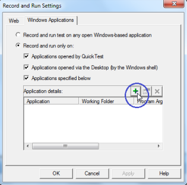

# Getting Started

Essential QuickTest Professional lets you test applications with different Syncfusion controls as well as allows playback of scripts. 

The following is a list of chapters containing information that steps you through the functionality of this software:

## Creating and Recording a Test 

To create a new test

1. Open QTP by double-clicking the QuickTest Professional icon. 
N> The QuickTest Professional – Add-in Manager window is displayed.

2. Select the WPF check box under the Add-in header. This ensures that WPF add-in is installed. 

   

3. Click OK. 
N> The QuickTest Professional – [Start Page] window opens. There are two tabs namely Start Page and Test in the main pane of the window. The content under the Start Page tab is displayed by default.

   

4. Click the New Test icon in the Start Page. 

   

5. A new test is created. 
  Note: You can also create a new test by selecting the Test tab in the main pane of the window or Test sub-menu under the New menu in the menu bar.

6. Click Record in the toolbar to start the recording. 

   

7. Record and Run Settings dialog box opens.

   

8. Select the Windows Application tab. The content under the tab is displayed.

   

N> The Record and run only option is selected by default._

9. Select the following checkbox to ensure that only the applications opened by QuickTest and added applications are tested.
1. Applications opened by Quick Test
2. Applications opened via the Desktop (by the Window shell)
3. Applications specified below
10. To add an application for testing, click the + button in the Application details.

N> The Application Details dialog box opens.

  

11. For Application field, browse and select the path of the application that has to be tested by clicking 
    
	

 button.
12. For Working folder field, browse and select the path of the working folder by clicking 

button.
13.  Select the Launch application check box, to launch the application immediately after clicking OK. 
14. Select Include descendant processes check box, to include all the processes that are descendant to the current process. 

N> Both Launch application and Include descendant processes check boxes are selected by default.

15. Click OK. 
N> The path of the application and working folder are displayed in the Application details frame as displayed in the following screenshot.

    

16. Click OK. 
N> The recording starts. The application in the given path is opened as displayed in the following screenshot.

    

17. Perform the required valid user-action in the application. 

N>

* Whenever the user performs any action involving the Syncfusion control used in the application, the Syncfusion.cfg file maps the control to the corresponding DLL.
* Finally, the DLL renders the correct method names of the Syncfusion namespace that are called respective to the user-actions performed. 
* these method names are then recorded and displayed in the screen behind the running application, as illustrated in the following screenshot.

   

This is called high-level recording, as the events are recorded with the method names of the Syncfusion namespace after recognizing the Syncfusion control unlike the low-level recording in which the Syncfusion controls are not recognized by QTP and the events are recorded with default method names. 

The low-level recording is the default recording that is performed by QTP when the steps mentioned in the Configuring Essential QuickTest Professional section are not followed. The recording can be stopped by clicking the Stop button in the toolbar. 

The process of creating and recording the test is completed.

## Running a Test

On recording, all your actions performed in the control are just noted with the corresponding method names of the Syncfusion namespace. The errors can be checked while running a test. To run a test, refer to the following steps. 

1. Click Run in the toolbar. 
N> Run dialog box opens. The Results Location tab is selected by default.

   

In the Results Location tab, two options are provided:

New run results folder - Allows the results of the test to be written to the selected location. 

Temporary run results folder (overwrites any existing temporary results) - Allows the results to get stored in a temporary location. 

2. Select the required option. 
N> Selecting one option renders the other unavailable.

3. Browse and select the required location.
N> QTP starts the running process; application containing the recorded Syncfusion control is opened and it shows all the recorded events in a continuous flow one-by-one. After it finishes running the test, it displays the Test [Result_Written_Location] - Test Results dialog box, where the results are summarized as illustrated in the following screenshot.

   

The process of running the test is completed.

## Editing a Test

The editing of a test can be done either in the Keyword view or in the Expert view. You can switch between these views by selecting the required tab at the bottom left of the QTP screen. 

### Editing in Expert View

This view is especially provided for the experts in VB Script. In the Expert view, the VB scripts are generated while recording. You can also manually write scripts to the existing scripts in this view. So, this view can be used as a tool for managing the testing process in a more controlled manner. You can add scripts to trigger events manually. 

The following screenshot illustartes adding a script line to the Expert View pane.

You can run the edited test to check whether the newly added/changed scripts affect the running process, by displaying the changes in the running application.

N> Sometimes the newly added/changed script may have an error causing the whole application to fail. In such a case, the Test Results dialog shows the failure as illustrated in the following screenshot.

### Editing in Keyword View

The keyword view is meant for people who are not experts in VB scripts. Keyword view contains the controls used, the user-actions or operations performed, values involved in the operation and the documentation summary in a table format. The controls used are listed under the Item header in a tree-view format as illustrated in the following screenshot.

For editing the test in Keyword view, you can perform any of the following actions:

1. Right-click on any of the items listed under the Item header. 
2. Select the required options from the menu. 

   

For example, clicking Cut in the menu causes the row representing a user-action to be cut. You can then right-click on any other item and click Paste on the menu displayed. This causes the row to be pasted before the right-clicked item.

N> All the items under the Item header are represented as a drop-down list.

You can run the edited test.

For more details on running the edited test, refer to Editing on Expert View topic.

## Saving a test

Saving a test is as simple as saving any other document or picture. To save a test:

1. Click the Save button in the toolbar. Save Test dialog box opens. 

   

2. Select the location, to save the file from the Look in drop-down list. 
3. Type the name of the file to be saved in the File name text box. 
4. Click Save. 
5. The test is saved.
## Running the Saved Test

The tests that are saved can be replayed later. For running such tests, refer to the following steps.

1. Click Open on the toolbar. 
N> The Open Test dialog box opens with a list of saved tests.

2. Select the required test. 
3. Click Open. 

N> The saved test is opened with its name and the complete path as the name of the window. By default, the Expert View of the Test is opened.

The following image illustrates the generated methods based on recording the process in SyncfusionGridDataControl. 

  

4. Click Run in the toolbar to run the test. 

For more details on running the test, refer to Running a Test section.

The process of running a saved test is completed.

