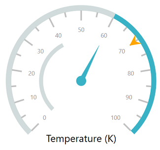

# Getting Started with SfCircularGauge

This section explains the steps required to configure the [`SfCircularGauge`](https://help.syncfusion.com/cr/wpf/Syncfusion.SfGauge.WPF~Syncfusion.UI.Xaml.Gauges.SfCircularGauge.html) and add basic elements to it using various APIs.

## Adding gauge references

You can add gauge reference using one of the following methods:

**Method 1: Adding gauge reference from nuget.org**

Syncfusion WPF components are available in [`nuget.org`](https://www.nuget.org/). To add gauge to your project, open the NuGet package manager in Visual Studio, search for [Syncfusion.SfGauge.WPF](https://www.nuget.org/packages/Syncfusion.SfGauge.WPF), and then install it.

**Method 2: Adding gauge reference from toolbox**

You can drag the circular gauge control from the  toolbox and drop it to the designer. It will automatically reference the required assemblies and add the namespace to the page. 

**Method 3: Adding gauge assemblies manually from the installed location**

If you prefer to manually reference the assemblies instead referencing from NuGet, add the following assemblies in respective projects.

Location: {Installed location}/{version}/WPF/Assemblies

You can refer to [this](https://help.syncfusion.com/wpf/control-dependencies#sfgauge) link to know about the assemblies required for adding gauge to your project.

## Initialize gauge

Import  the [`SfCircularGauge`](https://help.syncfusion.com/cr/wpf/Syncfusion.SfGauge.WPF~Syncfusion.UI.Xaml.Gauges.SfCircularGauge.html) namespace to your respective Window as follows.





xmlns:gauge ="clr-namespace:Syncfusion.UI.Xaml.Gauges;assembly=Syncfusion.SfGauge.Wpf"





using Syncfusion.UI.Xaml.Gauges;





You can initialize an empty [`SfCircularGauge`](https://help.syncfusion.com/cr/wpf/Syncfusion.SfGauge.WPF~Syncfusion.UI.Xaml.Gauges.SfCircularGauge.html) control.





<gauge:SfCircularGauge />





SfCircularGauge sfCircularGauge = new SfCircularGauge();
this.Content = sfCircularGauge;





## Adding headers

You can assign a unique header to the [`SfCircularGauge`](https://help.syncfusion.com/cr/wpf/Syncfusion.SfGauge.WPF~Syncfusion.UI.Xaml.Gauges.SfCircularGauge.html) by using the [`GaugeHeader`](https://help.syncfusion.com/cr/cref_files/wpf/Syncfusion.SfGauge.WPF~Syncfusion.UI.Xaml.Gauges.SfCircularGauge~GaugeHeader.html) property.





<gauge:SfCircularGauge Height="250"
                       Width="250"
                       HeaderAlignment="Custom"
                       GaugeHeaderPosition="0.63,0.75">
    <gauge:SfCircularGauge.GaugeHeader>
        <TextBlock Text="Speedometer"
                   Height="40"
                   Width="140"
                   FontSize="13"
                   Foreground="Black"
                   FontWeight="SemiBold" />
    </gauge:SfCircularGauge.GaugeHeader>
</gauge:SfCircularGauge>





//Initializing circular gauge
SfCircularGauge sfCircularGauge = new SfCircularGauge();
sfCircularGauge.Height = 250;
sfCircularGauge.Width = 250;

//Adding header
sfCircularGauge.HeaderAlignment = HeaderAlignment.Custom;
sfCircularGauge.GaugeHeaderPosition = new Point(0.63, 0.75);
TextBlock textBlock = new TextBlock();
textBlock.Text = "Temperature (K)";
textBlock.Height = 40;
textBlock.Width = 140;
textBlock.FontSize = 13;
textBlock.Foreground = new SolidColorBrush(Colors.Black);
textBlock.FontWeight = FontWeights.SemiBold;
sfCircularGauge.GaugeHeader = textBlock;
this.Content = sfCircularGauge;





## Configuring scales

You can configure the [`CircularScale`](https://help.syncfusion.com/cr/wpf/Syncfusion.SfGauge.WPF~Syncfusion.UI.Xaml.Gauges.CircularScale.html) elements by using the following APIs:

* StartAngle

* SweepAngle

* StartValue

* EndValue

* Interval

* TickStroke

* LabelStroke





<gauge:SfCircularGauge.Scales>
    <gauge:CircularScale />
<gauge:SfCircularGauge.Scales>





CircularScale mainscale = new CircularScale();
sfCircularGauge.Scales.Add(mainscale);





## Adding ranges

You can add ranges to the [`SfCircularGauge`](https://help.syncfusion.com/cr/wpf/Syncfusion.SfGauge.WPF~Syncfusion.UI.Xaml.Gauges.SfCircularGauge.html) by creating ranges collection using the [`CircularRange`](https://help.syncfusion.com/cr/wpf/Syncfusion.SfGauge.WPF~Syncfusion.UI.Xaml.Gauges.CircularRange.html)  property.





<gauge:SfCircularGauge>
    <gauge:SfCircularGauge.Scales>
        <gauge:CircularScale>
            <gauge:CircularScale.Ranges>
                <gauge:CircularRange StartValue="0"
                                     EndValue="60"
                                     Stroke="Gray" />
            </gauge:CircularScale.Ranges>
        </gauge:CircularScale>
    </gauge:SfCircularGauge.Scales>
</gauge:SfCircularGauge>





CircularScale mainscale = new CircularScale();
CircularRange circularRange = new CircularRange();
circularRange.StartValue = 0;
circularRange.EndValue = 60;
circularRange.Stroke = new SolidColorBrush(Colors.Gray);
mainscale.Ranges.Add(circularRange);





## Adding a needle pointer

Create a `Needle Pointer`, and associate it with a scale that is to be displayed the current value.




 
<gauge:SfCircularGauge.Scales>
    <gauge:CircularScale>
        <gauge:CircularScale.Pointers>
            <gauge:CircularPointer PointerType="NeedlePointer"
                                   Value="60"
                                   NeedleLengthFactor="0.5"
                                   NeedlePointerType="Triangle"
                                   PointerCapDiameter="12"
                                   NeedlePointerStroke="#757575"
                                   KnobFill="#757575"
                                   KnobStroke="#757575"
                                   NeedlePointerStrokeThickness="7" />
    </gauge:CircularScale>
</gauge:SfCircularGauge.Scales>





CircularScale mainscale = new CircularScale();
CircularPointer circularPointer = new CircularPointer();
circularPointer.PointerType = PointerType.NeedlePointer;
circularPointer.Value = 60;
circularPointer.NeedleLengthFactor = 0.5;
circularPointer.NeedlePointerType = NeedlePointerType.Triangle;
circularPointer.PointerCapDiameter = 12;
circularPointer.NeedlePointerStroke = (SolidColorBrush)new BrushConverter().ConvertFrom("#757575");
circularPointer.KnobFill = (SolidColorBrush)new BrushConverter().ConvertFrom("#757575");
circularPointer.KnobStroke = (SolidColorBrush)new BrushConverter().ConvertFrom("#757575");
circularPointer.NeedlePointerStrokeThickness = 7;
mainscale.Pointers.Add(circularPointer);
sfCircularGauge.Scales.Add(mainscale);





## Adding a range pointer

The `Range Pointer` provides an alternative way to indicate the current value.





<gauge:SfCircularGauge.Scales>
    <gauge:CircularScale>
        <gauge:CircularScale.Pointers>
            <gauge:CircularPointer PointerType="RangePointer"
                                   Value="40"
                                   RangePointerStrokeThickness="5"
                                   RangePointerStroke="#27beb6" />
    </gauge:CircularScale>
</gauge:SfCircularGauge.Scales>





CircularScale mainscale = new CircularScale();      
CircularPointer circularPointer1 = new CircularPointer();
circularPointer1.PointerType = PointerType.RangePointer;
circularPointer1.Value = 40;
circularPointer1.RangePointerStrokeThickness = 5;
circularPointer1.RangePointerStroke = (SolidColorBrush)new BrushConverter().ConvertFrom("#27beb6");
mainscale.Pointers.Add(circularPointer1);
sfCircularGauge.Scales.Add(mainscale);





## Adding a symbol pointer

The `Symbol Pointer` points to the current value in a scale.





<gauge:SfCircularGauge.Scales>
    <gauge:CircularScale>
        <gauge:CircularScale.Pointers>
            <gauge:CircularPointer PointerType="SymbolPointer"
                                   Value="70"
                                   SymbolPointerHeight="12"
                                   SymbolPointerWidth="12"
                                   Symbol="InvertedTriangle"
                                   SymbolPointerStroke="#757575" />
        </gauge:CircularScale.Pointers>
    </gauge:CircularScale>
</gauge:SfCircularGauge.Scales>





CircularScale mainscale = new CircularScale();      
CircularPointer circularPointer2 = new CircularPointer();
circularPointer2.PointerType = PointerType.SymbolPointer;
circularPointer2.Value = 70;
circularPointer2.SymbolPointerHeight = 12;
circularPointer2.SymbolPointerWidth = 12;
circularPointer2.Symbol = Symbol.InvertedTriangle;
circularPointer2.SymbolPointerStroke = (SolidColorBrush)new BrushConverter().ConvertFrom("#757575");
mainscale.Pointers.Add(circularPointer2);
sfCircularGauge.Scales.Add(mainscale);





The following code example is the complete code of the previous configurations.





<gauge:SfCircularGauge Height="250"
                       Width="250"
                       HeaderAlignment="Custom"
                       GaugeHeaderPosition="0.63,0.75">

    <gauge:SfCircularGauge.GaugeHeader>
        <TextBlock Text="Speedometer"
                   Height="40"
                   Width="140"
                   FontSize="13"
                   Foreground="Black"
                   FontWeight="SemiBold" />
    </gauge:SfCircularGauge.GaugeHeader>

    <gauge:SfCircularGauge.Scales>
        <gauge:CircularScale ShowRim="True"
                             RimStroke="LightGray"
                             RimStrokeThickness="3"
                             LabelOffset="0.1">

            <gauge:CircularScale.MajorTickSettings>
                <gauge:MajorTickSetting Length="10"
                                        StrokeThickness="1" />
            </gauge:CircularScale.MajorTickSettings>

            <gauge:CircularScale.MinorTickSettings>
                <gauge:MinorTickSetting Length="5"
                                        StrokeThickness="1" />
            </gauge:CircularScale.MinorTickSettings>

            <gauge:CircularScale.Ranges>
                <gauge:CircularRange StartValue="0"
                                     EndValue="60"
                                     Stroke="Gray" />
            </gauge:CircularScale.Ranges>
            <gauge:CircularScale.Pointers>
                <gauge:CircularPointer PointerType="NeedlePointer"
                                       Value="60"
                                       NeedleLengthFactor="0.5"
                                       NeedlePointerType="Triangle"
                                       PointerCapDiameter="12"
                                       NeedlePointerStroke="#757575"
                                       KnobFill="#757575"
                                       KnobStroke="#757575"
                                       NeedlePointerStrokeThickness="7" />
                <gauge:CircularPointer PointerType="RangePointer"
                                       Value="40"
                                       RangePointerStrokeThickness="5"
                                       RangePointerStroke="#27beb6" />
                <gauge:CircularPointer PointerType="SymbolPointer"
                                       Value="70"
                                       SymbolPointerHeight="12"
                                       SymbolPointerWidth="12"
                                       Symbol="InvertedTriangle"
                                       SymbolPointerStroke="#757575" />
            </gauge:CircularScale.Pointers>
        </gauge:CircularScale>
    </gauge:SfCircularGauge.Scales>
</gauge:SfCircularGauge>





//Initializing circular gauge
SfCircularGauge sfCircularGauge = new SfCircularGauge();
sfCircularGauge.Height = 250;
sfCircularGauge.Width = 250;

//Adding header
sfCircularGauge.HeaderAlignment = HeaderAlignment.Custom;
sfCircularGauge.GaugeHeaderPosition = new Point(0.63, 0.75);
TextBlock textBlock = new TextBlock();
textBlock.Text = "Temperature (K)";
textBlock.Height = 40;
textBlock.Width = 140;
textBlock.FontSize = 13;
textBlock.Foreground = new SolidColorBrush(Colors.Black);
textBlock.FontWeight = FontWeights.SemiBold;
sfCircularGauge.GaugeHeader = textBlock;

//Initializing scales for circular gauge
CircularScale mainscale = new CircularScale();
mainscale.RimStroke = new SolidColorBrush(Colors.LightGray);
mainscale.RimStrokeThickness = 3;
mainscale.LabelOffset = 0.1;

MajorTickSetting majorTickSetting = new MajorTickSetting();
majorTickSetting.StrokeThickness = 1;
majorTickSetting.Length = 10;
mainscale.MajorTickSettings = majorTickSetting;

MinorTickSetting minorTickSetting = new MinorTickSetting();
minorTickSetting.StrokeThickness = 1;
minorTickSetting.Length = 5;
mainscale.MinorTickSettings = minorTickSetting;

//Adding range
CircularRange circularRange = new CircularRange();
circularRange.StartValue = 0;
circularRange.EndValue = 60;
circularRange.Stroke = new SolidColorBrush(Colors.Gray);
mainscale.Ranges.Add(circularRange);

//Adding needle pointer
CircularPointer circularPointer = new CircularPointer();
circularPointer.PointerType = PointerType.NeedlePointer;
circularPointer.Value = 60;
circularPointer.NeedleLengthFactor = 0.5;
circularPointer.NeedlePointerType = NeedlePointerType.Triangle;
circularPointer.PointerCapDiameter = 12;
circularPointer.NeedlePointerStroke = (SolidColorBrush)new BrushConverter().ConvertFrom("#757575");
circularPointer.KnobFill = (SolidColorBrush)new BrushConverter().ConvertFrom("#757575");
circularPointer.KnobStroke = (SolidColorBrush)new BrushConverter().ConvertFrom("#757575");
circularPointer.NeedlePointerStrokeThickness = 7;
mainscale.Pointers.Add(circularPointer);

//Adding range pointer
CircularPointer circularPointer1 = new CircularPointer();
circularPointer1.PointerType = PointerType.RangePointer;
circularPointer1.Value = 40;
circularPointer1.RangePointerStrokeThickness = 5;
circularPointer1.RangePointerStroke = (SolidColorBrush)new BrushConverter().ConvertFrom("#27beb6");
mainscale.Pointers.Add(circularPointer1);

//Adding symbol pointer
CircularPointer circularPointer2 = new CircularPointer();
circularPointer2.PointerType = PointerType.SymbolPointer;
circularPointer2.Value = 70;
circularPointer2.SymbolPointerHeight = 12;
circularPointer2.SymbolPointerWidth = 12;
circularPointer2.Symbol = Symbol.InvertedTriangle;
circularPointer2.SymbolPointerStroke = (SolidColorBrush)new BrushConverter().ConvertFrom("#757575");
mainscale.Pointers.Add(circularPointer2);

sfCircularGauge.Scales.Add(mainscale);

this.Content = sfCircularGauge;





The following screenshot illustrates the result of the previous codes.

You can find the complete getting started sample from this [`link`](https://github.com/SyncfusionExamples/WPF-UG-getting-started-samples/tree/master/GettingStartedCircularGauge).