# Pointer support in SfCircularGauge

Pointers are used to indicate values on the scale. Pointer value can be modified using the [`Value`](https://help.syncfusion.com/cr/wpf/Syncfusion.UI.Xaml.Gauges.CircularPointer.html#Syncfusion_UI_Xaml_Gauges_CircularPointer_Value) property.

There are three types of pointers. You can choose a pointer using the [`PointerType`](https://help.syncfusion.com/cr/wpf/Syncfusion.UI.Xaml.Gauges.CircularPointer.html#Syncfusion_UI_Xaml_Gauges_CircularPointer_PointerType) property. 

## Needle pointer

Indicate a current value by using the highly customizable needle-type element. A needle pointer contains three parts, a needle,knob and tail that can be placed on a gauge to mark values. 





    <gauge:SfCircularGauge >

    <gauge:SfCircularGauge.Scales>

    <gauge:CircularScale >

    <gauge:CircularScale.Pointers>

    <gauge:CircularPointer PointerType="NeedlePointer"/>

    </gauge:CircularScale.Pointers>

    </gauge:CircularScale>

    </gauge:SfCircularGauge.Scales>

    </gauge:SfCircularGauge>





SfCircularGauge sfCircularGauge = new SfCircularGauge();

CircularScale mainscale = new CircularScale();

CircularPointer circularPointer = new CircularPointer();

circularPointer.PointerType = PointerType.NeedlePointer;

mainscale.Pointers.Add(circularPointer);

sfCircularGauge.Scales.Add(mainscale);





### Different types of needle pointer 

The appearance of the needle pointer can be customized using the [`NeedlePointerType`](https://help.syncfusion.com/cr/wpf/Syncfusion.UI.Xaml.Gauges.CircularPointer.html#Syncfusion_UI_Xaml_Gauges_CircularPointer_NeedlePointerType) property. The default value of this property is Rectangle.
The `NeedlePointerType` is an `enum` property that includes the following options:

1.	Rectangle

2.	Triangle

3.	Tapered

4.	Arrow





    <gauge:SfCircularGauge >

    <gauge:SfCircularGauge.Scales>

    <gauge:CircularScale >

    <gauge:CircularScale.Pointers>

    <gauge:CircularPointer PointerType="NeedlePointer" 
                           NeedlePointerType="Triangle"/>

    </gauge:CircularScale.Pointers>

    </gauge:CircularScale>

    </gauge:SfCircularGauge.Scales>

    </gauge:SfCircularGauge>





SfCircularGauge sfCircularGauge = new SfCircularGauge();

CircularScale mainscale = new CircularScale();

CircularPointer circularPointer = new CircularPointer();

circularPointer.PointerType = PointerType.NeedlePointer;

circularPointer.NeedlePointerType = NeedlePointerType.Triangle;

mainscale.Pointers.Add(circularPointer);

sfCircularGauge.Scales.Add(mainscale);





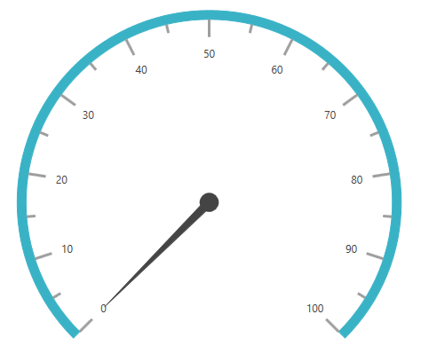

### Needle pointer customization

The length of a needle is controlled using the [`NeedleLengthFactor`](https://help.syncfusion.com/cr/wpf/Syncfusion.UI.Xaml.Gauges.CircularPointer.html#Syncfusion_UI_Xaml_Gauges_CircularPointer_NeedleLengthFactor) property. The minimum and maximum bounds of the `NeedleLengthFactor` property is 0 to 1. The needle’s UI is customized using the [`NeedlePointerStroke`](https://help.syncfusion.com/cr/wpf/Syncfusion.UI.Xaml.Gauges.CircularPointer.html#Syncfusion_UI_Xaml_Gauges_CircularPointer_NeedlePointerStroke) and [`NeedlePointerStrokeThickness`](https://help.syncfusion.com/cr/wpf/Syncfusion.UI.Xaml.Gauges.CircularPointer.html#Syncfusion_UI_Xaml_Gauges_CircularPointer_NeedlePointerStrokeThickness) properties. The size of the pointer cap can be modified by changing the [`PointerCapDiameter`](https://help.syncfusion.com/cr/wpf/Syncfusion.UI.Xaml.Gauges.CircularPointer.html#Syncfusion_UI_Xaml_Gauges_CircularPointer_PointerCapDiameter) property.





    <gauge:SfCircularGauge >

    <gauge:SfCircularGauge.Scales>

    <gauge:CircularScale >

    <gauge:CircularScale.Pointers>

    <gauge:CircularPointer PointerType="NeedlePointer" NeedlePointerType="Triangle" 
                           NeedlePointerStroke="DeepSkyBlue" PointerCapDiameter="20" KnobStroke="DeepSkyBlue"
			   KnobFill="DeepSkyBlue"
                           NeedleLengthFactor="0.5" NeedlePointerStrokeThickness="10"/>

    </gauge:CircularScale.Pointers>

    </gauge:CircularScale>

    </gauge:SfCircularGauge.Scales>

    </gauge:SfCircularGauge>





SfCircularGauge sfCircularGauge = new SfCircularGauge();

CircularScale mainscale = new CircularScale();

CircularPointer circularPointer = new CircularPointer();

circularPointer.PointerType = PointerType.NeedlePointer;

circularPointer.NeedlePointerType = NeedlePointerType.Triangle;

circularPointer.NeedlePointerStroke = new SolidColorBrush(Colors.DeepSkyBlue);

circularPointer.NeedlePointerStrokeThickness =10;

circularPointer.NeedleLengthFactor = 0.5;

circularPointer.PointerCapDiameter = 20;

circularPointer.KnobStroke = new SolidColorBrush(Colors.DeepSkyBlue);

circularPointer.KnobFill = new SolidColorBrush(Colors.DeepSkyBlue);

mainscale.Pointers.Add(circularPointer);

sfCircularGauge.Scales.Add(mainscale);





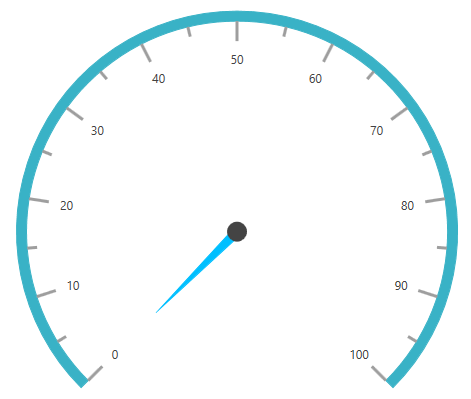

### Needle pointer knob customization

You can able to customize the needle pointer knob size, fill, stroke and stroke thickness by using [`KnobRadiusFactor`](https://help.syncfusion.com/cr/wpf/Syncfusion.UI.Xaml.Gauges.CircularPointer.html#Syncfusion_UI_Xaml_Gauges_CircularPointer_KnobRadiusFactor), [`KnobFill`](https://help.syncfusion.com/cr/wpf/Syncfusion.UI.Xaml.Gauges.CircularPointer.html#Syncfusion_UI_Xaml_Gauges_CircularPointer_KnobFill), [`KnobStroke`](https://help.syncfusion.com/cr/wpf/Syncfusion.UI.Xaml.Gauges.CircularPointer.html#Syncfusion_UI_Xaml_Gauges_CircularPointer_KnobStroke), [`KnobStrokeThickness`](https://help.syncfusion.com/cr/wpf/Syncfusion.UI.Xaml.Gauges.CircularPointer.html#Syncfusion_UI_Xaml_Gauges_CircularPointer_KnobStrokeThickness) properties. 





   <gauge:SfCircularGauge >
            <gauge:SfCircularGauge.Scales>
                <gauge:CircularScale>
                    <gauge:CircularScale.Pointers>
                        <gauge:CircularPointer PointerType="NeedlePointer" 
                                               KnobStrokeThickness="5"
                                               KnobRadiusFactor="0.2"
                                               KnobStroke="DeepSkyBlue"
                                               KnobFill="White"
                                               Value="60"/>
                    </gauge:CircularScale.Pointers>
                </gauge:CircularScale>
            </gauge:SfCircularGauge.Scales>
        </gauge:SfCircularGauge>





           SfCircularGauge sfCircularGauge = new SfCircularGauge();

            CircularScale mainscale = new CircularScale();

            CircularPointer circularPointer = new CircularPointer();

            circularPointer.PointerType = PointerType.NeedlePointer;

            circularPointer.KnobStroke = new SolidColorBrush(Colors.DeepSkyBlue);

            circularPointer.KnobRadiusFactor = 0.2;

            circularPointer.KnobStrokeThickness = 5;

            circularPointer.KnobFill = new SolidColorBrush(Colors.White);

            circularPointer.Value = 60;

            mainscale.Pointers.Add(circularPointer);

            sfCircularGauge.Scales.Add(mainscale);





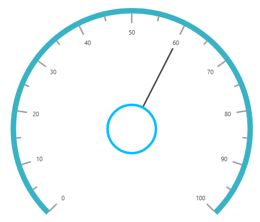

### Setting visibility of needle pointer

The visibility of the needle pointer can be set using the [`NeedlePointerVisibility`](https://help.syncfusion.com/cr/wpf/Syncfusion.UI.Xaml.Gauges.CircularPointer.html#Syncfusion_UI_Xaml_Gauges_CircularPointer_NeedlePointerVisibility) property.





    <gauge:SfCircularGauge >

    <gauge:SfCircularGauge.Scales>

    <gauge:CircularScale >

    <gauge:CircularScale.Pointers>

    <gauge:CircularPointer NeedlePointerVisibility="Hidden"/>

    </gauge:CircularScale.Pointers>

    </gauge:CircularScale>

    </gauge:SfCircularGauge.Scales>

    </gauge:SfCircularGauge>





SfCircularGauge sfCircularGauge = new SfCircularGauge();

CircularScale mainscale = new CircularScale();

CircularPointer circularPointer = new CircularPointer();

circularPointer.NeedlePointerVisibility = Visibility.Hidden;

mainscale.Pointers.Add(circularPointer);

sfCircularGauge.Scales.Add(mainscale);





### Setting tail for needle pointer

Tail of the needle pointer can be customized by using the [`TailFill`](https://help.syncfusion.com/cr/wpf/Syncfusion.UI.Xaml.Gauges.CircularPointer.html#Syncfusion_UI_Xaml_Gauges_CircularPointer_TailFill), [`TailLengthFactor`](https://help.syncfusion.com/cr/wpf/Syncfusion.UI.Xaml.Gauges.CircularPointer.html#Syncfusion_UI_Xaml_Gauges_CircularPointer_TailLengthFactor), [`TailStroke`](https://help.syncfusion.com/cr/wpf/Syncfusion.UI.Xaml.Gauges.CircularPointer.html#Syncfusion_UI_Xaml_Gauges_CircularPointer_TailStroke), and [`TailStrokeThickness`](https://help.syncfusion.com/cr/wpf/Syncfusion.UI.Xaml.Gauges.CircularPointer.html#Syncfusion_UI_Xaml_Gauges_CircularPointer_TailStrokeThickness) properties.

* `TailFill` - Fill color to needle pointer’s tail.

* `TailLengthFactor` - Length factor of needle pointer’s tail. It’s range is 0 to 1.

* `TailStroke` - Stroke to needle pointer’s tail.

* `TailStrokeThickness` - Set the stroke thickness to needle pointer’s tail.





    <gauge:SfCircularGauge >
    <gauge:SfCircularGauge.Scales>
    <gauge:CircularScale >
      <gauge:CircularScale.Pointers>
            <gauge:CircularPointer 
			Value="30" 
			PointerType="NeedlePointer"
            TailLengthFactor="0.3"
			TailStroke="#ed7d31"
			TailFill="#ed7d31"
			NeedlePointerStrokeThickness="3"
			NeedlePointerType="Tapered" 
			KnobFill="White"     
			NeedlePointerVisibility="Visible"
			NeedlePointerStroke="#ed7d31" />
      <gauge:CircularPointer
           Value="50"
	       PointerType="NeedlePointer"
		   TailLengthFactor="0.4"
	       TailStroke="#ed7d31"
           TailFill="#ed7d31"
           KnobFill="White"
           NeedlePointerStrokeThickness="3"
           NeedlePointerType="Tapered" 
           NeedlePointerVisibility="Visible"
           NeedlePointerStroke="#ed7d31"  />
    </gauge:CircularScale.Pointers>
    </gauge:CircularScale>
    </gauge:SfCircularGauge.Scales>
    </gauge:SfCircularGauge>





    SfCircularGauge sfCircularGauge = new SfCircularGauge();
            CircularScale mainscale = new CircularScale();
            CircularPointer circularPointer = new CircularPointer();
            circularPointer.PointerType = PointerType.NeedlePointer;
            circularPointer.Value = 30;
            circularPointer.TailLengthFactor = 0.3;
            circularPointer.TailStroke = new SolidColorBrush(Color.FromRgb(237,125,49));
            circularPointer.TailFill = new SolidColorBrush(Color.FromRgb(237, 125, 49));
            circularPointer.NeedlePointerStrokeThickness = 3;
            circularPointer.NeedlePointerType = NeedlePointerType.Tapered;
            circularPointer.KnobFill = new SolidColorBrush(Colors.White);
            circularPointer.NeedlePointerVisibility = Visibility.Visible;
            circularPointer.NeedlePointerStroke = new SolidColorBrush(Color.FromRgb(237, 125, 49));
            mainscale.Pointers.Add(circularPointer);
            CircularPointer circularPointer2 = new CircularPointer();
            circularPointer2.PointerType = PointerType.NeedlePointer;
            circularPointer2.Value = 50;
            circularPointer2.TailLengthFactor = 0.3;
            circularPointer2.TailStroke = new SolidColorBrush(Color.FromRgb(237, 125, 49));
            circularPointer2.TailFill = new SolidColorBrush(Color.FromRgb(237, 125, 49));
            circularPointer2.NeedlePointerStrokeThickness = 3;
            circularPointer2.NeedlePointerType = NeedlePointerType.Tapered;
            circularPointer2.KnobFill = new SolidColorBrush(Colors.White);
            circularPointer2.NeedlePointerVisibility = Visibility.Visible;
            circularPointer2.NeedlePointerStroke = new SolidColorBrush(Color.FromRgb(237, 125, 49));
            mainscale.Pointers.Add(circularPointer2);
            sfCircularGauge.Scales.Add(mainscale);





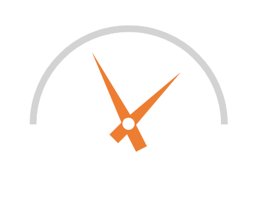

## Range pointer

A range pointer is used to indicate the current value relative to the start value of a circular scale.





    <gauge:SfCircularGauge >

    <gauge:SfCircularGauge.Scales>

    <gauge:CircularScale >

    <gauge:CircularScale.Pointers>

    <gauge:CircularPointer PointerType="RangePointer" Value="50" />

    </gauge:CircularScale.Pointers>

    </gauge:CircularScale>

    </gauge:SfCircularGauge.Scales>

    </gauge:SfCircularGauge>





SfCircularGauge sfCircularGauge = new SfCircularGauge();

CircularScale mainscale = new CircularScale();

CircularPointer circularPointer = new CircularPointer();

circularPointer.PointerType = PointerType.RangePointer;

circularPointer.Value = 50;

mainscale.Pointers.Add(circularPointer);

sfCircularGauge.Scales.Add(mainscale);





### Range pointer customization

The range pointer appearance is customized using the [`RangePointerStroke`](https://help.syncfusion.com/cr/wpf/Syncfusion.UI.Xaml.Gauges.CircularPointer.html#Syncfusion_UI_Xaml_Gauges_CircularPointer_RangePointerStroke) and [`RangePointerStrokeThickness`](https://help.syncfusion.com/cr/wpf/Syncfusion.UI.Xaml.Gauges.CircularPointer.html#Syncfusion_UI_Xaml_Gauges_CircularPointer_RangePointerStrokeThickness) properties.  





    <gauge:SfCircularGauge >

    <gauge:SfCircularGauge.Scales>

    <gauge:CircularScale >

    <gauge:CircularScale.Pointers>

    <gauge:CircularPointer PointerType="RangePointer" Value="50" 
                           RangePointerStroke="DarkCyan" RangePointerStrokeThickness="20"/>

    </gauge:CircularScale.Pointers>

    </gauge:CircularScale>

    </gauge:SfCircularGauge.Scales>

    </gauge:SfCircularGauge>





SfCircularGauge sfCircularGauge = new SfCircularGauge();

CircularScale mainscale = new CircularScale();

CircularPointer circularPointer = new CircularPointer();

circularPointer.PointerType = PointerType.RangePointer;

circularPointer.Value = 50;

circularPointer.RangePointerStroke = new SolidColorBrush(Colors.DarkCyan);

circularPointer.RangePointerStrokeThickness = 20;

mainscale.Pointers.Add(circularPointer);

sfCircularGauge.Scales.Add(mainscale);





### Setting visibility for range pointer

The [`RangePointerVisibility`](https://help.syncfusion.com/cr/wpf/Syncfusion.UI.Xaml.Gauges.CircularPointer.html#Syncfusion_UI_Xaml_Gauges_CircularPointer_RangePointerVisibility) property is used to set the visibility of the range pointer.





    <gauge:SfCircularGauge >

    <gauge:SfCircularGauge.Scales>

    <gauge:CircularScale >

    <gauge:CircularScale.Pointers>

    <gauge:CircularPointer RangePointerVisibility="Hidden"/>

    </gauge:CircularScale.Pointers>

    </gauge:CircularScale>
                    
    </gauge:SfCircularGauge.Scales>

    </gauge:SfCircularGauge>





SfCircularGauge sfCircularGauge = new SfCircularGauge();

CircularScale mainscale = new CircularScale();

CircularPointer circularPointer = new CircularPointer();

circularPointer.RangePointerVisibility = Visibility.Hidden;

mainscale.Pointers.Add(circularPointer);

sfCircularGauge.Scales.Add(mainscale);





### Setting position for range pointer

The `RangePointer` can be positioned anywhere in the gauge by the following ways:

1. Setting direct `RangePointerPosition` property to place pointer inside or outside the gauge.  
2. Setting `Offset` and `RangePointerStrokeThickness` properties. This positions is responsive for all the window size. But `RangePointer` width is fixed. 
3. Setting `RangeStartOffset` and `RangeEndOffset` properties. This position and width are responsive to all size of the window.

#### Setting direct range pointer position

You can directly place the range pointer inside, outside or cross the scale by selecting one of the below option available in the [`RangePointerPosition`](https://help.syncfusion.com/cr/wpf/Syncfusion.UI.Xaml.Gauges.CircularScale.html#Syncfusion_UI_Xaml_Gauges_CircularScale_RangePointerPosition) property. 

1.	Inside (Default)

2.	Outside

3.	Cross

4.	Custom





    <gauge:SfCircularGauge >

    <gauge:SfCircularGauge.Scales>

    <gauge:CircularScale RangePointerPosition="Outside">

    <gauge:CircularScale.Pointers>

    <gauge:CircularPointer PointerType="RangePointer" 
                           RangePointerStroke="HotPink" Value="60"/>

    </gauge:CircularScale.Pointers>

    </gauge:CircularScale>

    </gauge:SfCircularGauge.Scales>

    </gauge:SfCircularGauge>





SfCircularGauge sfCircularGauge = new SfCircularGauge();

CircularScale mainscale = new CircularScale();

mainscale.RangePointerPosition = RangePointerPosition.Outside;

CircularPointer circularPointer = new CircularPointer();

circularPointer.PointerType = PointerType.RangePointer;

circularPointer.RangePointerStroke = new SolidColorBrush(Colors.HotPink);

circularPointer.Value = 60;

mainscale.Pointers.Add(circularPointer);

sfCircularGauge.Scales.Add(mainscale);





#### Setting offset range pointer position with fixed width	

This ways allows to place the range pointer anywhere inside the gauge. First, set the [`RangePointerPosition`](https://help.syncfusion.com/cr/wpf/Syncfusion.UI.Xaml.Gauges.CircularScale.html#Syncfusion_UI_Xaml_Gauges_CircularScale_RangePointerPosition) to custom, and then set the [`Offset`](https://help.syncfusion.com/cr/wpf/Syncfusion.UI.Xaml.Gauges.CircularPointer.html#Syncfusion_UI_Xaml_Gauges_CircularPointer_Offset) property for required position. `Offset` value should be from 0 to 1. This positions is responsive for all the window size. But `RangePointer` width is fixed.





    <gauge:SfCircularGauge >
            <gauge:SfCircularGauge.Scales >
                <gauge:CircularScale  x:Name="scale" RangePointerPosition="Custom">
                    <gauge:CircularScale.Pointers>
                        <gauge:CircularPointer PointerType="RangePointer" Offset="0.5" 
                                              RangePointerStrokeThickness="20"
                                               RangePointerStroke="LightGray" Value="60"/>
                    </gauge:CircularScale.Pointers>
                </gauge:CircularScale>
            </gauge:SfCircularGauge.Scales>
        </gauge:SfCircularGauge>





SfCircularGauge sfCircularGauge = new SfCircularGauge();

CircularScale mainscale = new CircularScale();

mainscale.RangePointerPosition = RangePointerPosition.Custom;

CircularPointer circularPointer = new CircularPointer();

circularPointer.PointerType = PointerType.RangePointer;

circularPointer.Offset = 0.5;

circularPointer.RangePointerStroke = new SolidColorBrush(Colors.LightGray);

circularPointer.RangePointerStrokeThickness = 20;

circularPointer.Value = 60;

mainscale.Pointers.Add(circularPointer);

sfCircularGauge.Scales.Add(mainscale);





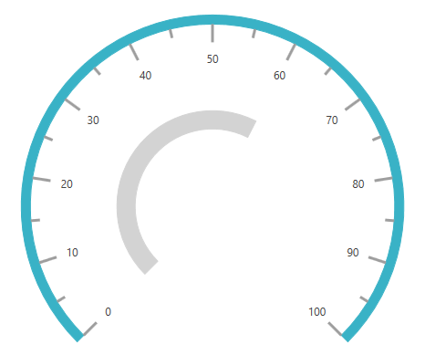

#### Setting start and end position of the range pointer with offset

[`RangeStartOffset`](https://help.syncfusion.com/cr/wpf/Syncfusion.UI.Xaml.Gauges.CircularPointer.html#Syncfusion_UI_Xaml_Gauges_CircularPointer_RangeStartOffset) and [`RangeEndOffset`](https://help.syncfusion.com/cr/wpf/Syncfusion.UI.Xaml.Gauges.CircularPointer.html#Syncfusion_UI_Xaml_Gauges_CircularPointer_RangeEndOffset) properties with `RangePointerPosition` is custom allows to place the range pointer anywhere inside the gauge. First, set the `RangePointerPosition` to custom, and then set the `RangeStartOffset` and `RangeEndOffset` properties for required position. Offset value should be from 0 to 1. This position and width are responsive to all size of the window.





    <gauge:SfCircularGauge >
        <gauge:SfCircularGauge.Scales >
            <gauge:CircularScale  x:Name="scale" RangePointerPosition="Custom">
                <gauge:CircularScale.Pointers>
                    <gauge:CircularPointer PointerType="RangePointer" 
					   RangeStartOffset="0.5"  RangeEndOffset="0.7" 
                                           RangePointerStroke="LightGray" Value="90"/>
                </gauge:CircularScale.Pointers>
            </gauge:CircularScale>
        </gauge:SfCircularGauge.Scales>
    </gauge:SfCircularGauge>





            SfCircularGauge sfCircularGauge = new SfCircularGauge();

            CircularScale mainscale = new CircularScale();

            mainscale.RangePointerPosition = RangePointerPosition.Custom;

            CircularPointer circularPointer = new CircularPointer();

            circularPointer.PointerType = PointerType.RangePointer;

            circularPointer.RangeStartOffset = 0.5;

            circularPointer.RangeEndOffset = 0.7;

            circularPointer.RangePointerStroke = new SolidColorBrush(Colors.LightGray);

            circularPointer.Value = 90;

            mainscale.Pointers.Add(circularPointer);

            sfCircularGauge.Scales.Add(mainscale);





### Range pointer start customization

The [`RangeStart`](https://help.syncfusion.com/cr/wpf/Syncfusion.UI.Xaml.Gauges.CircularPointer.html#Syncfusion_UI_Xaml_Gauges_CircularPointer_RangeStart) property used to customize the range pointer start position in scale. 





    <gauge:SfCircularGauge >
            <gauge:SfCircularGauge.Scales >
                <gauge:CircularScale  x:Name="scale" RangePointerPosition="Custom">
                    <gauge:CircularScale.Pointers>
                        <gauge:CircularPointer PointerType="RangePointer" 
                                               RangeStart="20"
                                               RangeStartOffset="0.5"  RangeEndOffset="0.7"
                                           RangePointerStroke="LightGray" Value="90"/>
                    </gauge:CircularScale.Pointers>
                </gauge:CircularScale>
            </gauge:SfCircularGauge.Scales>
        </gauge:SfCircularGauge>





            SfCircularGauge sfCircularGauge = new SfCircularGauge();

            CircularScale mainscale = new CircularScale();

            mainscale.RangePointerPosition = RangePointerPosition.Custom;

            CircularPointer circularPointer = new CircularPointer();

            circularPointer.PointerType = PointerType.RangePointer;

            circularPointer.RangeStartOffset = 0.5;

            circularPointer.RangeEndOffset = 0.7;

	    circularPointer.RangeStart = 20;

            circularPointer.RangePointerStroke = new SolidColorBrush(Colors.LightGray);

            circularPointer.Value = 90;

            mainscale.Pointers.Add(circularPointer);

            sfCircularGauge.Scales.Add(mainscale);





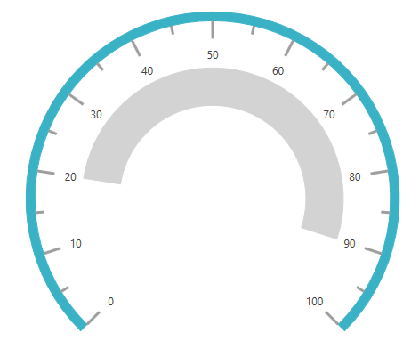

### Setting range cap for range pointer

The [`RangeCap`](https://help.syncfusion.com/cr/wpf/Syncfusion.UI.Xaml.Gauges.CircularPointer.html#Syncfusion_UI_Xaml_Gauges_CircularPointer_RangeCap) property provides options to position the range cap of the RangePointer, which contains the start, end, both, and none options. The `RangeCap` property is an enum property.





    <gauge:SfCircularGauge >
        <gauge:SfCircularGauge.Scales>
              <gauge:CircularScale x:Name="scale" SweepAngle="360" RimStroke="LightGray"  RimStrokeThickness="30" RangePointerPosition="Custom">
                   <gauge:CircularScale.Pointers>
                        <gauge:CircularPointer PointerType="RangePointer" RangePointerStrokeThickness="30" RangeCap="Both" 
                                               RangePointerStroke="LightSkyBlue" Value="75"/>
                    </gauge:CircularScale.Pointers>
              </gauge:CircularScale>
         </gauge:SfCircularGauge.Scales>
    </gauge:SfCircularGauge>





            SfCircularGauge sfCircularGauge = new SfCircularGauge();
            CircularScale mainscale = new CircularScale();
            mainscale.RangePointerPosition = RangePointerPosition.Custom;
            mainscale.SweepAngle = 360;
            mainscale.RimStroke = new SolidColorBrush(Colors.LightGray);
            mainscale.RimStrokeThickness = 30;
            CircularPointer circularPointer = new CircularPointer();
            circularPointer.PointerType = PointerType.RangePointer;
            circularPointer.RangePointerStrokeThickness = 30;
            circularPointer.RangeCap = RangeCap.Both;
            circularPointer.RangePointerStroke = new SolidColorBrush(Colors.LightSkyBlue);
            circularPointer.Value = 75;
            mainscale.Pointers.Add(circularPointer);
            sfCircularGauge.Scales.Add(mainscale);





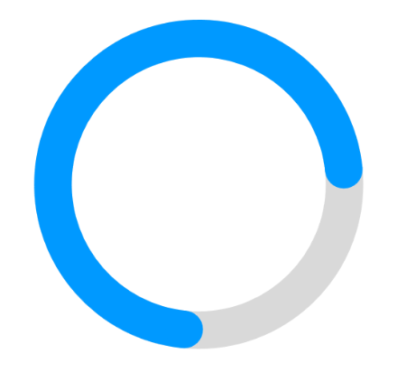

## Symbol pointer

In symbol pointer, the value is pointed out using a symbol on the scale. The symbol is an enum property that provides symbol options for the symbol pointer, which contains several shapes such as rectangle, ellipse, and triangle.





    <gauge:SfCircularGauge >

    <gauge:SfCircularGauge.Scales>

    <gauge:CircularScale>

    <gauge:CircularScale.Pointers>

    <gauge:CircularPointer PointerType="SymbolPointer"  Value="60"/>

    </gauge:CircularScale.Pointers>

    </gauge:CircularScale>

    </gauge:SfCircularGauge.Scales>

    </gauge:SfCircularGauge>





SfCircularGauge sfCircularGauge = new SfCircularGauge();

CircularScale mainscale = new CircularScale();

CircularPointer circularPointer = new CircularPointer();

circularPointer.PointerType = PointerType.SymbolPointer;

circularPointer.Value = 60;

mainscale.Pointers.Add(circularPointer);

sfCircularGauge.Scales.Add(mainscale);





### Symbol pointer types

You can modify the symbol pointer view by choosing available options in [`Symbol`](https://help.syncfusion.com/cr/wpf/Syncfusion.UI.Xaml.Gauges.Symbol.html) property. Please find the types of symbol below. 

1. Arrow
2. Cross
3. Custom
4. Diamond
5. Ellipse
6. Hexagon
7. InvertedArrow
8. InvertedTriangle
9. Pentagon
10. Rectangle
11. RoundedRectangle
12. Triangle





     <gauge:SfCircularGauge >

            <gauge:SfCircularGauge.Scales>

                <gauge:CircularScale>

                    <gauge:CircularScale.Pointers>

                        <gauge:CircularPointer PointerType="SymbolPointer"  
                                               Symbol="Pentagon"
                                               Value="60"/>

                    </gauge:CircularScale.Pointers>

                </gauge:CircularScale>

            </gauge:SfCircularGauge.Scales>

        </gauge:SfCircularGauge>





           SfCircularGauge sfCircularGauge = new SfCircularGauge();

            CircularScale mainscale = new CircularScale();

            CircularPointer circularPointer = new CircularPointer();

            circularPointer.PointerType = PointerType.SymbolPointer;

            circularPointer.Symbol = Symbol.Pentagon;

            circularPointer.Value = 60;

            mainscale.Pointers.Add(circularPointer);

            sfCircularGauge.Scales.Add(mainscale);

            grid.Children.Add(sfCircularGauge);





### Setting custom symbol pointer

You can customize the `SymbolPointer` by setting [`Symbol`](https://help.syncfusion.com/cr/wpf/Syncfusion.UI.Xaml.Gauges.CircularPointer.html#Syncfusion_UI_Xaml_Gauges_CircularPointer_Symbol) as `Custom` and defining [`SymbolTemplate`](https://help.syncfusion.com/cr/wpf/Syncfusion.UI.Xaml.Gauges.CircularPointer.html#Syncfusion_UI_Xaml_Gauges_CircularPointer_SymbolPointerTemplate). Please find the custom template section below. 



<gauge:SfCircularGauge >
            <gauge:SfCircularGauge.Scales >
                <gauge:CircularScale  x:Name="scale" 
                                      RangePointerPosition="Custom">
                    <gauge:CircularScale.Pointers>
                        <gauge:CircularPointer PointerType="SymbolPointer"
                                               Symbol="Custom"
                                               Value="60">
                            <gauge:CircularPointer.SymbolPointerTemplate>
                                <DataTemplate>
                                    <Grid>
                                        <Grid Name="backgroundGrid" Width="24" Height="24" Visibility="Visible">
                                            <Ellipse Fill="White" Name="Fill" Visibility="Visible" />
                                        </Grid>
                                        <Path Stretch="Uniform" Fill="Black" Width="24" Height="24" 
                                              Margin="0,0,0,0" RenderTransformOrigin="0.5,0.5">
                                            <Path.Data>
                                                <PathGeometry FillRule="Nonzero" 
                                                              Figures="M23.9296875,10.6165618896484L20.759765625,11.2200794219971 18.09375,
                            13.0306243896484 16.283203125,15.6966400146484 15.6796875,18.8665618896484 16.283203125,
                            22.0423431396484 18.09375,24.7259368896484 20.759765625,26.5540618896484 23.9296875,27.1634368896484 27.1025371551514,
                            26.5540618896484 29.77734375,24.7259368896484 31.5966796875,22.0423431396484 32.203125,18.8665618896484 31.5966796875,
                            15.6966400146484 29.77734375,13.0306243896484 27.1025371551514,11.2200794219971 23.9296875,10.6165618896484z M25.265625,
                            7.35874938964844L26.6953125,9.86656188964844 29.3671875,8.64781188964844 29.765625,11.4837493896484 32.7421875,
                            11.2728118896484 32.015625,14.1790618896484 34.921875,14.9759368896484 33.1875,17.4134368896484 35.578125,
                            19.1478118896484 33.140625,20.7884368896484 34.640625,23.3665618896484 31.8046875,23.9759368896484 32.3203125,
                            26.9759368896484 29.4375,26.5540618896484 28.921875,29.4837493896484 26.25,27.9603118896484 24.75,
                            30.4681243896484 22.8046875,28.2181243896484 20.5078125,30.0228118896484 19.5703125,27.1634368896484 16.640625,
                            28.0306243896484 16.875,25.1009368896484 13.875,24.7728118896484 15.140625,22.1478118896484 12.421875,
                            20.7415618896484 14.5546875,18.6790618896484 12.4921875,16.5228118896484 15.2578125,15.3040618896484 14.203125,
                            12.5384368896484 17.1328125,12.3978118896484 17.1328125,9.42124938964844 19.921875,10.4056243896484 21.046875,
                            7.61656188964844 23.296875,9.49156188964844 25.265625,7.35874938964844z" />
                                            </Path.Data>
                                            <Path.RenderTransform>
                                                <TransformGroup>
                                                    <TransformGroup.Children>
                                                        <RotateTransform Angle="0" />
                                                        <ScaleTransform ScaleX="1" ScaleY="1" />
                                                    </TransformGroup.Children>
                                                </TransformGroup>
                                            </Path.RenderTransform>
                                        </Path>
                                    </Grid>
                                </DataTemplate>
                            </gauge:CircularPointer.SymbolPointerTemplate>
                        </gauge:CircularPointer>
                                               
                    </gauge:CircularScale.Pointers>
                </gauge:CircularScale>
            </gauge:SfCircularGauge.Scales>
        </gauge:SfCircularGauge>    



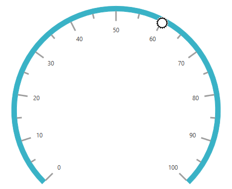

### Symbol pointer customization

You can modify the stroke of the symbol by changing the [`SymbolPointerStroke`](https://help.syncfusion.com/cr/wpf/Syncfusion.UI.Xaml.Gauges.CircularPointer.html#Syncfusion_UI_Xaml_Gauges_CircularPointer_SymbolPointerStroke) property. The [`SymbolPointerHeight`](https://help.syncfusion.com/cr/wpf/Syncfusion.UI.Xaml.Gauges.CircularPointer.html#Syncfusion_UI_Xaml_Gauges_CircularPointer_SymbolPointerHeight) property is used to set the height of the symbol pointer. The value should be given as a double value. The [`SymbolPointerWidth`](https://help.syncfusion.com/cr/wpf/Syncfusion.UI.Xaml.Gauges.CircularPointer.html#Syncfusion_UI_Xaml_Gauges_CircularPointer_SymbolPointerWidth) property is used to set the width of the symbol pointer.





    <gauge:SfCircularGauge >

    <gauge:SfCircularGauge.Scales>

    <gauge:CircularScale>

    <gauge:CircularScale.Pointers>

    <gauge:CircularPointer PointerType="SymbolPointer"  Value="60" SymbolPointerStroke="Red"
     SymbolPointerHeight="20" SymbolPointerWidth="20"/>

    </gauge:CircularScale.Pointers>

    </gauge:CircularScale>

    </gauge:SfCircularGauge.Scales>
            
    </gauge:SfCircularGauge>





SfCircularGauge sfCircularGauge = new SfCircularGauge();

CircularScale mainscale = new CircularScale();

CircularPointer circularPointer = new CircularPointer();

circularPointer.PointerType = PointerType.SymbolPointer;

circularPointer.Value = 60;

circularPointer.SymbolPointerStroke = new SolidColorBrush(Colors.Red);

circularPointer.SymbolPointerHeight = 20;

circularPointer.SymbolPointerWidth = 20;

mainscale.Pointers.Add(circularPointer);

sfCircularGauge.Scales.Add(mainscale);





### Setting visibility of symbol pointer

The visibility of the symbol pointer can be set using the [`SymbolPointerVisibility`](https://help.syncfusion.com/cr/wpf/Syncfusion.UI.Xaml.Gauges.CircularPointer.html#Syncfusion_UI_Xaml_Gauges_CircularPointer_SymbolPointerVisibility) Property.





    <gauge:SfCircularGauge >

    <gauge:SfCircularGauge.Scales>

    <gauge:CircularScale>

    <gauge:CircularScale.Pointers>

    <gauge:CircularPointer SymbolPointerVisibility="Hidden"/>

    </gauge:CircularScale.Pointers>

    </gauge:CircularScale>

    </gauge:SfCircularGauge.Scales>

    </gauge:SfCircularGauge>





SfCircularGauge sfCircularGauge = new SfCircularGauge();

CircularScale mainscale = new CircularScale();

CircularPointer circularPointer = new CircularPointer();

circularPointer.SymbolPointerVisibility = Visibility.Hidden;

mainscale.Pointers.Add(circularPointer);

sfCircularGauge.Scales.Add(mainscale);





### Setting offset for SymbolPointers

The [`Offset`](https://help.syncfusion.com/cr/wpf/Syncfusion.UI.Xaml.Gauges.CircularPointer.html#Syncfusion_UI_Xaml_Gauges_CircularPointer_Offset) property in the CircularPointer can be placed SymbolPointer in desired position of rim.





       <gauge:SfCircularGauge >
            <gauge:SfCircularGauge.Scales>
                <gauge:CircularScale>
                    <gauge:CircularScale.Pointers>
                        <gauge:CircularPointer PointerType="SymbolPointer" 
                                               Offset="0.5" Symbol="Triangle"  Value="60"/>
                    </gauge:CircularScale.Pointers>
                </gauge:CircularScale>
            </gauge:SfCircularGauge.Scales>
        </gauge:SfCircularGauge>
		




            SfCircularGauge sfCircularGauge = new SfCircularGauge();
            CircularScale mainscale = new CircularScale();
            CircularPointer circularPointer = new CircularPointer();
            circularPointer.PointerType = PointerType.SymbolPointer;
            circularPointer.Value = 60;
            circularPointer.Symbol = Symbol.Triangle;
            circularPointer.Offset = 0.5;
            mainscale.Pointers.Add(circularPointer);
            sfCircularGauge.Scales.Add(mainscale);
            CircularPointer circularPointer1 = new CircularPointer();
            circularPointer1.NeedlePointerVisibility = Visibility.Hidden;
            circularPointer1.PointerType = PointerType.NeedlePointer;
            mainscale.Pointers.Add(circularPointer1);





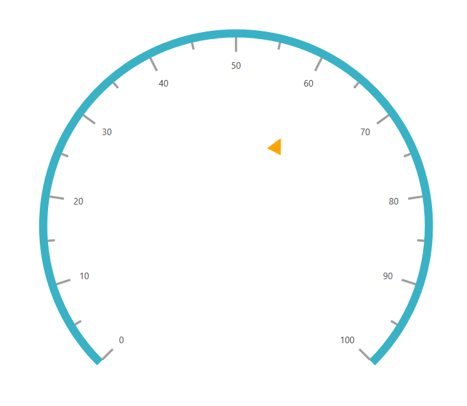

### Setting multiple pointers

In addition to the default pointer, you can add n number of pointers to a scale using the [`Pointers`](https://help.syncfusion.com/cr/wpf/Syncfusion.UI.Xaml.Gauges.CircularScale.html#Syncfusion_UI_Xaml_Gauges_CircularScale_Pointers) property.





<gauge:SfCircularGauge>
        <gauge:SfCircularGauge.Scales>
            <gauge:CircularScale >
                <gauge:CircularScale.Pointers>
                    <gauge:CircularPointer PointerType="NeedlePointer" 
                                           NeedleLengthFactor="0.4" Value="60"
                                           NeedlePointerType="Tapered" KnobStroke="#39B2C6" />
                    <gauge:CircularPointer PointerType="RangePointer"  Value="100"/>
                    <gauge:CircularPointer PointerType="SymbolPointer"  Value="50" Symbol="Pentagon"
                                           SymbolPointerHeight="20" SymbolPointerWidth="20" 
                                           SymbolPointerStroke="#39B2C6"/>
                </gauge:CircularScale.Pointers>
            </gauge:CircularScale>
        </gauge:SfCircularGauge.Scales>
    </gauge:SfCircularGauge>    





SfCircularGauge sfCircularGauge = new SfCircularGauge();

CircularScale mainscale = new CircularScale();

CircularPointer circularPointer = new CircularPointer();

circularPointer.PointerType = PointerType.NeedlePointer;

circularPointer.NeedleLengthFactor = 0.4;

circularPointer.Value = 60;

circularPointer.NeedlePointerType = NeedlePointerType.Tapered;

circularPointer.KnobStroke = new SolidColorBrush(Color.FromArgb(0xff, 0x39, 0xb2, 0xc6));

mainscale.Pointers.Add(circularPointer);

CircularPointer circularPointer1 = new CircularPointer();

circularPointer1.PointerType = PointerType.RangePointer;

circularPointer1.Value = 100;

mainscale.Pointers.Add(circularPointer1);

CircularPointer circularPointer2 = new CircularPointer();

circularPointer2.PointerType = PointerType.SymbolPointer;

circularPointer2.Value = 50;

circularPointer2.Symbol = Symbol.Pentagon;

circularPointer2.SymbolPointerHeight = 20;

circularPointer2.SymbolPointerWidth = 20;

circularPointer2.SymbolPointerStroke = new SolidColorBrush(Color.FromArgb(0xff, 0x39, 0xb2, 0xc6));

mainscale.Pointers.Add(circularPointer2);

mainscale.Pointers.Add(circularPointer);

sfCircularGauge.Scales.Add(mainscale);





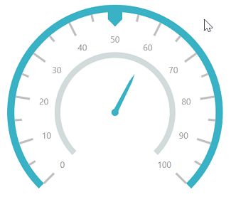

## Setting animation for pointer

The [`EnableAnimation`](https://help.syncfusion.com/cr/wpf/Syncfusion.UI.Xaml.Gauges.CircularPointer.html#Syncfusion_UI_Xaml_Gauges_CircularPointer_EnableAnimation) property is a Boolean property that enables or disables the animation of the pointers in circular gauge.





    <gauge:SfCircularGauge>

    <gauge:SfCircularGauge.Scales>

    <gauge:CircularScale Radius="150" >

    <gauge:CircularScale.Pointers>

    <gauge:CircularPointer PointerType="NeedlePointer" NeedleLengthFactor="0.4" Value="60"
    NeedlePointerType="Triangle" KnobStroke="#39B2C6" PointerCapDiameter="20"/>

    <gauge:CircularPointer PointerType="RangePointer"  Value="100" RangePointerStroke="#39B2C6"/>

    </gauge:CircularScale.Pointers>

    </gauge:CircularScale>

    </gauge:SfCircularGauge.Scales>

    </gauge:SfCircularGauge>





            SfCircularGauge sfCircularGauge = new SfCircularGauge();

            CircularScale mainscale = new CircularScale();

            mainscale.Radius = 150;

            CircularPointer circularPointer = new CircularPointer();

            circularPointer.PointerType = PointerType.NeedlePointer;

            circularPointer.EnableAnimation = true;

            circularPointer.NeedleLengthFactor = 0.4;

            circularPointer.Value = 60;

            circularPointer.NeedlePointerType = NeedlePointerType.Triangle;

            circularPointer.PointerCapDiameter = 20;

            circularPointer.KnobStroke = new SolidColorBrush(Color.FromArgb(0xff, 0x39, 0xb2, 0xc6));

            mainscale.Pointers.Add(circularPointer);

            CircularPointer circularPointer1 = new CircularPointer();

            circularPointer1.PointerType = PointerType.RangePointer;

            circularPointer1.RangePointerStroke = new SolidColorBrush(Color.FromArgb(0xff, 0x39, 0xb2, 0xc6));

            circularPointer1.EnableAnimation = true;

            circularPointer1.Value = 100;

            mainscale.Pointers.Add(circularPointer1);

            mainscale.Pointers.Add(circularPointer);

            sfCircularGauge.Scales.Add(mainscale);





## Circular pointer dragging

Symbol pointer and needle pointer can be dragged over the scale value by setting the [`EnableDragging`](https://help.syncfusion.com/cr/wpf/Syncfusion.UI.Xaml.Gauges.CircularPointer.html#Syncfusion_UI_Xaml_Gauges_CircularPointer_EnableDragging) property as true. Pointers can be moved to the respective position.




        <gauge:SfCircularGauge >
        <gauge:SfCircularGauge.Scales >
            <gauge:CircularScale LabelPosition="Custom"  Grid.Row="1" 
                                 RimStroke="LightGray" 
                                 RadiusFactor="1" ShowTicks="False"
                                 RimStrokeThickness="30"     
                                 StartValue="0" EndValue="100" Interval="10" 
                                 LabelOffset="0.75" LabelStroke="Black" FontSize="15">
                <gauge:CircularScale.Ranges>
                    <gauge:CircularRange StrokeThickness="30" StartValue="0" 
                                         x:Name="range" EndValue="25" 
                                         Stroke="DeepSkyBlue"/>
                </gauge:CircularScale.Ranges>
                <gauge:CircularScale.Pointers>
                    <gauge:CircularPointer PointerType="SymbolPointer" 
                                           Symbol="InvertedTriangle" 
                                           SymbolPointerHeight="18" SymbolPointerWidth="18"
                                           ValueChanged="CircularPointer_ValueChanged"  
                                           SymbolPointerStroke="DarkBlue" Value="25" 
                                           EnableAnimation="False" EnableDragging="True"/>
                </gauge:CircularScale.Pointers>
            </gauge:CircularScale>
        </gauge:SfCircularGauge.Scales>
    </gauge:SfCircularGauge>




    public partial class PointerDragging : Window
    {
        CircularRange range = new CircularRange();

        public PointerDragging()
        {
            InitializeComponent();
            SfCircularGauge circularGauge = new SfCircularGauge();
            CircularScale scale = new CircularScale();
            scale.RimStroke = new SolidColorBrush(Colors.LightGray);
            scale.RimStrokeThickness = 30;
            scale.RadiusFactor = 1;
            scale.ShowTicks = false;
            scale.StartValue = 0;
            scale.EndValue = 100;
            scale.Interval = 10;
            scale.LabelOffset = 0.75;
            scale.LabelStroke = new SolidColorBrush(Colors.Black);
            scale.FontSize = 15;
            scale.LabelPosition = LabelPosition.Custom;
            scale.RadiusFactor = 1;
            scale.ShowTicks = false ;
            CircularPointer circularPointer = new CircularPointer();
            circularPointer.PointerType = PointerType.SymbolPointer;
            circularPointer.Symbol = Symbol.InvertedTriangle;
            circularPointer.Value = 25;
            circularPointer.SymbolPointerStroke = new SolidColorBrush(Colors.DarkBlue);
            circularPointer.SymbolPointerHeight = 18;
            circularPointer.EnableAnimation = false;
            circularPointer.EnableDragging = true;
            circularPointer.SymbolPointerWidth = 18;
            circularPointer.ValueChanged += CircularPointer_ValueChanged;
            range.StrokeThickness = 30;
            range.StartValue = 0;
            range.EndValue = 25;
            range.Stroke = new SolidColorBrush(Colors.DeepSkyBlue);
            scale.Ranges.Add(range);
            scale.Pointers.Add(circularPointer);
            circularGauge.Scales.Add(scale);
            this.Content = circularGauge;
        }

        private void CircularPointer_ValueChanged(object sender, ValueChangedEventArgs e)
        {
            range.EndValue = e.Value;
        }
    }




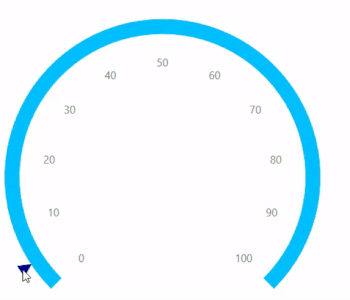

## Events

### Value change started

Invoked when the user starts selecting a new value of pointer by initiating the dragging. While dragging the pointer, other events (ValueChanging, ValueChanged and ValueChangeCompleted) will be followed after this event.

The `ValueChangeStarted` event contains the following arguments.

`Value` : This value will be the last value the pointer had before the changes began.




      <gauge:CircularScale.Pointers>
                        <gauge:CircularPointer EnableDragging="True" 
                                               ValueChangeStarted="CircularPointer_ValueChangeStarted"
                                               Value="20" Symbol="InvertedTriangle" 
                                               PointerType="SymbolPointer" />
                    </gauge:CircularScale.Pointers>




            SfCircularGauge circularGauge = new SfCircularGauge();
            CircularScale scale = new CircularScale();
            CircularPointer circularPointer = new CircularPointer();
            circularPointer.EnableDragging = true;
            circularPointer.Value = 20;
            circularPointer.Symbol = Symbol.InvertedTriangle;
            circularPointer.PointerType = PointerType.SymbolPointer;
            circularPointer.ValueChangeStarted += CircularPointer_ValueChangeStarted;
            scale.Pointers.Add(circularPointer);
            circularGauge.Scales.Add(scale);
            this.Content = circularGauge;

        private void CircularPointer_ValueChangeStarted(object sender, ValueChangedEventArgs e)
        {
            
        }          




### Value changing event

Called during a drag when the user is selecting before a new value for the pointer by dragging. The `ValueChangingEventArgs` contains `OldValue`, `NewValue`, and `Cancel` properties.
`OldValue`: Contains pointer old value.
`NewValue`: Contains pointer new value.
`Cancel`: To restrict the update of current drag pointer value, set `ValueChangingArgs.cancel` is true.




         <gauge:SfCircularGauge>
            <gauge:SfCircularGauge.Scales>
                <gauge:CircularScale>
                    <gauge:CircularScale.Pointers>
                        <gauge:CircularPointer EnableDragging="True" 
                                               ValueChanging="CircularPointer_ValueChanging" 
                                               Value="20" Symbol="InvertedTriangle" 
                                               PointerType="SymbolPointer" />
                    </gauge:CircularScale.Pointers>
                </gauge:CircularScale>
            </gauge:SfCircularGauge.Scales>
        </gauge:SfCircularGauge>




    public partial class PointerDragging : Window
    {
        public PointerDragging()
        {
            InitializeComponent();
            SfCircularGauge circularGauge = new SfCircularGauge();
            CircularScale scale = new CircularScale();
            CircularPointer circularPointer = new CircularPointer();
            circularPointer.EnableDragging = true;
            circularPointer.Value = 20;
            circularPointer.Symbol = Symbol.InvertedTriangle;
            circularPointer.PointerType = PointerType.SymbolPointer;
            circularPointer.ValueChanging += CircularPointer_ValueChanging;
            scale.Pointers.Add(circularPointer);
            circularGauge.Scales.Add(scale);
            this.Content = circularGauge;
        }

        private void CircularPointer_ValueChanging(object sender, ValueChangingEventArgs e)
        {
            if (e.NewValue > 30 && e.NewValue < 70)
            {
                e.Cancel = true;
            }
        }
    }




### Value changed event

Called during a drag when the user is selecting a new value for the pointer by dragging. The `ValueChangedEventArgs` contains `Value` property.
`Value` : Contains drag pointer value.




        <gauge:SfCircularGauge>
            <gauge:SfCircularGauge.Scales>
                <gauge:CircularScale>
                    <gauge:CircularScale.Pointers>
                        <gauge:CircularPointer ValueChanged="CircularPointer_ValueChanged" />
                    </gauge:CircularScale.Pointers>
                </gauge:CircularScale>
            </gauge:SfCircularGauge.Scales>
        </gauge:SfCircularGauge>




    public partial class PointerDragging : Window
    {
        public PointerDragging()
        {
            InitializeComponent();
            SfCircularGauge circularGauge = new SfCircularGauge();
            CircularScale scale = new CircularScale();
            CircularPointer circularPointer = new CircularPointer();
            circularPointer.ValueChanged += CircularPointer_ValueChanged;
            scale.Pointers.Add(circularPointer);
            circularGauge.Scales.Add(scale);
            this.Content = circularGauge;
        }

        private void CircularPointer_ValueChanged(object sender, ValueChangedEventArgs e)
        {
            var value = e.Value;
        }
    }




### Value change completed

Invoked after a new value has been selected by terminating the dragging of the pointer. While dragging the pointer, other events (ValueChangeStarted, ValueChanging and ValueChanged) will be called prior to the `ValueChangeCompleted` event.

This event will notify the completion of dragging with a new value being selected.

The `ValueChangeCompleted` event contains the following arguments.

`Value` : This value will be the new updated pointer value after dragging.




     <gauge:SfCircularGauge>
            <gauge:SfCircularGauge.Scales>
                <gauge:CircularScale>
                    <gauge:CircularScale.Pointers>
                        <gauge:CircularPointer EnableDragging="True" 
                                               ValueChangeCompleted="CircularPointer_ValueChangeCompleted"
                                               Value="20" Symbol="InvertedTriangle" 
                                               PointerType="SymbolPointer" />
                    </gauge:CircularScale.Pointers>
                </gauge:CircularScale>
            </gauge:SfCircularGauge.Scales>
        </gauge:SfCircularGauge>




            SfCircularGauge circularGauge = new SfCircularGauge();
            CircularScale scale = new CircularScale();
            CircularPointer circularPointer = new CircularPointer();
            circularPointer.EnableDragging = true;
            circularPointer.Value = 20;
            circularPointer.Symbol = Symbol.InvertedTriangle;
            circularPointer.PointerType = PointerType.SymbolPointer;
            circularPointer.ValueChangeCompleted += CircularPointer_ValueChangeCompleted;
            scale.Pointers.Add(circularPointer);
            circularGauge.Scales.Add(scale);
            this.Content = circularGauge;


