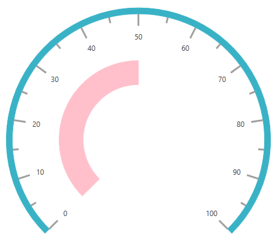
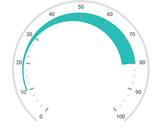
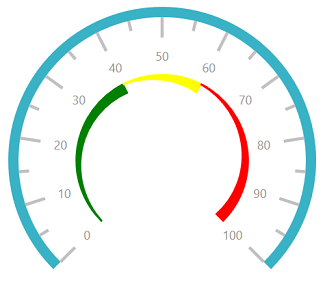

# Range support in SfCircularGauge

Range is a visual element, which begins and ends at the specified values within a scale.

## Setting a start and end values for range

The start and end values of ranges are set by using the [`StartValue`](https://help.syncfusion.com/cr/wpf/Syncfusion.SfGauge.WPF~Syncfusion.UI.Xaml.Gauges.CircularRange~StartValue.html) and [`EndValue`](https://help.syncfusion.com/cr/wpf/Syncfusion.SfGauge.WPF~Syncfusion.UI.Xaml.Gauges.CircularRange~EndValue.html) properties.





    <gauge:SfCircularGauge>
          
    <gauge:SfCircularGauge.Scales>

    <gauge:CircularScale>

    <gauge:CircularScale.Ranges>

    <gauge:CircularRange StartValue="0" EndValue="50"/>

    </gauge:CircularScale.Ranges>

    <gauge:CircularScale.Pointers>

    <gauge:CircularPointer NeedlePointerVisibility="Hidden"/>

    </gauge:CircularScale.Pointers>

    </gauge:CircularScale>

    </gauge:SfCircularGauge.Scales>

    </gauge:SfCircularGauge>





  SfCircularGauge sfCircularGauge = new SfCircularGauge();

  CircularScale mainscale = new CircularScale();

  CircularRange circularRange = new CircularRange();

  circularRange.StartValue = 0;

  circularRange.EndValue = 50;

  mainscale.Ranges.Add(circularRange);

  CircularPointer circularPointer = new CircularPointer();

  circularPointer.NeedlePointerVisibility = Visibility.Hidden;

  mainscale.Pointers.Add(circularPointer);

  sfCircularGauge.Scales.Add(mainscale);





## Range customization

A ranges UI is customized by using the [`Stroke`](https://help.syncfusion.com/cr/wpf/Syncfusion.SfGauge.WPF~Syncfusion.UI.Xaml.Gauges.CircularRange~Stroke.html), [`StrokeThickness`](https://help.syncfusion.com/cr/wpf/Syncfusion.SfGauge.WPF~Syncfusion.UI.Xaml.Gauges.CircularRange~StrokeThickness.html), and [`Offset`](https://help.syncfusion.com/cr/wpf/Syncfusion.SfGauge.WPF~Syncfusion.UI.Xaml.Gauges.CircularRange~Offset.html) properties. First, set the `RangePosition` property to custom in scale, and then set the `Offset`.





    <gauge:SfCircularGauge>
          
    <gauge:SfCircularGauge.Scales>

    <gauge:CircularScale RangePosition="Custom">

    <gauge:CircularScale.Ranges>

    <gauge:CircularRange StartValue="0" EndValue="50" Offset="0.6" Stroke="Pink" StrokeThickness="40"/>

    </gauge:CircularScale.Ranges>

    <gauge:CircularScale.Pointers>

    <gauge:CircularPointer NeedlePointerVisibility="Hidden"/>

    </gauge:CircularScale.Pointers>

    </gauge:CircularScale>

    </gauge:SfCircularGauge.Scales>

    </gauge:SfCircularGauge>





            SfCircularGauge sfCircularGauge = new SfCircularGauge();
            CircularScale mainscale = new CircularScale();
            mainscale.RangePosition = RangePosition.Custom;
            CircularRange circularRange = new CircularRange();
            circularRange.StartValue = 0;
            circularRange.EndValue = 50;
            circularRange.Offset = 0.6;
            circularRange.Stroke = new SolidColorBrush(Colors.Pink);
            circularRange.StrokeThickness = 40;
            mainscale.Ranges.Add(circularRange);
            CircularPointer circularPointer = new CircularPointer();
            circularPointer.NeedlePointerVisibility = Visibility.Hidden;
            mainscale.Pointers.Add(circularPointer);
            sfCircularGauge.Scales.Add(mainscale);





## Setting a width for range

The appearance of the circular range is customized by setting the [`StartWidth`](https://help.syncfusion.com/cr/wpf/Syncfusion.SfGauge.WPF~Syncfusion.UI.Xaml.Gauges.CircularRange~StartWidth.html) and [`EndWidth`](https://help.syncfusion.com/cr/wpf/Syncfusion.SfGauge.WPF~Syncfusion.UI.Xaml.Gauges.CircularRange~EndWidth.html) properties.





    <gauge:SfCircularGauge >

    <gauge:SfCircularGauge.Scales>

    <gauge:CircularScale  RangePosition="Inside" Radius="200">

    <gauge:CircularScale.Ranges>

    <gauge:CircularRange StartValue="10" EndValue="80" StrokeThickness ="10" StartWidth="1" EndWidth="10"/>

    </gauge:CircularScale.Ranges>

    <gauge:CircularScale.Pointers>
                    
    <gauge:CircularPointer NeedlePointerVisibility="Hidden"/>

    </gauge:CircularScale.Pointers>

    </gauge:CircularScale>

    </gauge:SfCircularGauge.Scales>

    </gauge:SfCircularGauge>





  SfCircularGauge sfCircularGauge = new SfCircularGauge();

  CircularScale mainscale = new CircularScale();

  mainscale.RangePosition = RangePosition.Inside;

  CircularRange circularRange = new CircularRange();

  circularRange.StartValue = 10;

  circularRange.EndValue = 80;

  circularRange.StrokeThickness = 10;

  circularRange.StartWidth = 1;

  circularRange.EndWidth = 10;

  mainscale.Ranges.Add(circularRange);

  CircularPointer circularPointer = new CircularPointer();

  circularPointer.NeedlePointerVisibility = Visibility.Hidden;

  mainscale.Pointers.Add(circularPointer);

  sfCircularGauge.Scales.Add(mainscale);





## Binding range stroke

You can bind the ranges stroke to the tick lines and labels within its range by setting the [`BindRangeStrokeToLabels`](https://help.syncfusion.com/cr/wpf/Syncfusion.SfGauge.WPF~Syncfusion.UI.Xaml.Gauges.CircularScale~BindRangeStrokeToLabels.html) and [`BindRangeStrokeToTicks`](https://help.syncfusion.com/cr/wpf/Syncfusion.SfGauge.WPF~Syncfusion.UI.Xaml.Gauges.CircularScale~BindRangeStrokeToTicks.html) properties to true.





    <gauge:SfCircularGauge >

    <gauge:SfCircularGauge.Scales>

    <gauge:CircularScale  BindRangeStrokeToLabels="True" BindRangeStrokeToTicks="True">

    <gauge:CircularScale.Ranges>

    <gauge:CircularRange StartValue="0" EndValue="40" Stroke="Green" StrokeThickness ="10" />

    <gauge:CircularRange StartValue="40" EndValue="60" Stroke="Yellow" StrokeThickness ="10" />

    <gauge:CircularRange StartValue="60" EndValue="100" Stroke="Red" StrokeThickness ="10"/>

    </gauge:CircularScale.Ranges>

    <gauge:CircularScale.Pointers>

    <gauge:CircularPointer NeedlePointerVisibility="Hidden"/>

    </gauge:CircularScale.Pointers>

    </gauge:CircularScale>

    </gauge:SfCircularGauge.Scales>

    </gauge:SfCircularGauge>





SfCircularGauge sfCircularGauge = new SfCircularGauge();

CircularScale mainscale = new CircularScale();

mainscale.BindRangeStrokeToLabels = true;

mainscale.BindRangeStrokeToTicks = true;

CircularRange circularRange = new CircularRange();

circularRange.StartValue = 0;

circularRange.EndValue = 40;

circularRange.Stroke = new SolidColorBrush(Colors.Green);

circularRange.StrokeThickness = 10;

mainscale.Ranges.Add(circularRange);

CircularRange circularRange1 = new CircularRange();

circularRange1.StartValue = 40;

circularRange1.EndValue = 60;

circularRange1.Stroke = new SolidColorBrush(Colors.Yellow);

circularRange1.StrokeThickness = 10;

mainscale.Ranges.Add(circularRange1);

CircularRange circularRange2 = new CircularRange();

circularRange2.StartValue = 60;

circularRange2.EndValue = 100;

circularRange2.Stroke = new SolidColorBrush(Colors.Red);

circularRange2.StrokeThickness = 10;

mainscale.Ranges.Add(circularRange2);

CircularPointer circularPointer = new CircularPointer();

circularPointer.NeedlePointerVisibility = Visibility.Hidden;

mainscale.Pointers.Add(circularPointer);

sfCircularGauge.Scales.Add(mainscale);





## Setting a position for range

The range can be placed inside the scale, outside the scale, or on the scale by using the following two ways:

### By setting range position

You can place the range by selecting one of the options available in the [`RangePosition`](https://help.syncfusion.com/cr/wpf/Syncfusion.SfGauge.WPF~Syncfusion.UI.Xaml.Gauges.CircularScale~RangePosition.html) property.

1.	Inside

2.	Outside

3.	SetAsGaugeRim (Default)

4.	Custom





    <gauge:SfCircularGauge >

    <gauge:SfCircularGauge.Scales>

    <gauge:CircularScale  RangePosition="Outside">

    <gauge:CircularScale.Ranges>

    <gauge:CircularRange StartValue="0" EndValue="40" Stroke="Green" StrokeThickness ="10" />

    <gauge:CircularRange StartValue="40" EndValue="60" Stroke="Yellow" StrokeThickness ="10" />

    <gauge:CircularRange StartValue="60" EndValue="100" Stroke="Red" StrokeThickness ="10"/>
                        
    </gauge:CircularScale.Ranges>

    <gauge:CircularScale.Pointers>

    <gauge:CircularPointer NeedlePointerVisibility="Hidden"/>

    </gauge:CircularScale.Pointers>

    </gauge:CircularScale>

    </gauge:SfCircularGauge.Scales>

    </gauge:SfCircularGauge>





SfCircularGauge sfCircularGauge = new SfCircularGauge();

CircularScale mainscale = new CircularScale();

mainscale.RangePosition = RangePosition.Outside;

CircularRange circularRange = new CircularRange();

circularRange.StartValue = 0;

circularRange.EndValue = 40;

circularRange.Stroke = new SolidColorBrush(Colors.Green);

circularRange.StrokeThickness = 10;

mainscale.Ranges.Add(circularRange);

CircularRange circularRange1 = new CircularRange();

circularRange1.StartValue = 40;

circularRange1.EndValue = 60;

circularRange1.Stroke = new SolidColorBrush(Colors.Yellow);

circularRange1.StrokeThickness = 10;

mainscale.Ranges.Add(circularRange1);

CircularRange circularRange2 = new CircularRange();

circularRange2.StartValue = 60;

circularRange2.EndValue = 100;

circularRange2.Stroke = new SolidColorBrush(Colors.Red);

circularRange2.StrokeThickness = 10;

mainscale.Ranges.Add(circularRange2);

CircularPointer circularPointer = new CircularPointer();

circularPointer.NeedlePointerVisibility = Visibility.Hidden;

mainscale.Pointers.Add(circularPointer);

sfCircularGauge.Scales.Add(mainscale);





### By setting range offset

The range can be placed inside the scale, outside the scale, or on the scale by using the following two ways:

1. Setting `Offset` and `StrokeThickness` properties.

2. Setting `InnerStartOffset`, `InnerEndOffset`, `OuterStartOffset`, and `OuterEndOffset` properties.

N>For using this feature need to set the `RangePosition` as custom in the `Rim`.

#### By setting Offset and StrokeThickness

For absolute position, you can use `Offset` and `StrokeThickness` properties of Range. For setting the `Offset` and `StrokeThickness` to the range.





            <gauge:SfCircularGauge x:Name="gauge">
                <gauge:SfCircularGauge.Scales >
                    <gauge:CircularScale  x:Name="scale" RangePosition="Custom" RimStroke="LightGray">
                        <gauge:CircularScale.Pointers>
                            <gauge:CircularPointer NeedlePointerVisibility="Hidden"/>
                        </gauge:CircularScale.Pointers>
                        <gauge:CircularScale.Ranges>
                            <gauge:CircularRange StartValue = "0" EndValue = "100" 
                                                 Stroke="MediumTurquoise" Offset = "0.3" 
                                                 StrokeThickness="20">
                            </gauge:CircularRange>
                      </gauge:CircularScale.Ranges>
                    </gauge:CircularScale>
                </gauge:SfCircularGauge.Scales>
            </gauge:SfCircularGauge>
			




            SfCircularGauge sfCircularGauge = new SfCircularGauge();
            CircularScale mainscale = new CircularScale();
            mainscale.RangePosition = RangePosition.Custom;
            CircularRange circularRange = new CircularRange();
            circularRange.StartValue = 0;
            circularRange.EndValue = 100;
            circularRange.Stroke = new SolidColorBrush(Colors.MediumTurquoise);
            circularRange.StrokeThickness = 20;
            circularRange.Offset = 0.3;
            mainscale.Ranges.Add(circularRange);
            CircularPointer circularPointer = new CircularPointer();
            circularPointer.NeedlePointerVisibility = Visibility.Hidden;
            mainscale.Pointers.Add(circularPointer);
            sfCircularGauge.Scales.Add(mainscale);
			




#### By setting InnerStartOffset, InnerEndOffset, OuterStartOffset, and OuterEndOffset

For relative position, you can use `InnerStartOffset`, `InnerEndOffset`, `OuterStartOffset`, and `OuterEndOffset` properties of Range. 





            <gauge:SfCircularGauge x:Name="gauge">
                <gauge:SfCircularGauge.Scales >
                    <gauge:CircularScale  x:Name="scale" RangePosition="Custom" RimStroke="LightGray">
                        <gauge:CircularScale.Pointers>
                            <gauge:CircularPointer NeedlePointerVisibility="Hidden"/>
                        </gauge:CircularScale.Pointers>
                        <gauge:CircularScale.Ranges>
                            <gauge:CircularRange StartValue="10" EndValue="80" InnerStartOffset = "0.83" 
                                                 InnerEndOffset = "0.6" OuterStartOffset = "0.85" 
                                                 OuterEndOffset =" 0.8"  Stroke="MediumTurquoise">
                            </gauge:CircularRange>             
                        </gauge:CircularScale.Ranges>
                    </gauge:CircularScale>
                </gauge:SfCircularGauge.Scales>
            </gauge:SfCircularGauge>
			




            SfCircularGauge sfCircularGauge = new SfCircularGauge();
            CircularScale mainscale = new CircularScale();
            mainscale.RangePosition = RangePosition.Custom;
            CircularRange circularRange = new CircularRange();
            circularRange.StartValue = 10;
            circularRange.EndValue = 80;
            circularRange.Stroke = new SolidColorBrush(Colors.MediumTurquoise);
            circularRange.InnerStartOffset = 0.83;
            circularRange.InnerEndOffset = 0.6;
            circularRange.OuterStartOffset = 0.85;
            circularRange.OuterEndOffset = 0.8;
            mainscale.Ranges.Add(circularRange);
            CircularPointer circularPointer = new CircularPointer();
            circularPointer.NeedlePointerVisibility = Visibility.Hidden;
            mainscale.Pointers.Add(circularPointer);
            sfCircularGauge.Scales.Add(mainscale);
			




## Setting a multiple ranges

In addition to the default range, you can add n number of ranges to a scale by using the [`Ranges`](https://help.syncfusion.com/cr/wpf/Syncfusion.SfGauge.WPF~Syncfusion.UI.Xaml.Gauges.CircularScale~Ranges.html) property.





<gauge:SfCircularGauge>
        <gauge:SfCircularGauge.Scales>
            <gauge:CircularScale  RangePosition="Inside" Radius="200">
                <gauge:CircularScale.Ranges>
                    <gauge:CircularRange StartValue="0" EndValue="40" 
                                         Stroke="Green" StrokeThickness ="10" 
                                         StartWidth="1" EndWidth="10"/>
                    <gauge:CircularRange StartValue="40" EndValue="60" 
                                         Stroke="Yellow" StrokeThickness ="10" 
                                         StartWidth="1" EndWidth="10"/>
                    <gauge:CircularRange StartValue="60" EndValue="100" 
                                         Stroke="Red" StrokeThickness ="10" 
                                         StartWidth="1" EndWidth="10"/>
                </gauge:CircularScale.Ranges>
                <gauge:CircularScale.Pointers>
                    <gauge:CircularPointer NeedlePointerVisibility="Hidden"/>
                </gauge:CircularScale.Pointers>
            </gauge:CircularScale>
        </gauge:SfCircularGauge.Scales>
    </gauge:SfCircularGauge>    





SfCircularGauge sfCircularGauge = new SfCircularGauge();

CircularScale mainscale = new CircularScale();

mainscale.RangePosition = RangePosition.Inside;

CircularRange circularRange = new CircularRange();

circularRange.StartValue = 0;

circularRange.EndValue = 40;

circularRange.Stroke = new SolidColorBrush(Colors.Green);

circularRange.StrokeThickness = 10;

circularRange.StartWidth = 1;

circularRange.EndWidth = 10;

mainscale.Ranges.Add(circularRange);

CircularRange circularRange1 = new CircularRange();

circularRange1.StartValue = 40;

circularRange1.EndValue = 60;

circularRange1.Stroke = new SolidColorBrush(Colors.Yellow);

circularRange1.StrokeThickness = 10;

circularRange1.StartWidth = 1;

circularRange1.EndWidth = 10;

mainscale.Ranges.Add(circularRange1);

CircularRange circularRange2 = new CircularRange();

circularRange2.StartValue = 60;

circularRange2.EndValue = 100;

circularRange2.Stroke = new SolidColorBrush(Colors.Red);

circularRange2.StrokeThickness = 10;

circularRange2.StartWidth = 1;

circularRange2.EndWidth = 10;

mainscale.Ranges.Add(circularRange2);

CircularPointer circularPointer = new CircularPointer();

circularPointer.NeedlePointerVisibility = Visibility.Hidden;

mainscale.Pointers.Add(circularPointer);

sfCircularGauge.Scales.Add(mainscale);





### Setting gradient color for range

You can give color transition to range by specifying the different colors using the [`GradientStops`](https://help.syncfusion.com/cr/wpf/Syncfusion.SfGauge.WPF~Syncfusion.UI.Xaml.Gauges.CircularRange~GradientStops.html) property of range. By using the `Value` and `Color` properties of `GradientStops`, you can adjust the color transition range for each color.





     <gauge:SfCircularGauge>
        <gauge:SfCircularGauge.Scales>
            <gauge:CircularScale LabelStroke ="IndianRed" LabelOffset="0.77" 
                                 LabelPosition="Custom" MinorTicksPerInterval="5"  
                                 RangePosition="Custom" TickPosition="Custom" 
                                 RimStroke="White">
                <gauge:CircularScale.Ranges>
                    <gauge:CircularRange StartValue="0" EndValue="85" Offset="0.5" 
                                         StrokeThickness="40" >
                        <gauge:CircularRange.GradientStops>
                            <gauge:GaugeGradientStop Value="15" Color="OrangeRed"/>
                            <gauge:GaugeGradientStop Value="50" Color="#FFDD00"/>
                            <gauge:GaugeGradientStop Value="80" Color="Green"/>
                        </gauge:CircularRange.GradientStops>
                    </gauge:CircularRange>
                </gauge:CircularScale.Ranges>
                <gauge:CircularScale.MajorTickSettings>
                    <gauge:MajorTickSetting  Length="20" Stroke="IndianRed" 
                                             StrokeThickness="2"  Offset="0.7"  />
                </gauge:CircularScale.MajorTickSettings>
                <gauge:CircularScale.MinorTickSettings>
                    <gauge:MinorTickSetting  Stroke="IndianRed"  StrokeThickness="2"  
                                             Offset="0.65"  />
                </gauge:CircularScale.MinorTickSettings>
                <gauge:CircularScale.Pointers>
                    <gauge:CircularPointer PointerType="NeedlePointer" 
                                           Visibility="Collapsed"/>
                </gauge:CircularScale.Pointers>
            </gauge:CircularScale>
        </gauge:SfCircularGauge.Scales>
    </gauge:SfCircularGauge>





            SfCircularGauge sfCircularGauge = new SfCircularGauge();
            CircularScale mainscale = new CircularScale();
            mainscale.RimStroke = new SolidColorBrush(Colors.White);
            mainscale.LabelStroke = new SolidColorBrush(Colors.IndianRed);
            mainscale.LabelOffset = 0.77;
            mainscale.LabelPosition = LabelPosition.Custom;
            mainscale.MinorTicksPerInterval = 5;
            mainscale.RangePosition = RangePosition.Custom;
            mainscale.TickPosition = TickPosition.Custom;
            CircularRange circularRange = new CircularRange();
            circularRange.StartValue = 0;
            circularRange.EndValue = 85;
            circularRange.Offset = 0.5;
            circularRange.StrokeThickness = 40;
            ObservableCollection<GaugeGradientStop> gradientColor1 = new ObservableCollection<GaugeGradientStop>();
            GaugeGradientStop gaugeGradientStop = new GaugeGradientStop();
            gaugeGradientStop.Value = 15;
            gaugeGradientStop.Color = Colors.Green;
            circularRange.GradientStops.Add(gaugeGradientStop);
            GaugeGradientStop gaugeGradientStop1 = new GaugeGradientStop();
            gaugeGradientStop1.Value = 50;
            gaugeGradientStop1.Color = Colors.Yellow;
            circularRange.GradientStops.Add(gaugeGradientStop1);
            GaugeGradientStop gaugeGradientStop2 = new GaugeGradientStop();
            gaugeGradientStop2.Value = 80;
            gaugeGradientStop2.Color = Colors.Red;
            circularRange.GradientStops.Add(gaugeGradientStop2);
            mainscale.Ranges.Add(circularRange);
            MajorTickSetting majorTickSetting = new MajorTickSetting();
            majorTickSetting.Length = 20;
            majorTickSetting.Stroke = new SolidColorBrush(Colors.IndianRed);
            majorTickSetting.StrokeThickness = 2;
            majorTickSetting.Offset = 0.7;
            mainscale.MajorTickSettings = majorTickSetting;
            MinorTickSetting minorTickSetting = new MinorTickSetting();
            minorTickSetting.Stroke = new SolidColorBrush(Colors.IndianRed);
            minorTickSetting.StrokeThickness = 2;
            minorTickSetting.Offset = 0.65;
            mainscale.MinorTickSettings = minorTickSetting;
            CircularPointer circularPointer = new CircularPointer();
            circularPointer.NeedlePointerVisibility = Visibility.Hidden;
            mainscale.Pointers.Add(circularPointer);
            sfCircularGauge.Scales.Add(mainscale);





