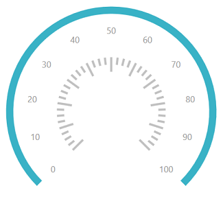
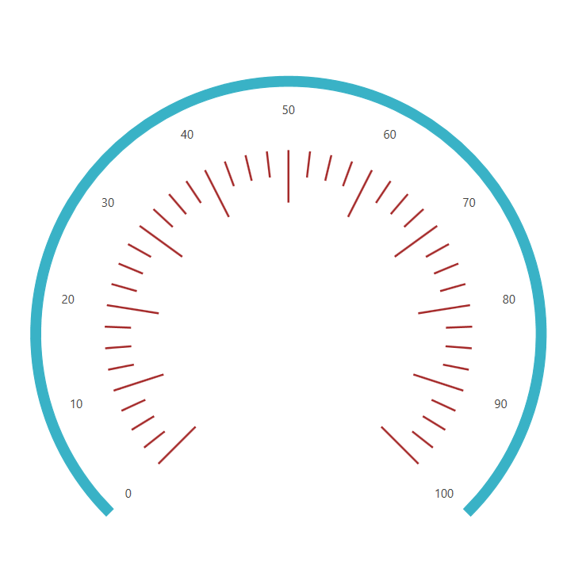
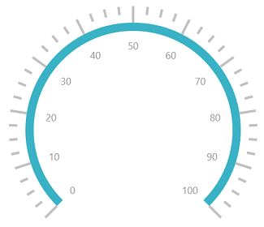
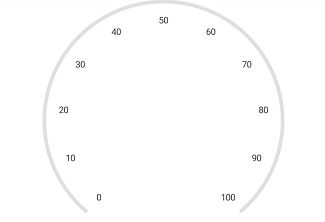

# CircularScale Ticks customization

Ticks help you identify the gauge’s data value by marking the gauge scale in regular increments.

## Tick customization

The Interval property is used to calculate the tick count for a scale. Similar ticks, small ticks are calculated using the [`MinorTicksPerInterval`](https://help.syncfusion.com/cr/wpf/Syncfusion.SfGauge.WPF~Syncfusion.UI.Xaml.Gauges.CircularScale~MinorTicksPerInterval.html) property.

The length, stroke, and stroke thickness of a major ticks and minor ticks are set by using the [`Length`](https://help.syncfusion.com/cr/cref_files/wpf/Syncfusion.SfGauge.WPF~Syncfusion.UI.Xaml.Gauges.TickSetting~Length.html), [`Stroke`](https://help.syncfusion.com/cr/cref_files/wpf/Syncfusion.SfGauge.WPF~Syncfusion.UI.Xaml.Gauges.TickSetting~Stroke.html), and [`StrokeThickness`](https://help.syncfusion.com/cr/cref_files/wpf/Syncfusion.SfGauge.WPF~Syncfusion.UI.Xaml.Gauges.TickSetting~StrokeThickness.html) properties, respectively. 

### Customize major ticks for scale





           <gauge:SfCircularGauge x:Name="gauge">
                <gauge:SfCircularGauge.Scales >
                    <gauge:CircularScale  x:Name="scale"  MinorTicksPerInterval="3" >
                        <gauge:CircularScale.MajorTickSettings>
                            <gauge:MajorTickSetting  Length="20" Stroke="Brown" StrokeThickness="2"  />
                        </gauge:CircularScale.MajorTickSettings>
                        <gauge:CircularScale.MinorTickSettings>
                            <gauge:MinorTickSetting  Stroke="White"  />
                        </gauge:CircularScale.MinorTickSettings>
                        <gauge:CircularScale.Pointers>
                            <gauge:CircularPointer NeedlePointerVisibility="Hidden"/>
                        </gauge:CircularScale.Pointers>
                    </gauge:CircularScale>
                </gauge:SfCircularGauge.Scales>
            </gauge:SfCircularGauge>




 
            SfCircularGauge sfCircularGauge = new SfCircularGauge();
            CircularScale mainscale = new CircularScale();
            mainscale.MinorTicksPerInterval = 3;
            MajorTickSetting majorTickSetting = new MajorTickSetting();
            majorTickSetting.Length = 20;
            majorTickSetting.Stroke = new SolidColorBrush(Colors.Brown);
            majorTickSetting.StrokeThickness = 2;
            mainscale.MajorTickSettings = majorTickSetting;
            MinorTickSetting minorTickSetting = new MinorTickSetting();
            minorTickSetting.Stroke = new SolidColorBrush(Colors.White);
            mainscale.MinorTickSettings = minorTickSetting;
            CircularPointer circularPointer = new CircularPointer();
            circularPointer.NeedlePointerVisibility = Visibility.Hidden;
            mainscale.Pointers.Add(circularPointer);
            sfCircularGauge.Scales.Add(mainscale);
			




### Customize minor ticks for scale





            <gauge:SfCircularGauge x:Name="gauge">
                <gauge:SfCircularGauge.Scales >
                    <gauge:CircularScale  x:Name="scale"  MinorTicksPerInterval="3" >
                        <gauge:CircularScale.MinorTickSettings>
                            <gauge:MinorTickSetting  Length="10" Stroke="Blue" StrokeThickness="2"   />
                        </gauge:CircularScale.MinorTickSettings>
                        <gauge:CircularScale.Pointers>
                            <gauge:CircularPointer NeedlePointerVisibility="Hidden"/>
                        </gauge:CircularScale.Pointers>
                    </gauge:CircularScale>
                </gauge:SfCircularGauge.Scales>
            </gauge:SfCircularGauge>





            SfCircularGauge sfCircularGauge = new SfCircularGauge();
            CircularScale mainscale = new CircularScale();
            mainscale.MinorTicksPerInterval = 3;
            MinorTickSetting minorTickSetting = new MinorTickSetting();
            minorTickSetting.Length = 10;
            minorTickSetting.Stroke = new SolidColorBrush(Colors.Blue);
            minorTickSetting.StrokeThickness = 2;
            mainscale.MinorTickSettings = minorTickSetting;
            CircularPointer circularPointer = new CircularPointer();
            circularPointer.NeedlePointerVisibility = Visibility.Hidden;
            mainscale.Pointers.Add(circularPointer);
            sfCircularGauge.Scales.Add(mainscale);




## Setting shape for tick

The [`TickShape`](https://help.syncfusion.com/cr/wpf/Syncfusion.SfGauge.WPF~Syncfusion.UI.Xaml.Gauges.CircularScale~TickShape.html) is an enum property that provides an option to select shape of the circular mark ticks, which contains several shapes such as rectangle, ellipse, and triangle.





       <gauge:SfCircularGauge>
            <gauge:SfCircularGauge.Scales>
                <gauge:CircularScale  TickShape="Triangle" MinorTicksPerInterval="3">
                    <gauge:CircularScale.MajorTickSettings>
                        <gauge:MajorTickSetting Stroke="Blue"/>
                    </gauge:CircularScale.MajorTickSettings>
                    <gauge:CircularScale.MinorTickSettings>
                        <gauge:MinorTickSetting Stroke="Blue"/>
                    </gauge:CircularScale.MinorTickSettings>
                    <gauge:CircularScale.Pointers>
                        <gauge:CircularPointer NeedlePointerVisibility="Hidden"/>
                    </gauge:CircularScale.Pointers>
                </gauge:CircularScale>
            </gauge:SfCircularGauge.Scales>
        </gauge:SfCircularGauge>





SfCircularGauge sfCircularGauge = new SfCircularGauge();

CircularScale mainscale = new CircularScale();

mainscale.TickShape = TickShape.Triangle;

mainscale.MinorTicksPerInterval = 3;

mainscale.MajorTickSettings.Stroke = new SolidColorBrush(Colors.Blue);

mainscale.MinorTickSettings.Stroke = new SolidColorBrush(Colors.Blue);

CircularPointer circularPointer = new CircularPointer();

circularPointer.NeedlePointerVisibility = Visibility.Hidden;

mainscale.Pointers.Add(circularPointer);

sfCircularGauge.Scales.Add(mainscale);





## Setting position for tick

The major and minor ticks can be positioned far away from the rim using the following two ways:
 
* Using the [`MajorTickSettings`](https://help.syncfusion.com/cr/wpf/Syncfusion.SfGauge.WPF~Syncfusion.UI.Xaml.Gauges.MajorTickSetting_members.html) and [`MinorTickSettings`](https://help.syncfusion.com/cr/wpf/Syncfusion.SfGauge.WPF~Syncfusion.UI.Xaml.Gauges.MinorTickSetting_members.html) [`Offset`](https://help.syncfusion.com/cr/wpf/Syncfusion.SfGauge.WPF~Syncfusion.UI.Xaml.Gauges.TickSetting~Offset.html), [`StartOffset`](https://help.syncfusion.com/cr/wpf/Syncfusion.SfGauge.WPF~Syncfusion.UI.Xaml.Gauges.TickSetting~StartOffset.html), and [`EndOffset`](https://help.syncfusion.com/cr/wpf/Syncfusion.SfGauge.WPF~Syncfusion.UI.Xaml.Gauges.TickSetting~EndOffset.html) properties. First, set the [`TickPosition`](https://help.syncfusion.com/cr/wpf/Syncfusion.SfGauge.WPF~Syncfusion.UI.Xaml.Gauges.CircularScale~TickPosition.html) property to custom, and then set the offset of the tick.

#### Setting scale ticket Offset value

For relative position you can use `Offset` property, for setting the `Offset` to the Ticks.





          <gauge:SfCircularGauge x:Name="gauge">
                <gauge:SfCircularGauge.Scales >
                    <gauge:CircularScale  TickPosition="Custom" x:Name="scale"  MinorTicksPerInterval="3" >
                        <gauge:CircularScale.MajorTickSettings>
                            <gauge:MajorTickSetting  Offset="0.5"/>
                        </gauge:CircularScale.MajorTickSettings>
                        <gauge:CircularScale.MinorTickSettings>
                            <gauge:MinorTickSetting  Offset="0.5"/>
                        </gauge:CircularScale.MinorTickSettings>
                        <gauge:CircularScale.Pointers>
                            <gauge:CircularPointer NeedlePointerVisibility="Hidden"/>
                        </gauge:CircularScale.Pointers>
                    </gauge:CircularScale>
                </gauge:SfCircularGauge.Scales>
            </gauge:SfCircularGauge>





            SfCircularGauge sfCircularGauge = new SfCircularGauge();
            CircularScale mainscale = new CircularScale();
            mainscale.TickPosition = TickPosition.Custom;
            mainscale.MinorTicksPerInterval = 3;
            MajorTickSetting majorTickSetting = new MajorTickSetting();
            majorTickSetting.Offset = 0.5;
            mainscale.MajorTickSettings = majorTickSetting;
            MinorTickSetting minorTickSetting = new MinorTickSetting();
            minorTickSetting.Offset = 0.5;
            mainscale.MinorTickSettings = minorTickSetting;
            CircularPointer circularPointer = new CircularPointer();
            circularPointer.NeedlePointerVisibility = Visibility.Hidden;
            mainscale.Pointers.Add(circularPointer);
            sfCircularGauge.Scales.Add(mainscale);





#### Setting start and end Offset value for scale tick

For absolute position you can use `StartOffset`, `EndOffset` properties of `MajorTickSettings` and `MinorTickSettings`.





         <gauge:SfCircularGauge x:Name="gauge">
            <gauge:SfCircularGauge.Scales >
                <gauge:CircularScale  x:Name="scale" TickPosition="Custom" MinorTicksPerInterval="3" >
                    <gauge:CircularScale.MajorTickSettings>
                        <gauge:MajorTickSetting  StartOffset="0.5" EndOffset="0.7" 
                                                 Length="20" Stroke="Brown" StrokeThickness="2"  />
                    </gauge:CircularScale.MajorTickSettings>
                    <gauge:CircularScale.MinorTickSettings>
                        <gauge:MinorTickSetting  Stroke="Brown" StartOffset="0.6" 
                                                 EndOffset="0.7"   StrokeThickness="2"  />
                    </gauge:CircularScale.MinorTickSettings>
                    <gauge:CircularScale.Pointers>
                        <gauge:CircularPointer NeedlePointerVisibility="Hidden"/>
                    </gauge:CircularScale.Pointers>
                </gauge:CircularScale>
            </gauge:SfCircularGauge.Scales>
        </gauge:SfCircularGauge>
			




            SfCircularGauge sfCircularGauge = new SfCircularGauge();
            CircularScale mainscale = new CircularScale();
            mainscale.TickPosition = TickPosition.Custom;
            mainscale.MinorTicksPerInterval = 3;
            MajorTickSetting majorTickSetting = new MajorTickSetting();
            majorTickSetting.StartOffset = 0.5;
            majorTickSetting.EndOffset = 0.7;
            majorTickSetting.Length = 20;
            majorTickSetting.Stroke = new SolidColorBrush(Colors.Brown);
            majorTickSetting.StrokeThickness = 2;
            mainscale.MajorTickSettings = majorTickSetting;
            MinorTickSetting minorTickSetting = new MinorTickSetting();
            minorTickSetting.StartOffset = 0.6;
            minorTickSetting.EndOffset = 0.7;
            minorTickSetting.Stroke = new SolidColorBrush(Colors.Brown);
            minorTickSetting.StrokeThickness = 2;
            mainscale.MinorTickSettings = minorTickSetting;
            CircularPointer circularPointer = new CircularPointer();
            circularPointer.NeedlePointerVisibility = Visibility.Hidden;
            mainscale.Pointers.Add(circularPointer);
            sfCircularGauge.Scales.Add(mainscale);
			




* Placing the ticks inside the scale, outside the scale, or across the scale by selecting one of the options available in the `TickPosition` property. They are:

1.	Inside (Default)

2.	Outside

3.	Cross

4.	Custom





    <gauge:SfCircularGauge >

    <gauge:SfCircularGauge.Scales>

    <gauge:CircularScale  TickPosition="Outside"  MinorTicksPerInterval="3">

    <gauge:CircularScale.Pointers>

    <gauge:CircularPointer NeedlePointerVisibility="Hidden"/>

    </gauge:CircularScale.Pointers>

    </gauge:CircularScale>

    </gauge:SfCircularGauge.Scales>

    </gauge:SfCircularGauge>





SfCircularGauge sfCircularGauge = new SfCircularGauge();

CircularScale mainscale = new CircularScale();

mainscale.TickPosition = TickPosition.Outside;

mainscale.MinorTicksPerInterval = 3;

CircularPointer circularPointer = new CircularPointer();

circularPointer.NeedlePointerVisibility = Visibility.Hidden;

mainscale.Pointers.Add(circularPointer);

sfCircularGauge.Scales.Add(mainscale);





### Setting ticks visibility in scale

The [`ShowTicks`](https://help.syncfusion.com/cr/wpf/Syncfusion.SfGauge.WPF~Syncfusion.UI.Xaml.Gauges.CircularScale~ShowTicks.html) property allows you to enable or disable the ticks of circular gauge.

N> Default value of the ShowTicks property is true.





    <gauge:SfCircularGauge >
         <gauge:SfCircularGauge.Scales >
               <gauge:CircularScale ShowTicks="False" x:Name="scale" RimStroke="LightGray" >
                    <gauge:CircularScale.Pointers>
                         <gauge:CircularPointer NeedlePointerVisibility="Hidden"/>
                     </gauge:CircularScale.Pointers>
               </gauge:CircularScale>
         </gauge:SfCircularGauge.Scales> 
	</gauge:SfCircularGauge>





            SfCircularGauge sfCircularGauge = new SfCircularGauge();
            CircularScale mainscale = new CircularScale();
            mainscale.RimStroke = new SolidColorBrush(Colors.LightGray);
            mainscale.ShowTicks = false;
            CircularPointer circularPointer = new CircularPointer();
            circularPointer.NeedlePointerVisibility = Visibility.Hidden;
            mainscale.Pointers.Add(circularPointer);
            sfCircularGauge.Scales.Add(mainscale);





