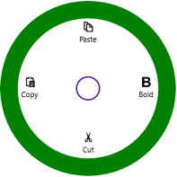
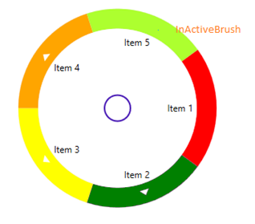
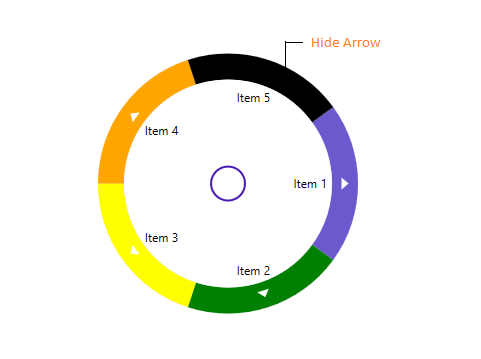
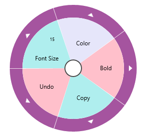

## Appearance and Styling 

## Radius 

RadiusX and RadiusY properties in the Radial Menu can be used to define the X and Y axis radius to render the control. 



<navigation:SfRadialMenu RadiusX="150" RadiusY="150" />



## CenterRimRadiusFactor

CenterRimRadiusFactor property can be used to define the radius of the center rim (inner circle). 



<navigation:SfRadialMenu   CenterRimRadiusFactor="0.3" IsOpen="True" />



## RimBackground

RimBackground property used to fill the outer rim (outer circle).



<navigation:SfRadialMenu IsOpen="True" RimBackground="Green" />



RadialMenu outer ring filled with color

## RimActiveBrush

RimActiveBrush property used to fill the expander rim and this expander rim only visible when the items have sub items.   



<navigation:SfRadialMenu RimActiveBrush="Red" RimBackground="Green" IsOpen="True" />



##RimInactiveBrush

`RimInactiveBrush` property used to fill the expander rim item background when the corresponding menu item doesn’t have sub items.



      <syncfusion:SfRadialMenu >
            <syncfusion:SfRadialMenuItem Header="Item 1" RimActiveBrush="SlateBlue" RimInactiveBrush="Red"/>
            <syncfusion:SfRadialMenuItem Header="Item 2" RimActiveBrush="Green">
                <syncfusion:SfRadialMenuItem Header="Item 21" />
            </syncfusion:SfRadialMenuItem>
            <syncfusion:SfRadialMenuItem Header="Item 3" RimActiveBrush="Yellow">
                <syncfusion:SfRadialMenuItem Header="Item 31"/>
            </syncfusion:SfRadialMenuItem>
            <syncfusion:SfRadialMenuItem Header="Item 4" RimActiveBrush="Orange">
                <syncfusion:SfRadialMenuItem Header="Item 41"/>
            </syncfusion:SfRadialMenuItem >
            <syncfusion:SfRadialMenuItem   Header="Item 5" IsExpanderVisible="False" RimActiveBrush="Black" RimInactiveBrush="GreenYellow" />
        </syncfusion:SfRadialMenu>



## RimHoverBrush

The RimHoverBrush property can be used to fill the expander rim while the pointer is hovering over it. 



<navigation:SfRadialMenu RimActiveBrush="Red" RimBackground="Green"   RimHoverBrush="Blue" IsOpen="True" />



## IsExpanderVisible

Expander arrow in the OuterRim of `SfRadialMenu` visibility can be changed by `IsExpanderVisible` property of `SfRadialMenuItem`. By default, `IsExpanderVisible` value is True.



      <syncfusion:SfRadialMenu >
        <syncfusion:SfRadialMenuItem Header="Item 1" RimActiveBrush="SlateBlue">      
          <syncfusion:SfRadialMenuItem Header="Item 21"/>
            </syncfusion:SfRadialMenuItem>
            <syncfusion:SfRadialMenuItem Header="Item 2" RimActiveBrush="Green"  >
                <syncfusion:SfRadialMenuItem Header="Item 21" />
            </syncfusion:SfRadialMenuItem>
            <syncfusion:SfRadialMenuItem Header="Item 3" RimActiveBrush="Yellow">
                <syncfusion:SfRadialMenuItem Header="Item 31"/>
            </syncfusion:SfRadialMenuItem>
            <syncfusion:SfRadialMenuItem Header="Item 4" RimActiveBrush="Orange">
                <syncfusion:SfRadialMenuItem Header="Item 41"/>
            </syncfusion:SfRadialMenuItem >
            <syncfusion:SfRadialMenuItem   Header="Item 5" IsExpanderVisible="False" RimActiveBrush="Black" >
                <syncfusion:SfRadialMenuItem Header="Item 41"/>
            </syncfusion:SfRadialMenuItem>
        </syncfusion:SfRadialMenu>



## RimRadiusFactor

RimRadiusFactor property of Radial Menu can be used to set the radius of the items panel. Lowest values to this factor increases the thickness of the outer rim. Highest values to this factor decreases the thickness of the outer rim. 



<navigation:SfRadialMenu RimActiveBrush="Red" RimRadiusFactor="0.7" RimBackground="Green"   RimHoverBrush="Blue" IsOpen="True" />



## Navigation Button Style

The navigation button displayed in the center of radial menu can be styled using NavigationButtonStyle property. 



<syncfusion:SfRadialMenu NavigationButtonStyle="{StaticResource NavigationButtonStyle}"

IsOpen="True" />



## MenuBackgroundColor

Each `SfRadialMenuItem` can be set a different background color using `MenuBackgroundColor` property.





<navigation:SfRadialMenu IsOpen="True">

<navigation:SfRadialMenuItem Header="Bold" MenuBackgroundColor="Pink">

<navigation:SfRadialMenuItem/>

</navigation:SfRadialMenuItem>

<navigation:SfRadialMenuItem Header="Copy" MenuBackgroundColor="PaleTurquoise">

<navigation:SfRadialMenuItem/>

</navigation:SfRadialMenuItem>

<navigation:SfRadialMenuItem Header="Undo" MenuBackgroundColor="Pink">

<navigation:SfRadialMenuItem/>

</navigation:SfRadialMenuItem>

<navigation:SfRadialMenuItem Header="Font Size" MenuBackgroundColor="PaleTurquoise">

<navigation:SfRadialMenuItem/>

</navigation:SfRadialMenuItem>

<navigation:SfRadialMenuItem Header="Color" MenuBackgroundColor="Lavender">

<navigation:SfRadialMenuItem/>

</navigation:SfRadialMenuItem>

</navigation:SfRadialMenu>





## MenuMouseOverBackgroundColor

Each SfRadialMenuItem can be set with a different background color on mouse over by using the MenuMouseOverBackgroundColor property. Before that, the ShowMouseOverStyle property should be set to true.



<navigation:SfRadialMenu IsOpen="True">
  <navigation:SfRadialMenuItem Header="Bold" MenuMouseOverBackgroundColor="Pink" ShowMouseOverStyle="true">
    <navigation:SfRadialMenuItem/>
  </navigation:SfRadialMenuItem>
  <navigation:SfRadialMenuItem Header="Copy" MenuMouseOverBackgroundColor="PaleTurquoise" ShowMouseOverStyle="true">
    <navigation:SfRadialMenuItem/>
  </navigation:SfRadialMenuItem>
  <navigation:SfRadialMenuItem Header="Undo" MenuMouseOverBackgroundColor="Pink" ShowMouseOverStyle="true">
    <navigation:SfRadialMenuItem/>
  </navigation:SfRadialMenuItem>
  <navigation:SfRadialMenuItem Header="Font Size" MenuMouseOverBackgroundColor="PaleTurquoise" ShowMouseOverStyle="true">
    <navigation:SfRadialMenuItem/>
  </navigation:SfRadialMenuItem>
 <navigation:SfRadialMenuItem Header="Color" MenuMouseOverBackgroundColor="Lavender" ShowMouseOverStyle="true">
    <navigation:SfRadialMenuItem/>
  </navigation:SfRadialMenuItem>
</navigation:SfRadialMenu> 



