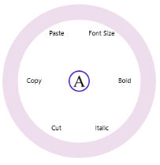

---
layout: post
title: Icon Customization in WPF RadialMenu | Syncfusion®
description: Customize the icon displayed in the center of the WPF RadialMenu to provide a distinctive navigation experience.
platform: wpf
control: SfRadialMenu 
documentation: ug
---

# Icon Customization in WPF Radial Menu (SfRadialMenu)

The Icon property of the RadialMenu is used to customize the icon displayed in the center of RadialMenu circle.   



<navigation:SfRadialMenu IsOpen="True" >

<navigation:SfRadialMenu.Icon>

                <Grid Background="White">

                    <Image Source="ms-appx:///Assets/text.png" Width="20"  

 	 	 	                Stretch="Uniform"/>

                </Grid>

            </navigation:SfRadialMenu.Icon>

 </navigation:SfRadialMenu>



