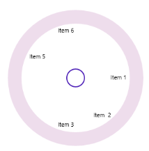

# Layout Types in WPF Radial Menu (SfRadialMenu)

There are two different layout types available for the WPF Radial Menu.

* Default
* Custom

 Both the layout types divide the available space equally among all the children in the circular panel.

## Default

The number of segments in the panel is determined by the children count in the level. Hence, the segment count in each hierarchical level differs. `RadialMenuItem` is arranged in the sequential order as added in the WPF Radial Menu.

## Custom

The number of segments in the panel is determined by the `VisibleSegmentsCount` property. Hence, the segment count in all the hierarchical levels is the same. `RadialMenuItem` is arranged in any order based on the `SegmentIndex` property.

### VisibleSegmentsCount

The `VisibleSegmentsCount` property is used to specify the number of segments available in the circular panel. When the children count is greater than the value given in the `VisibleSegmentsCount` property, then the overflowing children are not arranged in the panel. When the children count is less than the `VisibleSegmentsCount` property, then the remaining segments are left free.




<navigation:SfRadialMenu LayoutType="Custom" VisibleSegmentsCount="7" />




SfRadialMenu radialMenu = new SfRadialMenu();
radialMenu.LayoutType = LayoutType.Custom;
 radialMenu.VisibleSegmentsCount = 7; 




### SegmentIndex

The `SegmentIndex` property is used to specify the index of the `SfRadialMenuItem` in the circular panel. Based on the index, the `RadialMenuItem`s are inserted in the segment. When `SegmentIndex` is not specified for a `RadialMenuItem` (or) two or more `RadialMenuItem`s have the same `SegmentIndex`, then the menu item is arranged in the next available free segment. 




<navigation:SfRadialMenu LayoutType="Custom" VisibleSegmentsCount="7" />  
 <navigation:SfRadialMenuItem Header="Item  2" SegmentIndex="1" />   
 <navigation:SfRadialMenuItem Header="Item 5" SegmentIndex="4" />   
 <navigation:SfRadialMenuItem Header="Item 1" SegmentIndex="0" />  
 <navigation:SfRadialMenuItem Header="Item 6" SegmentIndex="5" />  
 <navigation:SfRadialMenuItem Header="Item 3" SegmentIndex="2" />
 </navigation:SfRadialMenu> 




SfRadialMenu radialMenu = new SfRadialMenu();
radialMenu.LayoutType = LayoutType.Custom; 
radialMenu.VisibleSegmentsCount = 7; 
SfRadialMenuItem item2 = new SfRadialMenuItem() { Header = "Item 2", SegmentIndex = 1 };               
SfRadialMenuItem item5 = new SfRadialMenuItem() { Header   ="Item 5", SegmentIndex = 4 };
SfRadialMenuItem item1 = new SfRadialMenuItem() { Header = "Item 1", SegmentIndex = 0 };
SfRadialMenuItem item6 = new SfRadialMenuItem() { Header = "Item 6", SegmentIndex = 5 };
SfRadialMenuItem item3 = new SfRadialMenuItem() { Header = "Item 3",SegmentIndex = 2 };
radialMenu.Items.Add(item2);radialMenu.Items.Add(item5);radialMenu.Items.Add(item1);
radialMenu.Items.Add(item6); radialMenu.Items.Add(item3); </td></tr>




