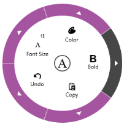

# WPF Radial Menu (SfRadialMenu) Overview

The Radial Menu provides a hierarchical menu in a circular layout. Commonly used as a context menu, it can present more menu items within the same space compared to traditional menus.

### Key Features

- **Items Source**: Bind to any business object collection.
- **Commanding**: Bind each item to a command to perform specific actions.
- **Color Palette**: Easily create a radial color palette layout.

