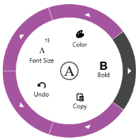

# About Syncfusion® WPF RadialMenu (SfRadialMenu) Control

The Radial Menu displays a hierarchical menu in a circular layout. Typically used as a context menu, it can expose more menu items in the same space than traditional menus.

### Key Features

* **Items Source** – Any business object collection can be bound to control. 
* **Commanding** – Each item can be bound to a command that could perform an action. 
* **Color Palette** – Easy to form radial color palette layout. 

