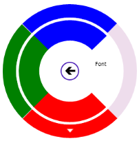

# Color Palette in WPF Radial Menu (SfRadialMenu)

A color palette can be formed in the WPF Radial Menu with the radial color items. 



<navigation:SfRadialMenu IsOpen="True" >

    <navigation:SfRadialMenuItem Header="Font Color">

       <navigation:SfRadialMenuItem Header="Font"/>

       <navigation:SfRadialColorItem Color="Red">

           <navigation:SfRadialColorItem Color="DarkRed"/>

           <navigation:SfRadialColorItem Color="IndianRed"/>

           <navigation:SfRadialColorItem Color="OrangeRed"/>

           <navigation:SfRadialColorItem Color="MediumVioletRed"/>

       </navigation:SfRadialColorItem>

       <navigation:SfRadialColorItem Color="Green"/>

       <navigation:SfRadialColorItem Color="Blue"/>

     </navigation:SfRadialMenuItem>

</navigation:SfRadialMenu>



