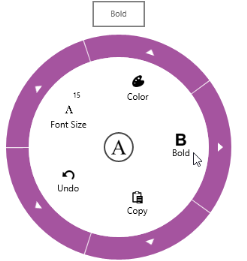

# ToolTips in WPF Radial Menu (SfRadialMenu)

Tooltip support is available for the WPF Radial Menu items. This will show when the mouse hovers over the corresponding item. 

ToolTip Placement

The position of the tooltip displayed relative to the WPF Radial Menu can be customized using the `ToolTipPlacement` property. The following tooltip positions are supported:

* None: Hides the tooltip.
* Left: Displays the tooltip to the left of the WPF Radial Menu.
* Top: Displays the tooltip above the control.
* Right: Displays the tooltip to the right of the control.
* Bottom: Displays the tooltip below the control.



<navigation:SfRadialMenuItem  ToolTip="Bold" ToolTipPlacement="Top"  />



