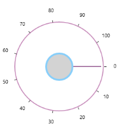
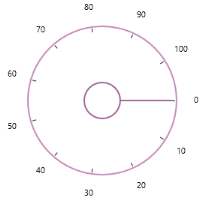
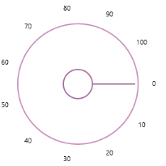
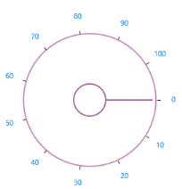
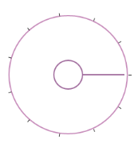
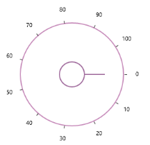
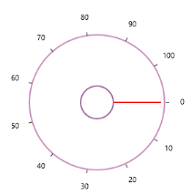
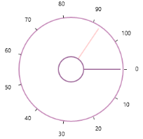

# Appearance and Styling 

## Inner Rim 

Inner Rim term denotes the circle in the center of Radial Slider.  Following properties can be used to customize the Inner Rim. 

### Inner Rim Radius Factor

[InnerRimRadiusFactor](https://help.syncfusion.com/cr/wpf/Syncfusion.SfRadialMenu.Wpf~Syncfusion.Windows.Controls.Navigation.SfRadialSlider~InnerRimRadiusFactor.html) property decides the radius of Inner Rim from the total radius available to render the Radial Slider. 

### Inner Rim Stroke

[InnerRimStroke](https://help.syncfusion.com/cr/wpf/Syncfusion.SfRadialMenu.Wpf~Syncfusion.Windows.Controls.Navigation.SfRadialSlider~InnerRimStroke.html) property can be used to set the stroke color of the Inner Rim. 

### Inner Rim Stroke Thickness

[InnerRimStrokeThickness](https://help.syncfusion.com/cr/wpf/Syncfusion.SfRadialMenu.Wpf~Syncfusion.Windows.Controls.Navigation.SfRadialSlider~InnerRimStrokeThickness.html) property can be used to set the thickness of the Inner Rim.

### Inner Rim Fill

[InnerRimFill](https://help.syncfusion.com/cr/wpf/Syncfusion.SfRadialMenu.Wpf~Syncfusion.Windows.Controls.Navigation.SfRadialSlider~InnerRimFill.html) property can be used the set the fill color of the Inner Rim. 



  <syncfusion:SfRadialSlider

InnerRimFill="LightGray"

            InnerRimRadiusFactor="0.25"

            InnerRimStroke="LightSkyBlue"

            InnerRimStrokeThickness="4" />



 

## Outer Rim 

Outer Rim term denotes circular track (outer circle) of Radial Slider.  Following properties can be used to customize the Inner Rim

### Outer Rim Radius Factor

[OuterRimRadiusFactor](https://help.syncfusion.com/cr/wpf/Syncfusion.SfRadialMenu.Wpf~Syncfusion.Windows.Controls.Navigation.SfRadialSlider~OuterRimRadiusFactor.html) property decides the radius of Outer Rim from the total radius available to render the Radial Slider. 

### Outer Rim Stroke 

[OuterRimStroke](https://help.syncfusion.com/cr/wpf/Syncfusion.SfRadialMenu.Wpf~Syncfusion.Windows.Controls.Navigation.SfRadialSlider~OuterRimStroke.html) property can be used to set the stroke color of the Outer Rim. 

### Outer Rim Stroke Thickness 

[OuterRimStrokeThickness](https://help.syncfusion.com/cr/wpf/Syncfusion.SfRadialMenu.Wpf~Syncfusion.Windows.Controls.Navigation.SfRadialSlider~OuterRimStrokeThickness.html) property can be used to set the thickness of the Outer Rim. 

### Background

Background property can be used to fill the Outer Rim.



<syncfusion:SfRadialSlider

            Background="LightGray"

            OuterRimRadiusFactor="0.8"

            OuterRimStroke="LightSkyBlue"

            OuterRimStrokeThickness="4" />



 

## Ticks

Ticks displayed along the circular path can be customized using the following properties. 

### Tick Template

Ticks can be customized using the [TickTemplate](https://help.syncfusion.com/cr/wpf/Syncfusion.SfRadialMenu.Wpf~Syncfusion.Windows.Controls.Navigation.SfRadialSlider~TickTemplate.html) property. 



<syncfusion:SfRadialSlider>

            <syncfusion:SfRadialSlider.TickTemplate>

                <DataTemplate>

                    <Border Background="Red"></Border>

                </DataTemplate>

            </syncfusion:SfRadialSlider.TickTemplate>

 </syncfusion:SfRadialSlider>



 

### Tick Radius Factor

[TickRadiusFactor](https://help.syncfusion.com/cr/wpf/Syncfusion.SfRadialMenu.Wpf~Syncfusion.Windows.Controls.Navigation.SfRadialSlider~TickRadiusFactor.html) property decides the radius of the ticks from the total radius available to render the Radial Slider. 


<syncfusion:SfRadialSlider  TickRadiusFactor="0.75"  />



### Tick Visibility

Visibility of ticks can be controlled by [TickVisibility](https://help.syncfusion.com/cr/wpf/Syncfusion.SfRadialMenu.Wpf~Syncfusion.Windows.Controls.Navigation.SfRadialSlider~TickVisibility.html) property. 



<syncfusion:SfRadialSlider TickVisibility="Collapsed" />



## Labels

Labels displayed along the circular path in the Radial slider can be customized by the following properties. 

### Label Template

The [LabelTemplate](https://help.syncfusion.com/cr/wpf/Syncfusion.SfRadialMenu.Wpf~Syncfusion.Windows.Controls.Navigation.SfRadialSlider~LabelTemplate.html) property can be used to customize the label object. 



<syncfusion:SfRadialSlider>

<syncfusion:SfRadialSlider.LabelTemplate>

           <DataTemplate>

               <TextBlock Text="{Binding}" Foreground="DodgerBlue"></TextBlock>

           </DataTemplate>

       </syncfusion:SfRadialSlider.LabelTemplate>

</syncfusion:SfRadialSlider>



### Label Radius Factor

[LabelRadiusFactor](https://help.syncfusion.com/cr/wpf/Syncfusion.SfRadialMenu.Wpf~Syncfusion.Windows.Controls.Navigation.SfRadialSlider~LabelRadiusFactor.html) property decides the radius of the labels from the total radius available to render the Radial Slider. 



<syncfusion:SfRadialSlider LabelRadiusFactor="0.7" />



 

### Label Visibility

Visibility of ticks can be controlled by [LabelVisibility](https://help.syncfusion.com/cr/wpf/Syncfusion.SfRadialMenu.Wpf~Syncfusion.Windows.Controls.Navigation.SfRadialSlider~LabelVisibility.html) property. 



<syncfusion:SfRadialSlider  LabelVisibility="Collapsed" />



 

## Pointer

The Pointer that is used for the select the value by dragging in circular track can be customized with the following properties. 

### Pointer Radius Factor

The [PointerRadiusFactor](https://help.syncfusion.com/cr/wpf/Syncfusion.SfRadialMenu.Wpf~Syncfusion.Windows.Controls.Navigation.SfRadialSlider~PointerRadiusFactor.html) property decides the radius of the Pointer from the total radius available to render the Radial Slider. 



<syncfusion:SfRadialSlider PointerRadiusFactor="0.5" />



 

#### Pointer Style

Style of the Pointer can be customized using the [PointerStyle](https://help.syncfusion.com/cr/wpf/Syncfusion.SfRadialMenu.Wpf~Syncfusion.Windows.Controls.Navigation.SfRadialSlider~PointerStyle.html) property. 



<syncfusion:SfRadialSlider>

<syncfusion:SfRadialSlider.PointerStyle>

                

            </syncfusion:SfRadialSlider.PointerStyle>

</syncfusion:SfRadialSlider>



 

### Preview Pointer Style

The Preview Pointer that appears when hovering over the Radial Slider can be customized using the [PreviewPointerStyle](https://help.syncfusion.com/cr/wpf/Syncfusion.SfRadialMenu.Wpf~Syncfusion.Windows.Controls.Navigation.SfRadialSlider~PreviewPointerStyle.html) property. 



<syncfusion:SfRadialSlider

            Minimum="0" 

            Maximum="100"  >

            <syncfusion:SfRadialSlider.PreviewPointerStyle>

                

            </syncfusion:SfRadialSlider.PreviewPointerStyle>

</syncfusion:SfRadialSlider>



 