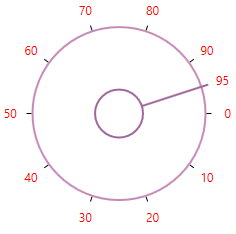

# Appearance in WPF SfRadialSlider

This section explains different styling, theming options available in [SfRadialSlider](https://help.syncfusion.com/cr/wpf/Syncfusion.Windows.Controls.Navigation.SfRadialSlider.html) control.

## Setting the foreground

You can change the foreground color of the `SfRadialSlider` by using the `Foreground` property. The default value of `Foreground` property is `Black`.




<syncfusion:SfRadialSlider Foreground="Red" 
                           Name="radialSlider" />




radialSlider.Foreground = Brushes.Red;




N> [View Sample in GitHub](https://github.com/SyncfusionExamples/syncfusion-wpf-radial-slider-examples/tree/master/Samples/RadialSlider-Features)

## Setting the background

You can change the background color of the `SfRadialSlider` by using the `Background` property. The default value of `Background` property is `White`.




<syncfusion:SfRadialSlider Background="Yellow"
                           Name="radialSlider" />




radialSlider.Background = Brushes.Yellow;




N> [View Sample in GitHub](https://github.com/SyncfusionExamples/syncfusion-wpf-radial-slider-examples/tree/master/Samples/RadialSlider-Features)

## Change flow direction

You can change the flow direction of the `SfRadialSlider` layout from right to left by setting the `FlowDirection` property value as `RightToLeft`. The default value of `FlowDirection` property is `LeftToRight`.




<syncfusion:SfRadialSlider FlowDirection="RightToLeft"
                           Name="radialSlider" />




radialSlider.FlowDirection = FlowDirection.RightToLeft;




N> [View Sample in GitHub](https://github.com/SyncfusionExamples/syncfusion-wpf-radial-slider-examples/tree/master/Samples/RadialSlider-Features)

## Theme

SfRadialSlider supports various built-in themes. Refer to the below links to apply themes for the SfRadialSlider,

  * [Apply theme using SfSkinManager](https://help.syncfusion.com/wpf/themes/skin-manager)
	
  * [Create a custom theme using ThemeStudio](https://help.syncfusion.com/wpf/themes/theme-studio#creating-custom-theme)

  