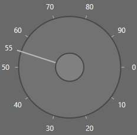

# Appearance in WPF SfRadialSlider

This section explains different styling, theming options available in [SfRadialSlider](https://help.syncfusion.com/cr/wpf/Syncfusion.SfRadialMenu.Wpf~Syncfusion.Windows.Controls.Navigation.SfRadialSlider.html) control.

## Setting the foreground

You can change the foreground color of the `SfRadialSlider` by using the `Foreground` property. The default value of `Foreground` property is `Black`.




<syncfusion:SfRadialSlider Foreground="Red" 
                           Name="radialSlider" />




radialSlider.Foreground = Brushes.Red;




N> [View Sample in GitHub](https://github.com/SyncfusionExamples/syncfusion-wpf-radial-slider-examples/tree/master/Samples/RadialSlider-Features)

## Setting the background

You can change the background color of the `SfRadialSlider` by using the `Background` property. The default value of `Background` property is `White`.




<syncfusion:SfRadialSlider Background="Yellow"
                           Name="radialSlider" />




radialSlider.Background = Brushes.Yellow;




N> [View Sample in GitHub](https://github.com/SyncfusionExamples/syncfusion-wpf-radial-slider-examples/tree/master/Samples/RadialSlider-Features)

## Change flow direction

You can change the flow direction of the `SfRadialSlider` layout from right to left by setting the `FlowDirection` property value as `RightToLeft`. The default value of `FlowDirection` property is `LeftToRight`.




<syncfusion:SfRadialSlider FlowDirection="RightToLeft"
                           Name="radialSlider" />




radialSlider.FlowDirection = FlowDirection.RightToLeft;




N> [View Sample in GitHub](https://github.com/SyncfusionExamples/syncfusion-wpf-radial-slider-examples/tree/master/Samples/RadialSlider-Features)

## Theme

You can customize the appearance of the `SfRadialSlider` control by using the [SfSkinManager.SetVisualStyle](https://help.syncfusion.com/cr/cref_files/wpf/Syncfusion.SfSkinmanager.Wpf~Syncfusion.SfSkinmanager.SfSkinmanager~SetVisualStyle.html) method. The following are the various built-in visual styles for `SfRadialSlider` control.

* Blend
* Lime
* MaterialDark
* MaterialDarkBlue
* MaterialLight
* MaterialLightBlue
* Metro
* Office2010Black
* Office2010Blue
* Office2010Silver
* Office2013DarkGray
* Office2013LightGray
* Office2013White
* Office2016Colorful
* Office2016DarkGray
* Office2016White
* Office2019Black
* Office2019Colorful
* Office365
* Saffron
* VisualStudio2013
* VisualStudio2015




<Window>
    <!--Theme Namespace-->
    xmlns:syncfusionskin ="clr-namespace:Syncfusion.SfSkinManager;assembly=Syncfusion.SfSkinManager.WPF">
    <Grid>
        <syncfusion:SfRadialSlider syncfusionskin:SfSkinManager.VisualStyle="Blend" 
                                   Name="radialSlider" />
    </Grid>
</Window>
</Window>




//Namespace for the SfSkinManager.
using Syncfusion.SfSkinManager;

SfRadialSlider radialSlider = new SfRadialSlider();
SfSkinManager.SetVisualStyle(radialSlider, VisualStyles.Blend);




Here, the `Blend` style is applied to the `SfRadialSlider`.

N> [View Sample in GitHub](https://github.com/SyncfusionExamples/syncfusion-wpf-radial-slider-examples/tree/master/Samples/Themes)
