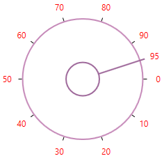
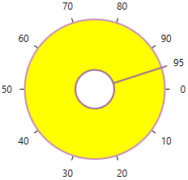
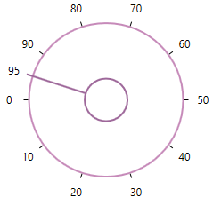

---
layout: post
title: Appearance in WPF Radial Slider | Syncfusion®
description: Customize the appearance of the WPF Radial Slider using foreground, background, flow direction, and theme settings.
platform: wpf
control: SfRadialSlider
documentation: ug
---

# Appearance in WPF Radial Slider (SfRadialSlider)

This section explains the styling and theming options available in the [WPF Radial Slider](https://www.syncfusion.com/wpf-controls/radial-slider) control. The WPF Radial Slider is implemented through the [SfRadialSlider](https://help.syncfusion.com/cr/wpf/Syncfusion.Windows.Controls.Navigation.SfRadialSlider.html) class.

## Setting the foreground

You can change the foreground color of the `SfRadialSlider` by using the `Foreground` property. The default value of the `Foreground` property is `Black`.




<syncfusion:SfRadialSlider Foreground="Red" 
                           Name="radialSlider" />




radialSlider.Foreground = Brushes.Red;




N> [View Sample in GitHub](https://github.com/SyncfusionExamples/syncfusion-wpf-radial-slider-examples/tree/master/Samples/RadialSlider-Features)

## Setting the background

You can change the background color of the `SfRadialSlider` by using the `Background` property. The default value of the `Background` property is `White`.




<syncfusion:SfRadialSlider Background="Yellow"
                           Name="radialSlider" />




radialSlider.Background = Brushes.Yellow;




N> [View Sample in GitHub](https://github.com/SyncfusionExamples/syncfusion-wpf-radial-slider-examples/tree/master/Samples/RadialSlider-Features)

## Change flow direction

You can change the flow direction of the `SfRadialSlider` layout from right to left by setting the `FlowDirection` property value to `RightToLeft`. The default value of the `FlowDirection` property is `LeftToRight`.




<syncfusion:SfRadialSlider FlowDirection="RightToLeft"
                           Name="radialSlider" />




radialSlider.FlowDirection = FlowDirection.RightToLeft;




N> [View Sample in GitHub](https://github.com/SyncfusionExamples/syncfusion-wpf-radial-slider-examples/tree/master/Samples/RadialSlider-Features)

## Theme

The WPF Radial Slider supports various built-in themes. Refer to the following links to apply themes to the WPF Radial Slider:

  * [Apply theme using SfSkinManager](https://help.syncfusion.com/wpf/themes/skin-manager)
	
  * [Create a custom theme using ThemeStudio](https://help.syncfusion.com/wpf/themes/theme-studio#creating-custom-theme)

  
