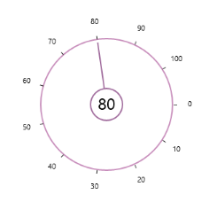

# Content

The [Content](https://help.syncfusion.com/cr/wpf/Syncfusion.SfRadialMenu.Wpf~Syncfusion.Windows.Controls.Navigation.SfRadialSlider~Content.html) property can be used to place any content inside the Inner Rim. 



<syncfusion:SfRadialSlider x:Name="rSlider1">

    <TextBlock Text="{Binding ElementName=rSlider1,Path=Value}" FontSize="24"/>

</syncfusion:SfRadialSlider>



