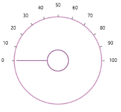

# End Angle 

The [EndAngle](https://help.syncfusion.com/cr/wpf/Syncfusion.SfRadialMenu.Wpf~Syncfusion.Windows.Controls.Navigation.SfRadialSlider~EndAngle.html) property can be used to set the ending position for the ticks in the circular track. 



<syncfusion:SfRadialSlider  StartAngle="180" EndAngle="360" />



