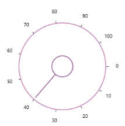

# Getting Started with SfRadialSlider

This section describes how to design a `SfRadialSlider` control in a WPF application and overview of its basic functionalities.

## Assembly deployment

Namespace: Syncfusion.Windows.Controls.Navigation 

Assembly: Syncfusion.SfRadialMenu.WPF (in Syncfusion.SfRadialMenu.WPF.dll) 

### Creating simple application with SfRadialSlider

The SfRadialSlider control can be added to an application using Visual Studio.

You can create the WPF application with SfRadialSlider control as follows:

1. [Creating project](#creating-the-project)
2. [Adding control via designer](#adding-control-via-designer)
3. [Adding control manually in code](#adding-control-manually-in-code)

## Creating the project

The steps to create a SfRadialSlider control by using Visual Studio in C# are as follows:

1.	Open Visual Studio.

2.	On the File menu, select New -> Project. This opens the New Project Dialog box.

## Adding control via designer

SfRadialSlider control can be added to the application by dragging it from the toolbox and dropping it in a designer view. The following required assembly references will be added automatically:

* Syncfusion.SfRadialMenu.WPF
* Syncfusion.SfShared.WPF





<syncfusion:SfRadialSlider  Minimum="0" Maximum="100" />





## Adding control manually in code

The following code sample shows how to create the SfRadialSlider from code-behind.





SfRadialSlider sfRadialSlider = new SfRadialSlider() {Minimum = 0, Maximum = 100};





Dim sfRadialSlider As SfRadialSlider = New SfRadialSlider

sfRadialSlider.Minimum = 0

sfRadialSlider.Maximum = 100





 

## Configuration of SfRangeSlider

### Value

Gets or sets the value of the Radial Slider.





<syncfusion:SfRadialSlider Minimum="0" Maximum="100" Value="40"/>





The value can be changed by dragging the pointer along the circular track. 

### Ticks 

Ticks are placed along the round track in a uniform manner. The position of tick marks can be customized.

### Tick Frequency

The [TickFrequency](https://help.syncfusion.com/cr/wpf/Syncfusion.SfRadialMenu.Wpf~Syncfusion.Windows.Controls.Navigation.SfRadialSlider~TickFrequency.html) property is used to define the number of ticks along the track, based on Minimum and Maximum values.





<syncfusion:SfRadialSlider Minimum="0" Maximum="100"  TickFrequency="5" />





 

### Small Change

The SmallChange property can be used to control the smallest possible range of value to be selected in Radial Slider.  For example, if SmallChange is set to 5, then it is only possible to select values that are multiples of 5. 





<syncfusion:SfRadialSlider Minimum="0" Maximum="100" SmallChange="5" />





## Text formatting

You can customize the text format for the specific or all tick labels by handling the [DrawLabel](https://help.syncfusion.com/cr/wpf/Syncfusion.SfRadialMenu.Wpf~Syncfusion.Windows.Controls.Navigation.SfRadialSlider~DrawLabel_EV.html) event and setting the [DrawLabelEventArgs.Handled](https://help.syncfusion.com/cr/wpf/Syncfusion.SfRadialMenu.Wpf~Syncfusion.Windows.Controls.Navigation.DrawLabelEventArgs~Handled.html) property value as `true`. You can change the content and foreground of the tick labels by using the [DrawLabelEventArgs.Text](https://help.syncfusion.com/cr/wpf/Syncfusion.SfRadialMenu.Wpf~Syncfusion.Windows.Controls.Navigation.DrawLabelEventArgs~Text.html) and [DrawLabelEventArgs.Foreground](https://help.syncfusion.com/cr/wpf/Syncfusion.SfRadialMenu.Wpf~Syncfusion.Windows.Controls.Navigation.DrawLabelEventArgs~Foreground.html) properties. You can also change the font family and font size of the tick labels by using the [DrawLabelEventArgs.FontFamily](https://help.syncfusion.com/cr/wpf/Syncfusion.SfRadialMenu.Wpf~Syncfusion.Windows.Controls.Navigation.DrawLabelEventArgs~FontFamily.html) and [DrawLabelEventArgs.FontSize](https://help.syncfusion.com/cr/wpf/Syncfusion.SfRadialMenu.Wpf~Syncfusion.Windows.Controls.Navigation.DrawLabelEventArgs~FontSize.html) properties.




<syncfusion:SfRadialSlider DrawLabel="sfRadialSlider_DrawLabel"  
                           Name="sfRadialSlider">           
    <TextBlock Text="{Binding ElementName=sfRadialSlider, Path=Value}" 
               FontSize="15"
               HorizontalAlignment="Center"
               VerticalAlignment="Center"/>
</syncfusion:SfRadialSlider>




sfRadialSlider.DrawLabel += sfRadialSlider_DrawLabel;




You can handle the event as follows,




private void sfRadialSlider_DrawLabel(object sender, DrawLabelEventArgs e) {            
    e.Handled = true;
    e.Text += "°C";
    if (e.Value <= 33) {
        e.FontSize = 8;
        e.FontFamily = new FontFamily("Arial");
        e.Foreground = Brushes.Green;
    }
    else if (e.Value > 33 && e.Value <= 66) {
        e.FontSize = 10;
        e.FontFamily = new FontFamily("Courier");
        e.Foreground = Brushes.Gold;
    }
    else {
        e.FontSize = 12;
        e.FontFamily = new FontFamily("Georgia");
        e.Foreground = Brushes.Red;
    }
}




N> [View Sample in GitHub](https://github.com/SyncfusionExamples/syncfusion-wpf-radial-slider-examples/tree/master/Samples/Label-Formatting) 