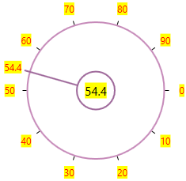

# Labels in WPF SfRadialSlider

Labels are the numerical representation of the ticks starting from Minimum to Maximum value. The frequency of the labels also controlled by [TickFrequency](https://help.syncfusion.com/cr/wpf/Syncfusion.SfRadialMenu.Wpf~Syncfusion.Windows.Controls.Navigation.SfRadialSlider~TickFrequency.html) property.

## Change tick label text formatting

You can customize the text format for the specific or all tick labels by handling the [DrawLabel](https://help.syncfusion.com/cr/wpf/Syncfusion.SfRadialMenu.Wpf~Syncfusion.Windows.Controls.Navigation.SfRadialSlider~DrawLabel_EV.html) event and setting the [DrawLabelEventArgs.Handled](https://help.syncfusion.com/cr/wpf/Syncfusion.SfRadialMenu.Wpf~Syncfusion.Windows.Controls.Navigation.DrawLabelEventArgs~Handled.html) property value as `true`. You can change the content and foreground of the tick labels by using the [DrawLabelEventArgs.Text](https://help.syncfusion.com/cr/wpf/Syncfusion.SfRadialMenu.Wpf~Syncfusion.Windows.Controls.Navigation.DrawLabelEventArgs~Text.html) and [DrawLabelEventArgs.Foreground](https://help.syncfusion.com/cr/wpf/Syncfusion.SfRadialMenu.Wpf~Syncfusion.Windows.Controls.Navigation.DrawLabelEventArgs~Foreground.html) properties. You can also change the font family and font size of the tick labels by using the [DrawLabelEventArgs.FontFamily](https://help.syncfusion.com/cr/wpf/Syncfusion.SfRadialMenu.Wpf~Syncfusion.Windows.Controls.Navigation.DrawLabelEventArgs~FontFamily.html) and [DrawLabelEventArgs.FontSize](https://help.syncfusion.com/cr/wpf/Syncfusion.SfRadialMenu.Wpf~Syncfusion.Windows.Controls.Navigation.DrawLabelEventArgs~FontSize.html) properties.




<syncfusion:SfRadialSlider DrawLabel="sfRadialSlider_DrawLabel"  
                           Name="sfRadialSlider">           
    <TextBlock Text="{Binding ElementName=sfRadialSlider, Path=Value}" 
               FontSize="15"
               HorizontalAlignment="Center"
               VerticalAlignment="Center"/>
</syncfusion:SfRadialSlider>




sfRadialSlider.DrawLabel += sfRadialSlider_DrawLabel;




You can handle the event as follows,




private void sfRadialSlider_DrawLabel(object sender, DrawLabelEventArgs e) {            
    e.Handled = true;
    if (e.Handled == true) {
        e.Text += "°C";
        sfRadialSlider.Content = e.Text;
        if (e.Value <= 33) {
            e.FontSize = 8;
            e.FontFamily = new FontFamily("Arial");
            e.Foreground = Brushes.Green;
        }
        else if (e.Value > 33 && e.Value <= 66) {
            e.FontSize = 10;
            e.FontFamily = new FontFamily("Courier");
            e.Foreground = Brushes.Gold;
        }
        else {
            e.FontSize = 12;
            e.FontFamily = new FontFamily("Georgia");
            e.Foreground = Brushes.Red;
        }
    }
}




N> View [Sample](https://github.com/SyncfusionExamples/syncfusion-wpf-radial-slider-examples/tree/master/Samples/Label-Formatting) in GitHub

## Custom UI for tick label

You can change the UI of the each tick labels available in the `SfRadialSlider` by using the [LabelTemplate](https://help.syncfusion.com/cr/wpf/Syncfusion.SfRadialMenu.Wpf~Syncfusion.Windows.Controls.Navigation.SfRadialSlider~LabelTemplate.html) property.




<syncfusion:SfRadialSlider Name="sfRadialSlider">
    <syncfusion:SfRadialSlider.LabelTemplate>
        <DataTemplate>
            <TextBlock Background="Yellow" 
                       Text="{Binding}"
                       Foreground="Red"/>
        </DataTemplate>
    </syncfusion:SfRadialSlider.LabelTemplate>
    <TextBlock Text="{Binding ElementName=sfRadialSlider, Path=Value}" 
               Background="Yellow" />
</syncfusion:SfRadialSlider>




N> View [Sample](https://github.com/SyncfusionExamples/syncfusion-wpf-radial-slider-examples/tree/master/Samples/Custon-Label) in GitHub
