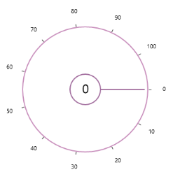

# WPF SfRadialSlider Overview  

The [SfRadialSlider](https://help.syncfusion.com/cr/wpf/Syncfusion.Windows.Controls.Navigation.SfRadialSlider.html) provides an optimized interface for selecting a numeric value within the minimum and maximum range in the circular track.

## Key features

* Customization – Can customize outer rim, inner rim, labels, ticks, and pointer. 

* Content – Can place content inside the inner rim.

* Step interval support

* Min-Max value support

* Sweep direction support

* Start-End angle support

 

