# Working with WPF SfRadialSlider

This section explains different UI customization and common features available in [SfRadialSlider](https://help.syncfusion.com/cr/wpf/Syncfusion.SfRadialMenu.Wpf~Syncfusion.Windows.Controls.Navigation.SfRadialSlider.html) control.

## Select tick value

You can select any tick value by dragging the pointer along the circular track or clicking on the corresponding track value. You can get the selected value by using the `Value` property. The default value of `Value` property is `0`.

### Select tick value programmatically

You can select a tick value programmatically by assigning the tick value to the `Value` property.




<syncfusion:SfRadialSlider Value="34"
                           Name="radialSlider" />




radialSlider.Value = 34;




N> [View Sample in GitHub](https://github.com/SyncfusionExamples/syncfusion-wpf-radial-slider-examples/tree/master/Samples/RadialSlider-Features)

## Display selected value

You can display the selected value in the content area of the `SfRadialSlider` by setting the selected value to the [Content](https://help.syncfusion.com/cr/cref_files/wpf/Syncfusion.SfRadialMenu.Wpf~Syncfusion.Windows.Controls.Navigation.SfRadialSlider~Content.html) property. The default value of `Content` property is `null`.




public class ViewModel
{
    private double selectedValue;

    public double SelectedValue {
        get {
            return selectedValue;
        }
        set {
            selectedValue= value;
        }
    }
}







<syncfusion:SfRadialSlider Content="{Binding SelectedValue,Mode=TwoWay}"
                           Value="{Binding SelectedValue,Mode=TwoWay}" 
                           Name="radialSlider">
    <syncfusion:SfRadialSlider.DataContext>
        <local:ViewModel/>
    </syncfusion:SfRadialSlider.DataContext>
</syncfusion:SfRadialSlider>




N> [View Sample in GitHub](https://github.com/SyncfusionExamples/syncfusion-wpf-radial-slider-examples/tree/master/Samples/RadialSlider-Features)

## Custom UI for display content

You can customize the appearance of display content area by using the `ContentTemplate` property. The default value of `ContentTemplate` property is `null`. The `DataContext` of the `ContentTemplate` property is `SfRadialSlider`.




public class ViewModel
{
    private double selectedValue;

    public double SelectedValue {
        get {
            return selectedValue;
        }
        set {
            selectedValue= value;
        }
    }
}







<syncfusion:SfRadialSlider Value="{Binding SelectedValue,Mode=TwoWay}" 
                           Name="radialSlider">
    <syncfusion:SfRadialSlider.ContentTemplate>
        <DataTemplate>
            <TextBlock Text="{Binding SelectedValue}"
                       FontWeight="Bold" 
                       Background="Yellow"/>
        </DataTemplate>
    </syncfusion:SfRadialSlider.ContentTemplate>

    <syncfusion:SfRadialSlider.DataContext>
        <local:ViewModel/>
    </syncfusion:SfRadialSlider.DataContext>
</syncfusion:SfRadialSlider>




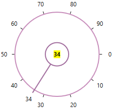

## Change min-max tick value

You can change the minimum and maximum ticks value of the `SfRadialSlider` by using the `Minimum` and `Maximum` properties. The default value of `Minimum` property is `0` and `Maximum` property is `100`.




<syncfusion:SfRadialSlider Minimum="100"
                           Maximum="200"
                           Name="radialSlider" />




radialSlider.Minimum = 100;
radialSlider.Maximum = 200;




N> [View Sample in GitHub](https://github.com/SyncfusionExamples/syncfusion-wpf-radial-slider-examples/tree/master/Samples/RadialSlider-Features)

## Change start and end position

You can change starting and ending position for generating the ticks in the circular track by using the [StartAngle](https://help.syncfusion.com/cr/cref_files/wpf/Syncfusion.SfRadialMenu.Wpf~Syncfusion.Windows.Controls.Navigation.SfRadialSlider~StartAngle.html) and [EndAngle](https://help.syncfusion.com/cr/cref_files/wpf/Syncfusion.SfRadialMenu.Wpf~Syncfusion.Windows.Controls.Navigation.SfRadialSlider~EndAngle.html) properties. The default value of `StartAngle` property is `0` and `StartAngle` property is `360`.




<syncfusion:SfRadialSlider StartAngle="90"
                           EndAngle="330"
                           Name="radialSlider" />




radialSlider.StartAngle = 90;
radialSlider.EndAngle = 300;




N> [View Sample in GitHub](https://github.com/SyncfusionExamples/syncfusion-wpf-radial-slider-examples/tree/master/Samples/RadialSlider-Features)

## Change tick display interval

You can change the tick display interval from the `Minimum` to `Maximum` values by using the [TickFrequency](https://help.syncfusion.com/cr/cref_files/wpf/Syncfusion.SfRadialMenu.Wpf~Syncfusion.Windows.Controls.Navigation.SfRadialSlider~TickFrequency.html) property. Based on `TickFrequency`'s multiples, the display interval is set from `Minimum` to `Maximum` value.




<syncfusion:SfRadialSlider TickFrequency="20"
                           Name="radialSlider" />




radialSlider.TickFrequency = 20;




N> [View Sample in GitHub](https://github.com/SyncfusionExamples/syncfusion-wpf-radial-slider-examples/tree/master/Samples/RadialSlider-Features)

## Step interval

If you want to control the smallest possible range of value to be selected in `SfRadialSlider`, use the `SmallChange` property. The default value of `SmallChange` property is `0.1`. For example, if `SmallChange` is set to `5`, then it is only possible to select values that are multiples of `5`.




<syncfusion:SfRadialSlider SmallChange="5"
                           Name="radialSlider" />




radialSlider.SmallChange = 5;




N> [View Sample in GitHub](https://github.com/SyncfusionExamples/syncfusion-wpf-radial-slider-examples/tree/master/Samples/RadialSlider-Features)

## Change tick direction

You can change the ticks direction either clockwise or counter-clockwise direction by using the [SweepDirection](https://help.syncfusion.com/cr/cref_files/wpf/Syncfusion.SfRadialMenu.Wpf~Syncfusion.Windows.Controls.Navigation.SfRadialSlider~SweepDirection.html) property. The default value of `SweepDirection` property is `Clockwise`.




<syncfusion:SfRadialSlider SweepDirection="Counterclockwise" 
                           StartAngle="180" 
                           EndAngle="360" 
                           Name="radialSlider" />




radialSlider.SweepDirection = SweepDirection.Counterclockwise;




N> [View Sample in GitHub](https://github.com/SyncfusionExamples/syncfusion-wpf-radial-slider-examples/tree/master/Samples/RadialSlider-Features)

## Show maximum value

By default, the maximum value is not shown in the `SfRadialSlider`. If you want to show the maximum value when difference of the minimum and maximum value is not a `TickFrequency` multiples, use the [ShowMaximumValue](https://help.syncfusion.com/cr/cref_files/wpf/Syncfusion.SfRadialMenu.Wpf~Syncfusion.Windows.Controls.Navigation.SfRadialSlider~ShowMaximumValue.html) property value as `true`. The default value of `ShowMaximumValue` property is `false`.




<syncfusion:SfRadialSlider TickFrequency="9" 
                           ShowMaximumValue="True"
                           Name="radialSlider" />




radialSlider.TickFrequency = 9;
radialSlider.ShowMaximumValue = true;




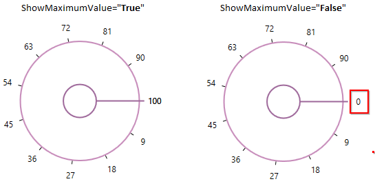

N> [View Sample in GitHub](https://github.com/SyncfusionExamples/syncfusion-wpf-radial-slider-examples/tree/master/Samples/RadialSlider-Features)

## Change tick radius

You can change the each tick radius by using the [TickRadiusFactor](https://help.syncfusion.com/cr/cref_files/wpf/Syncfusion.SfRadialMenu.Wpf~Syncfusion.Windows.Controls.Navigation.SfRadialSlider~TickRadiusFactor.html) property. The default value of `TickRadiusFactor` property is `0.72`. You can hide the ticks by using the [TickVisibility](https://help.syncfusion.com/cr/cref_files/wpf/Syncfusion.SfRadialMenu.Wpf~Syncfusion.Windows.Controls.Navigation.SfRadialSlider~TickVisibility.html) property value as `Hidden`.




<syncfusion:SfRadialSlider TickRadiusFactor="0.5"
                           TickVisibility="Visible" 
                           Name="radialSlider" />




radialSlider.TickRadiusFactor = 0.5;
radialSlider.TickVisibility = Visibility.Visible;




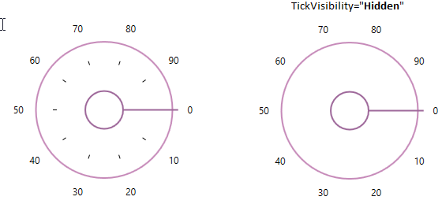

N> [View Sample in GitHub](https://github.com/SyncfusionExamples/syncfusion-wpf-radial-slider-examples/tree/master/Samples/RadialSlider-Features)

### Custom UI of ticks

You can customize the appearance of ticks by using the `TickTemplate` property. The default value of `TickTemplate` property is `null`. The `DataContext` of the `TickTemplate` property is `SfRadialSlider` tick value count.




<syncfusion:SfRadialSlider Name="radialSlider">
    <syncfusion:SfRadialSlider.TickTemplate>
        <DataTemplate>
            <Border Background="Red"/>
        </DataTemplate>
    </syncfusion:SfRadialSlider.TickTemplate>
</syncfusion:SfRadialSlider>




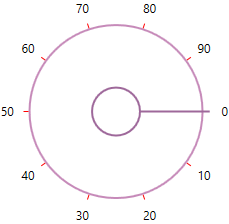

N> [View Sample in GitHub](https://github.com/SyncfusionExamples/syncfusion-wpf-radial-slider-examples/tree/master/Samples/Custom-UI)

## Change tick label radius

You can change the each tick label radius by using the [LabelRadiusFactor](https://help.syncfusion.com/cr/cref_files/wpf/Syncfusion.SfRadialMenu.Wpf~Syncfusion.Windows.Controls.Navigation.SfRadialSlider~LabelRadiusFactor.html) property. The default value of `LabelRadiusFactor` property is `0.87`. You can hide the tick labels by using the [LabelVisibility](https://help.syncfusion.com/cr/cref_files/wpf/Syncfusion.SfRadialMenu.Wpf~Syncfusion.Windows.Controls.Navigation.SfRadialSlider~LabelVisibility.html) property value as `Hidden`.




<syncfusion:SfRadialSlider LabelRadiusFactor="0.5"
                           LabelVisibility="Visible" 
                           Name="radialSlider" />




radialSlider.LabelRadiusFactor = 0.5;
radialSlider.LabelVisibility = Visibility.Visible;




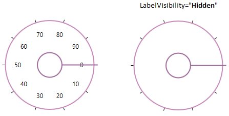

N> [View Sample in GitHub](https://github.com/SyncfusionExamples/syncfusion-wpf-radial-slider-examples/tree/master/Samples/RadialSlider-Features)

### Custom UI of tick labels

You can customize the appearance of tick labels by using the `LabelTemplate` property. The default value of `LabelTemplate` property is `null`. The `DataContext` of the `LabelTemplate` property is `SfRadialSlider` tick values.




<syncfusion:SfRadialSlider Name="radialSlider">
    <syncfusion:SfRadialSlider.LabelTemplate>
        <DataTemplate>
            <TextBlock Text="{Binding}"
                       Foreground="Red"
                       Background="Yellow"/>
        </DataTemplate>
    </syncfusion:SfRadialSlider.LabelTemplate>
</syncfusion:SfRadialSlider>




N> [View Sample in GitHub](https://github.com/SyncfusionExamples/syncfusion-wpf-radial-slider-examples/tree/master/Samples/Custom-UI)

## Change inner rim radius

You can change inner rim(circle in the center of radial slider) radius of the `SfRadialSlider` by using the [InnerRimRadiusFactor](https://help.syncfusion.com/cr/cref_files/wpf/Syncfusion.SfRadialMenu.Wpf~Syncfusion.Windows.Controls.Navigation.SfRadialSlider~InnerRimRadiusFactor.html) property. The default value of `InnerRimRadiusFactor` property is `0.2`.




<syncfusion:SfRadialSlider InnerRimRadiusFactor="0.5" 
                           Name="radialSlider" />




radialSlider.InnerRimRadiusFactor = 0.5;




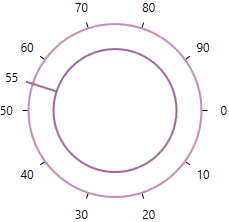

N> [View Sample in GitHub](https://github.com/SyncfusionExamples/syncfusion-wpf-radial-slider-examples/tree/master/Samples/RadialSlider-Features)

### Custom appearance of inner rim

You can change the background of the inner rim by using the [InnerRimFill](https://help.syncfusion.com/cr/wpf/Syncfusion.SfRadialMenu.Wpf~Syncfusion.Windows.Controls.Navigation.SfRadialSlider~InnerRimFill.html) 
property. You can also change the border color and border thickness of the inner rim by using the [InnerRimStroke](https://help.syncfusion.com/cr/wpf/Syncfusion.SfRadialMenu.Wpf~Syncfusion.Windows.Controls.Navigation.SfRadialSlider~InnerRimStroke.html) and [InnerRimStrokeThickness](https://help.syncfusion.com/cr/wpf/Syncfusion.SfRadialMenu.Wpf~Syncfusion.Windows.Controls.Navigation.SfRadialSlider~InnerRimStrokeThickness.html) properties. The default value of `InnerRimStroke` property is `Light SlateGray` and `InnerRimStrokeThickness` property is `2`.




<syncfusion:SfRadialSlider InnerRimFill="Yellow" 
                           InnerRimStroke="Red" 
                           InnerRimStrokeThickness="4"
                           Name="radialSlider" />




radialSlider.InnerRimFill = Brushes.Yellow;
radialSlider.InnerRimStroke = Brushes.Red;
radialSlider.InnerRimStrokeThickness = 4;




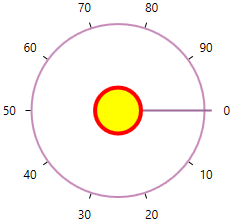

N> [View Sample in GitHub](https://github.com/SyncfusionExamples/syncfusion-wpf-radial-slider-examples/tree/master/Samples/RadialSlider-Features)

## Change outer rim radius

You can change outer rim radius of the `SfRadialSlider` by using the [OuterRimRadiusFactor](https://help.syncfusion.com/cr/cref_files/wpf/Syncfusion.SfRadialMenu.Wpf~Syncfusion.Windows.Controls.Navigation.SfRadialSlider~OuterRimRadiusFactor.html) properties. The default value of `OuterRimRadiusFactor` property is `0.7`.




<syncfusion:SfRadialSlider OuterRimRadiusFactor="0.5"
                           Name="radialSlider" />




radialSlider.OuterRimRadiusFactor = 0.5;




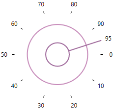

N> [View Sample in GitHub](https://github.com/SyncfusionExamples/syncfusion-wpf-radial-slider-examples/tree/master/Samples/RadialSlider-Features)

### Custom appearance of outer rim

You can change the fill color of the outer rim by using the `Background` property. You can also change the border color and border thickness of the outer rim by using the [OuterRimStroke](https://help.syncfusion.com/cr/wpf/Syncfusion.SfRadialMenu.Wpf~Syncfusion.Windows.Controls.Navigation.SfRadialSlider~OuterRimStroke.html) and [OuterRimStrokeThickness](https://help.syncfusion.com/cr/wpf/Syncfusion.SfRadialMenu.Wpf~Syncfusion.Windows.Controls.Navigation.SfRadialSlider~InnerRimStrokeThickness.html) properties. The default value of `OuterRimStroke` property is `Rosy Brown` and `OuterRimStrokeThickness` property is `2`.




<syncfusion:SfRadialSlider Background="Yellow" 
                           OuterRimStroke="Red" 
                           Name="radialSlider" />




radialSlider.Background = Brushes.Yellow;
radialSlider.OuterRimStroke = Brushes.Red;




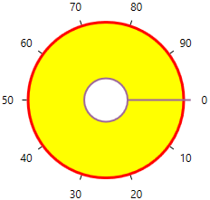

N> [View Sample in GitHub](https://github.com/SyncfusionExamples/syncfusion-wpf-radial-slider-examples/tree/master/Samples/RadialSlider-Features)

## Change selection pointer radius

You can change the selection pointer radius by using the [PointerRadiusFactor](https://help.syncfusion.com/cr/wpf/Syncfusion.SfRadialMenu.Wpf~Syncfusion.Windows.Controls.Navigation.SfRadialSlider~PointerRadiusFactor.html) property. The default value of `PointerRadiusFactor` property is `0.75`. 




<syncfusion:SfRadialSlider PointerRadiusFactor="0.5"
                           Name="radialSlider" />




radialSlider.PointerRadiusFactor = 0.5;




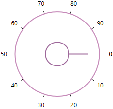

N> [View Sample in GitHub](https://github.com/SyncfusionExamples/syncfusion-wpf-radial-slider-examples/tree/master/Samples/RadialSlider-Features)

### Custom UI of selection pointer

You can customize the appearance of selection pointer by using the [PointerStyle](https://help.syncfusion.com/cr/cref_files/wpf/Syncfusion.SfRadialMenu.Wpf~Syncfusion.Windows.Controls.Navigation.SfRadialSlider~PointerStyle.html) property. The `DataContext` of the `PointerStyle` property is `syncfusion:RadialPointer`.




<syncfusion:SfRadialSlider Name="radialSlider">
    <syncfusion:SfRadialSlider.PointerStyle>
        
    </syncfusion:SfRadialSlider.PointerStyle>
</syncfusion:SfRadialSlider>




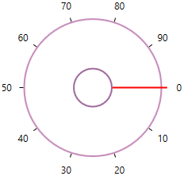

N> [View Sample in GitHub](https://github.com/SyncfusionExamples/syncfusion-wpf-radial-slider-examples/tree/master/Samples/Custom-UI)

### Custom UI of preview selection pointer

You can customize the appearance of preview selection pointer by using the [PreviewPointerStyle](https://help.syncfusion.com/cr/cref_files/wpf/Syncfusion.SfRadialMenu.Wpf~Syncfusion.Windows.Controls.Navigation.SfRadialSlider~PreviewPointerStyle.html) property. The `DataContext` of the `PreviewPointerStyle` property is `syncfusion:RadialPreviewPointer`.




<syncfusion:SfRadialSlider Name="radialSlider">
    <syncfusion:SfRadialSlider.PreviewPointerStyle>
        
    </syncfusion:SfRadialSlider.PreviewPointerStyle>
</syncfusion:SfRadialSlider>




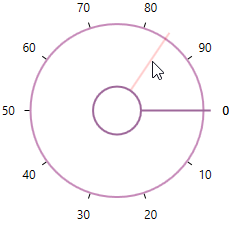

N> [View Sample in GitHub](https://github.com/SyncfusionExamples/syncfusion-wpf-radial-slider-examples/tree/master/Samples/Custom-UI)

## Text formatting

You can customize the text format for the specific or all tick labels by handling the [DrawLabel](https://help.syncfusion.com/cr/wpf/Syncfusion.SfRadialMenu.Wpf~Syncfusion.Windows.Controls.Navigation.SfRadialSlider~DrawLabel_EV.html) event and setting the [DrawLabelEventArgs.Handled](https://help.syncfusion.com/cr/wpf/Syncfusion.SfRadialMenu.Wpf~Syncfusion.Windows.Controls.Navigation.DrawLabelEventArgs~Handled.html) property value as `true`. You can change the content and foreground of the tick labels by using the [DrawLabelEventArgs.Text](https://help.syncfusion.com/cr/wpf/Syncfusion.SfRadialMenu.Wpf~Syncfusion.Windows.Controls.Navigation.DrawLabelEventArgs~Text.html) and [DrawLabelEventArgs.Foreground](https://help.syncfusion.com/cr/wpf/Syncfusion.SfRadialMenu.Wpf~Syncfusion.Windows.Controls.Navigation.DrawLabelEventArgs~Foreground.html) properties. You can also change the font family and font size of the tick labels by using the [DrawLabelEventArgs.FontFamily](https://help.syncfusion.com/cr/wpf/Syncfusion.SfRadialMenu.Wpf~Syncfusion.Windows.Controls.Navigation.DrawLabelEventArgs~FontFamily.html) and [DrawLabelEventArgs.FontSize](https://help.syncfusion.com/cr/wpf/Syncfusion.SfRadialMenu.Wpf~Syncfusion.Windows.Controls.Navigation.DrawLabelEventArgs~FontSize.html) properties.




<syncfusion:SfRadialSlider DrawLabel="sfRadialSlider_DrawLabel"  
                           Name="sfRadialSlider">           
    <TextBlock Text="{Binding ElementName=sfRadialSlider, Path=Value}" 
               FontSize="15"
               HorizontalAlignment="Center"
               VerticalAlignment="Center"/>
</syncfusion:SfRadialSlider>




sfRadialSlider.DrawLabel += sfRadialSlider_DrawLabel;




You can handle the event as follows,




private void sfRadialSlider_DrawLabel(object sender, DrawLabelEventArgs e) {            
    e.Handled = true;
    e.Text += "°C";
    if (e.Value <= 33) {
        e.FontSize = 8;
        e.FontFamily = new FontFamily("Arial");
        e.Foreground = Brushes.Green;
    }
    else if (e.Value > 33 && e.Value <= 66) {
        e.FontSize = 10;
        e.FontFamily = new FontFamily("Courier");
        e.Foreground = Brushes.Gold;
    }
    else {
        e.FontSize = 12;
        e.FontFamily = new FontFamily("Georgia");
        e.Foreground = Brushes.Red;
    }
}




N> [View Sample in GitHub](https://github.com/SyncfusionExamples/syncfusion-wpf-radial-slider-examples/tree/master/Samples/Label-Formatting)

 ## Value changed notification

The selected value changed in `SfRadialSlider` can be examined using `ValueChanged` event. The `ValueChanged` event contains the old and newly selected tick value in the `OldValue` and `NewValue` properties.




 <syncfusion:SfRadialSlider ValueChanged="RadialSlider_ValueChanged" 
                      Name="radialSlider"/>




SfRadialSlider radialSlider = new SfRadialSlider();
radialSlider.ValueChanged += RadialSlider_ValueChanged;




You can handle the event as follows,




private void RadialSlider_ValueChanged(object sender, RoutedPropertyChangedEventArgs<double> e){
    //Get old and new selected tick value
    var oldValue = e.OldValue;
    var newValue = e.NewValue;
}



