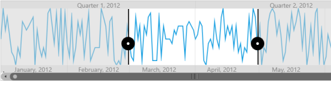

# Getting Started with WPF Range Selector (SfDateTimeRangeNavigator)

## Visual structure

The date-time range navigator control is composed of various elements such as higher level bar, lower Level bar, content, and resizable scroll bar.

* Higher level bar: Contains timespan format that is one level higher than date-time values of lower level bar, e.g. the higher level bar contains year format (yyyy) and the lower level bar contains month format (MMM).
* Lower level bar: Contains timespan format that is one lever lower than date-time values of higher level bar, e.g. the lower level bar contains month format (MMM) and the higher level bar contains year format (yyyy).
* Content: Holds any type of UI element inside the navigator.
* Resizable scroll bar: Allows users to zoom and scroll the content and label bars.

## Create SfDateTimeRangeNavigator

The following section explains how to create SfDateTimeRangeNavigator.

### Add the assembly reference

1. Open the Add Reference window in your project.
2. Choose our assemblies by following the given steps depending upon the developing environment.

   * If you use VS 2012, choose Assemblies > Extensions > Syncfusion.SfChart.WPF.dll.
   * If you use VS 2010, choose .Net > Syncfusion.SfChart.WPF.dll.

3.  Add the following namespace in your XAML page:



xmlns:Syncfusion="clr-namespace:Syncfusion.UI.Xaml.Charts"



### Initialize the SfDateTimeRangeNavigator





<Syncfusion:SfDateTimeRangeNavigator>

</Syncfusion:SfDateTimeRangeNavigator >





 SfDateTimeRangeNavigator rangeNavigator = new SfDateTimeRangeNavigator();





### Set ItemsSource for SfDateTimeRangeNavigator

Since the above steps are enough to create only empty date-time range navigator, you need to set the [`ItemsSource`](https://help.syncfusion.com/cr/wpf/Syncfusion.UI.Xaml.Charts.SfDateTimeRangeNavigator.html#Syncfusion_UI_Xaml_Charts_SfDateTimeRangeNavigator_ItemsSource) and [`XBindingPath`](https://help.syncfusion.com/cr/wpf/Syncfusion.UI.Xaml.Charts.SfDateTimeRangeNavigator.html#Syncfusion_UI_Xaml_Charts_SfDateTimeRangeNavigator_XBindingPath) for the SfDateTimeRangeNavigator. The ItemsSource must implement the IEnumerable interface. 





<Syncfusion:SfDateTimeRangeNavigator ItemsSource="{Binding UsersList}" XBindingPath="Date"  >

</Syncfusion:SfDateTimeRangeNavigator >





SfDateTimeRangeNavigator rangeNavigator = new SfDateTimeRangeNavigator()
{

        ItemsSource = new ViewModel().UsersList,

        XBindingPath ="Date"

};





### Add content

Add content that needs to be displayed inside the date-time range navigator.

### Property 

<table>
<tr>
<th>
Property</th><th>
Description</th></tr>
<tr>
<td>
{{'[`ItemsSource`](https://help.syncfusion.com/cr/wpf/Syncfusion.UI.Xaml.Charts.SfDateTimeRangeNavigator.html#Syncfusion_UI_Xaml_Charts_SfDateTimeRangeNavigator_ItemsSource)'| markdownify }}</td><td>
Sets the ItemsSource for SfDateTimeRangeNavigator.</td></tr>
<tr>
<td>
{{'[`XBindingPath`](https://help.syncfusion.com/cr/wpf/Syncfusion.UI.Xaml.Charts.SfDateTimeRangeNavigator.html#Syncfusion_UI_Xaml_Charts_SfDateTimeRangeNavigator_XBindingPath)'| markdownify }}</td><td>
Represents the date-time x values.</td></tr>
<tr>
<td>
{{'[`Content`](https://help.syncfusion.com/cr/wpf/Syncfusion.UI.Xaml.Charts.SfRangeNavigator.html#Syncfusion_UI_Xaml_Charts_SfRangeNavigator_Content)'| markdownify }}</td><td>
Adds any UI content inside the date-time range navigator.</td></tr>
</table>





<Syncfusion:SfDateTimeRangeNavigator ItemsSource="{Binding UsersList}" XBindingPath="Date"  >

	<Syncfusion:SfDateTimeRangeNavigator.Content>

		<Syncfusion:SfChart x:Name="Chart">

			<Syncfusion:SfChart.PrimaryAxis>

				<Syncfusion:DateTimeAxis/>

			</Syncfusion:SfChart.PrimaryAxis>

		<Syncfusion:SfChart.SecondaryAxis>

    <Syncfusion:NumericalAxis/>

</Syncfusion:SfChart.SecondaryAxis>

<Syncfusion:LineSeries 

        ItemsSource="{Binding UsersList}" 

        XBindingPath="Date”

        YBindingPath="NoOfUsers">

</Syncfusion:LineSeries>

</Syncfusion:SfChart>

</Syncfusion:SfDateTimeRangeNavigator.Content >

</Syncfusion:SfDateTimeRangeNavigator >





SfChart chart = new SfChart();

chart.PrimaryAxis = new DateTimeAxis();

chart.SecondaryAxis = new NumericalAxis();

LineSeries series = new LineSeries()
{

        ItemsSource = new ViewModel().UsersList,

        XBindingPath = "Date",

        YBindingPath = "NoOfUsers"

};

chart.Series.Add(series);

SfDateTimeRangeNavigator rangeNavigator = new SfDateTimeRangeNavigator()
{

        ItemsSource = new ViewModel().StockPriceDetails,

        XBindingPath ="Date"

};

rangeNavigator.Content = chart;





The following screenshot illustrates the result of the above code sample.

## Create SfDateTimeRangeNavigator from code-behind

This section explains how to create an application using the date-time range navigator from code-behind.

### Add assembly reference

1. Open the Add Reference window in your project.
2. Choose Windows > Extensions > Syncfusion.SfChart.WPF.
3. Add the following namespace in your C# file: MainPage.xaml.cs.



using Syncfusion.UI.Xaml.Charts;



Initialize the Range Navigator



SfDateTimeRangNavigator rangenavigator = new SfDateTimeRangNavigator ();



Create a Sample Data Source



public class ItemsSource
 {

   public DateTime Date { get; set; }

   public double NoOfUsers { get; set; }

 }

public class UsersViewModel

 {

 public UsersViewModel()

  {

   this.UsersList = new ObservableCollection<ItemsSource>();

   DateTime date = DateTime.Today;

   UsersList.Add(new ItemsSource { TimeStamp = date.AddHours(0.5), NoOfUsers = 3000 });

   UsersList.Add(new ItemsSource { TimeStamp = date.AddHours(0.5), NoOfUsers = 5000 });

   UsersList.Add(new ItemsSource { TimeStamp = date.AddHours(0.5), NoOfUsers = 2000 });

   UsersList.Add(new ItemsSource { TimeStamp = date.AddHours(0.5), NoOfUsers = 7000 });

   UsersList.Add(new ItemsSource { TimeStamp = date.AddHours(0.5), NoOfUsers = 6000 });

   UsersList.Add(new ItemsSource { TimeStamp = date.AddHours(0.5), NoOfUsers = 3000 });  }

 public ObservableCollection<ItemsSource> UsersList

  {

    get; set;

  }

 }



### Define ItemsSource 

Define the ItemsSource for the date-time range navigator as demonstrated in the following code sample.

N> You can set any IEnumerable collection as ItemsSource.



//Intialize the SfDateTimeRangNavigator.

SfDateTimeRangNavigator rangenavigator = new SfDateTimeRangNavigator ();

rangenavigator.ItemsSource = UsersList;

rangenavigator.XBindingPath = "Date";



### Add content

Add the content that needs to be displayed inside the date-time range navigator control using the [`Content`](https://help.syncfusion.com/cr/wpf/Syncfusion.UI.Xaml.Charts.SfRangeNavigator.html#Syncfusion_UI_Xaml_Charts_SfRangeNavigator_Content) property.



//Intialize the SfChart

SfChart chart = new SfChart();

LineSeries series = new LineSeries();

series.ItemsSource = UsersList;

series.XBindingPath = "Date";

series.YBindingPath = "NoOfUsers";

var content = chart.Series.add(series);

//Add content to navigator

rangenavigator.Content = content;



The following screenshot illustrates the result of the above code sample.

N> The [`SelectedData`](https://help.syncfusion.com/cr/wpf/Syncfusion.UI.Xaml.Charts.SfDateTimeRangeNavigator.html#Syncfusion_UI_Xaml_Charts_SfDateTimeRangeNavigator_SelectedData) property of the date-time range navigator control returns the collection that represents the data between the selected ranges.

## Theme

SfDateTimeRangeNavigator supports various built-in themes. Refer to the below links to apply themes for the SfDateTimeRangeNavigator,

  * [Apply theme using SfSkinManager](https://help.syncfusion.com/wpf/themes/skin-manager)
	
  * [Create a custom theme using ThemeStudio](https://help.syncfusion.com/wpf/themes/theme-studio#creating-custom-theme)

  