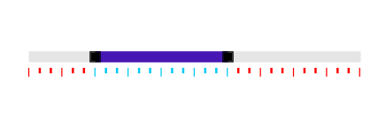
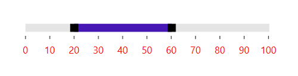

# Styling and Appearance in WPF Range Slider (SfRangeSlider)

[SfRangeSlider](https://help.syncfusion.com/cr/wpf/Syncfusion.SfInput.Wpf~Syncfusion.Windows.Controls.Input.SfRangeSlider.html) makes it possible to change the appearance by providing certain properties.

## InactiveTrackStyle

Modify the appearance of the inactive track using the [InactiveTrackStyle](https://help.syncfusion.com/cr/wpf/Syncfusion.Windows.Controls.Input.SfRangeSlider.html#Syncfusion_Windows_Controls_Input_SfRangeSlider_InactiveTrackStyle) property.





    <Grid>
        <Grid.Resources>
            <ResourceDictionary>
                
            </ResourceDictionary>
        </Grid.Resources>
        <editors:SfRangeSlider
            Width="300"
            InactiveTrackStyle="{StaticResource InactiveTrackStyle}"
            Maximum="100"
            Minimum="0" />
    </Grid>





            Grid parentGrid = new Grid();

            Style inactiveTrackStyle = new Style(typeof(Rectangle));
            inactiveTrackStyle.Setters.Add(new Setter(Rectangle.FillProperty, new SolidColorBrush((Color)ColorConverter.ConvertFromString("#a8a8a8"))));
            inactiveTrackStyle.Setters.Add(new Setter(Rectangle.HeightProperty, (double)3));
            inactiveTrackStyle.Setters.Add(new Setter(Rectangle.RadiusXProperty, (double)2));
            inactiveTrackStyle.Setters.Add(new Setter(Rectangle.RadiusYProperty, (double)2));
            Resources.Add("inactiveTrackStyle", inactiveTrackStyle);

            SfRangeSlider rangeSlider = new SfRangeSlider()
            {
                Width = 300,
                Minimum = 0,
                Maximum = 100,
                InactiveTrackStyle = inactiveTrackStyle
            };

            parentGrid.Children.Add(rangeSlider);
            this.Content = parentGrid;





## ActiveTrackStyle

Modify the appearance of the active track by using the [ActiveTrackStyle](https://help.syncfusion.com/cr/wpf/Syncfusion.Windows.Controls.Input.SfRangeSlider.html#Syncfusion_Windows_Controls_Input_SfRangeSlider_ActiveTrackStyle) property.





    <Grid>
        <Grid.Resources>
            <ResourceDictionary>
                
                
            </ResourceDictionary>
        </Grid.Resources>
        <editors:SfRangeSlider
            Width="300"
            ActiveTrackStyle="{StaticResource ActiveTrackStyle}"
            InactiveTrackStyle="{StaticResource InactiveTrackStyle}"
            Maximum="100"
            Minimum="0"
            RangeEnd="60"
            RangeStart="20"
            ShowRange="True" />
    </Grid>





            Grid parentGrid = new Grid();

            Style inactiveTrackStyle = new Style(typeof(Rectangle));
            inactiveTrackStyle.Setters.Add(new Setter(Rectangle.FillProperty, new SolidColorBrush((Color)ColorConverter.ConvertFromString("#a8a8a8"))));
            inactiveTrackStyle.Setters.Add(new Setter(Rectangle.HeightProperty, (double)3));
            inactiveTrackStyle.Setters.Add(new Setter(Rectangle.RadiusXProperty, (double)2));
            inactiveTrackStyle.Setters.Add(new Setter(Rectangle.RadiusYProperty, (double)2));
            Resources.Add("inactiveTrackStyle", inactiveTrackStyle);

            Style activeTrackStyle = new Style(typeof(Rectangle));
            activeTrackStyle.Setters.Add(new Setter(Rectangle.FillProperty, new SolidColorBrush((Color)ColorConverter.ConvertFromString("#505050"))));
            activeTrackStyle.Setters.Add(new Setter(Rectangle.HeightProperty, (double)3));
            Resources.Add("activeTrackStyle", activeTrackStyle);

            SfRangeSlider rangeSlider = new SfRangeSlider()
            {
                Width = 300,
                Minimum = 0,
                Maximum = 100,
                ShowRange = true,
                RangeStart = 20,
                RangeEnd = 60,
                ActiveTrackStyle = activeTrackStyle,
                InactiveTrackStyle = inactiveTrackStyle
            };

            parentGrid.Children.Add(rangeSlider);
            this.Content = parentGrid;





## ThumbStyle

Modify the appearance of the thumb by using the [ThumbStyle](https://help.syncfusion.com/cr/wpf/Syncfusion.Windows.Controls.Input.SfRangeSlider.html#Syncfusion_Windows_Controls_Input_SfRangeSlider_ThumbStyle) property.





    <Grid>
        <Grid.Resources>
            <ResourceDictionary>
                
                
                
            </ResourceDictionary>
        </Grid.Resources>
        <editors:SfRangeSlider
            Width="300"
            ActiveTrackStyle="{StaticResource ActiveTrackStyle}"
            InactiveTrackStyle="{StaticResource InactiveTrackStyle}"
            Maximum="100"
            Minimum="0"
            RangeEnd="60"
            RangeStart="20"
            ShowRange="True"
            ThumbStyle="{StaticResource ThumbStyle}" />
    </Grid>





            Grid parentGrid = new Grid();

            Style inactiveTrackStyle = new Style(typeof(Rectangle));
            inactiveTrackStyle.Setters.Add(new Setter(Rectangle.FillProperty, new SolidColorBrush((Color)ColorConverter.ConvertFromString("#a8a8a8"))));
            inactiveTrackStyle.Setters.Add(new Setter(Rectangle.HeightProperty, (double)3));
            inactiveTrackStyle.Setters.Add(new Setter(Rectangle.RadiusXProperty, (double)2));
            inactiveTrackStyle.Setters.Add(new Setter(Rectangle.RadiusYProperty, (double)2));
            Resources.Add("inactiveTrackStyle", inactiveTrackStyle);

            Style activeTrackStyle = new Style(typeof(Rectangle));
            activeTrackStyle.Setters.Add(new Setter(Rectangle.FillProperty, new SolidColorBrush((Color)ColorConverter.ConvertFromString("#505050"))));
            activeTrackStyle.Setters.Add(new Setter(Rectangle.HeightProperty, (double)3));
            Resources.Add("activeTrackStyle", activeTrackStyle);

            ControlTemplate template = new ControlTemplate(typeof(Thumb));
            FrameworkElementFactory elemFactory = new FrameworkElementFactory(typeof(Border));
            elemFactory.Name = "Border";
            elemFactory.SetValue(Border.CornerRadiusProperty, new CornerRadius(12));
            elemFactory.SetValue(Border.BackgroundProperty, new SolidColorBrush((Color)ColorConverter.ConvertFromString("#0095ff")));
            elemFactory.SetValue(Border.BorderBrushProperty, new SolidColorBrush((Color)ColorConverter.ConvertFromString("#0095ff")));
            template.VisualTree = elemFactory;
            

            Style thumbStyle = new Style(typeof(Thumb));
            thumbStyle.Setters.Add(new Setter(Thumb.BackgroundProperty, new SolidColorBrush((Color)ColorConverter.ConvertFromString("#0095ff"))));
            thumbStyle.Setters.Add(new Setter(Thumb.HeightProperty, (double)13));
            thumbStyle.Setters.Add(new Setter(Thumb.WidthProperty, (double)13));
            thumbStyle.Setters.Add(new Setter(Thumb.TemplateProperty, template));
            Resources.Add("thumbStyle", thumbStyle);

            SfRangeSlider rangeSlider = new SfRangeSlider()
            {
                Width = 300,
                Minimum = 0,
                Maximum = 100,
                ShowRange = true,
                RangeStart = 20,
                RangeEnd = 60,
                ActiveTrackStyle = activeTrackStyle,
                InactiveTrackStyle = inactiveTrackStyle,
                ThumbStyle = thumbStyle
            };

            parentGrid.Children.Add(rangeSlider);
            this.Content = parentGrid;





## Tick Customization

Modify the appearance of the ticks by using the following properties:

* TickStroke
* ActiveTickStroke
* TickLength
* TickStrokeThickness
* MinorTickStroke
* ActiveMinorTickStroke
* MinorTickLength
* MinorTickStrokeThickness

### TickStroke

Use the [TickStroke](https://help.syncfusion.com/cr/wpf/Syncfusion.Windows.Controls.Input.SfRangeSlider.html#Syncfusion_Windows_Controls_Input_SfRangeSlider_TickStroke) property, to change the color of major ticks. 





    <editors:SfRangeSlider
            Width="300"
            Maximum="100"
            Minimum="0"
            RangeEnd="60"
            RangeStart="20"
            ShowRange="True"
            TickFrequency="10"
            TickPlacement="BottomRight"
            TickStroke="#FF0000" />
    </Grid>





            Grid parentGrid = new Grid();
            SfRangeSlider rangeSlider = new SfRangeSlider()
            {
                Width = 300,
                Maximum = 100,
                Minimum = 0,
                RangeEnd = 60,
                RangeStart = 20,
                ShowRange = true,
                TickFrequency = 10,
                TickPlacement = Syncfusion.Windows.Controls.Input.TickPlacement.BottomRight,
                TickStroke = new SolidColorBrush((Color)ColorConverter.ConvertFromString("#FF0000"))
            };

            parentGrid.Children.Add(rangeSlider);
            this.Content = parentGrid;





### ActiveTickStroke

Use the [ActiveTickStroke](https://help.syncfusion.com/cr/wpf/Syncfusion.Windows.Controls.Input.SfRangeSlider.html#Syncfusion_Windows_Controls_Input_SfRangeSlider_ActiveTickStroke) property, to change the active major ticks color. 





    <editors:SfRangeSlider
            Width="300"
            Maximum="100"
            Minimum="0"
            RangeEnd="60"
            RangeStart="20"
            ShowRange="True"
            TickFrequency="10"
            TickPlacement="BottomRight"
            TickStroke="#FF0000" 
            ActiveTickStroke="#02C9F3"/>
    </Grid>





            Grid parentGrid = new Grid();
            SfRangeSlider rangeSlider = new SfRangeSlider()
            {
                Width = 300,
                Maximum = 100,
                Minimum = 0,
                RangeEnd = 60,
                RangeStart = 20,
                ShowRange = true,
                TickFrequency = 10,
                TickPlacement = Syncfusion.Windows.Controls.Input.TickPlacement.BottomRight,
                TickStroke = new SolidColorBrush((Color)ColorConverter.ConvertFromString("#FF0000")),
                ActiveTickStroke = new SolidColorBrush((Color)ColorConverter.ConvertFromString("#02C9F3"))
            };

            parentGrid.Children.Add(rangeSlider);
            this.Content = parentGrid;





### TickLength

Use the [TickLength](https://help.syncfusion.com/cr/wpf/Syncfusion.Windows.Controls.Input.SfRangeSlider.html#Syncfusion_Windows_Controls_Input_SfRangeSlider_TickLength) property, to change the height of the major ticks. 





    <Grid>
        <editors:SfRangeSlider
            Width="300"
            Maximum="100"
            Minimum="0"
            RangeEnd="60"
            RangeStart="20"
            ShowRange="True"
            TickLength="8"
            TickFrequency="10"
            TickPlacement="BottomRight"
            TickStroke="#FF0000" />
    </Grid>





            Grid parentGrid = new Grid();
            SfRangeSlider rangeSlider = new SfRangeSlider()
            {
                Width = 300,
                Maximum = 100,
                Minimum = 0,
                RangeEnd = 60,
                RangeStart = 20,
                ShowRange = true,
                TickFrequency = 10,
                TickLength = 8,
                TickPlacement = Syncfusion.Windows.Controls.Input.TickPlacement.BottomRight,
                TickStroke = new SolidColorBrush((Color)ColorConverter.ConvertFromString("#FF0000"))
            };

            parentGrid.Children.Add(rangeSlider);
            this.Content = parentGrid;





### TickStrokeThickness

Use the [TickStrokeThickness](https://help.syncfusion.com/cr/wpf/Syncfusion.Windows.Controls.Input.SfRangeSlider.html#Syncfusion_Windows_Controls_Input_SfRangeSlider_TickStrokeThickness) property, to change the thickness of the major ticks. 





    <Grid>
        <editors:SfRangeSlider
            Width="300"
            Maximum="100"
            Minimum="0"
            RangeEnd="60"
            RangeStart="20"
            ShowRange="True"
            TickFrequency="10"
            TickLength="8"
            TickPlacement="BottomRight"
            TickStroke="#FF0000"
            TickStrokeThickness="2" />
    </Grid>





            Grid parentGrid = new Grid();
            SfRangeSlider rangeSlider = new SfRangeSlider()
            {
                Width = 300,
                Maximum = 100,
                Minimum = 0,
                RangeEnd = 60,
                RangeStart = 20,
                ShowRange = true,
                TickFrequency = 10,
                TickLength = 8,
                TickStrokeThickness = 2,
                TickPlacement = Syncfusion.Windows.Controls.Input.TickPlacement.BottomRight,
                TickStroke = new SolidColorBrush((Color)ColorConverter.ConvertFromString("#FF0000"))
            };

            parentGrid.Children.Add(rangeSlider);
            this.Content = parentGrid;





### MinorTickStroke

Use the [MinorTickStroke](https://help.syncfusion.com/cr/wpf/Syncfusion.Windows.Controls.Input.SfRangeSlider.html#Syncfusion_Windows_Controls_Input_SfRangeSlider_MinorTickStroke) property, to change the minor ticks color. 





    <editors:SfRangeSlider
            Width="300"
            Maximum="100"
            Minimum="0"
            RangeEnd="60"
            RangeStart="20"
            ShowRange="True"
            TickFrequency="10"
            MinorTickFrequency="3"
            TickPlacement="BottomRight"
            MinorTickStroke ="#FF0000" />
    </Grid>





            Grid parentGrid = new Grid();
            SfRangeSlider rangeSlider = new SfRangeSlider()
            {
                Width = 300,
                Maximum = 100,
                Minimum = 0,
                RangeEnd = 60,
                RangeStart = 20,
                ShowRange = true,
                TickFrequency = 10,
                MinorTickFrequency=3,
                TickPlacement = Syncfusion.Windows.Controls.Input.TickPlacement.BottomRight,
                MinorTickStroke = new SolidColorBrush((Color)ColorConverter.ConvertFromString("#FF0000"))
            };

            parentGrid.Children.Add(rangeSlider);
            this.Content = parentGrid;





### ActiveMinorTickStroke

Use the [ActiveMinorTickStroke](https://help.syncfusion.com/cr/wpf/Syncfusion.Windows.Controls.Input.SfRangeSlider.html#Syncfusion_Windows_Controls_Input_SfRangeSlider_ActiveMinorTickStroke) property, to change the color of the active minor ticks. 





    <editors:SfRangeSlider
            Width="300"
            Maximum="100"
            Minimum="0"
            RangeEnd="60"
            RangeStart="20"
            ShowRange="True"
            TickFrequency="10"
            MinorTickFrequency="3"
            TickPlacement="BottomRight"
            ActiveMinorTickStroke ="#FF0000" />
    </Grid>





            Grid parentGrid = new Grid();
            SfRangeSlider rangeSlider = new SfRangeSlider()
            {
                Width = 300,
                Maximum = 100,
                Minimum = 0,
                RangeEnd = 60,
                RangeStart = 20,
                ShowRange = true,
                TickFrequency = 10,
                MinorTickFrequency=3,
                TickPlacement = Syncfusion.Windows.Controls.Input.TickPlacement.BottomRight,
                ActiveMinorTickStroke = new SolidColorBrush((Color)ColorConverter.ConvertFromString("#FF0000"))
            };

            parentGrid.Children.Add(rangeSlider);
            this.Content = parentGrid;





### MinorTickLength

Use the [MinorTickLength](https://help.syncfusion.com/cr/wpf/Syncfusion.Windows.Controls.Input.SfRangeSlider.html#Syncfusion_Windows_Controls_Input_SfRangeSlider_MinorTickLength) property, to change the height of the minor ticks. 





    <Grid>
        <editors:SfRangeSlider
            Width="300"
            Maximum="100"
            Minimum="0"
            RangeEnd="60"
            RangeStart="20"
            ShowRange="True"
            MinorTickLength ="6"
            TickLength ="10"
            TickFrequency="10"
            MinorTickFrequency="2"
            TickPlacement="BottomRight" />
    </Grid>





            Grid parentGrid = new Grid();
            SfRangeSlider rangeSlider = new SfRangeSlider()
            {
                Width = 300,
                Maximum = 100,
                Minimum = 0,
                RangeEnd = 60,
                RangeStart = 20,
                ShowRange = true,
                MinorTickLength = 6,
                TickLength = 10,
                TickFrequency= 10,
                MinorTickFrequency= 2,
                TickPlacement = Syncfusion.Windows.Controls.Input.TickPlacement.BottomRight
            };

            parentGrid.Children.Add(rangeSlider);
            this.Content = parentGrid;





### MinorTickStrokeThickness

Use the [MinorTickStrokeThickness](https://help.syncfusion.com/cr/wpf/Syncfusion.Windows.Controls.Input.SfRangeSlider.html#Syncfusion_Windows_Controls_Input_SfRangeSlider_MinorTickStrokeThickness) property, to change the thickness of the minor ticks. 





    <Grid>
        <editors:SfRangeSlider
            Width="300"
            Maximum="100"
            Minimum="0"
            RangeEnd="60"
            RangeStart="20"
            ShowRange="True"
            TickFrequency="10"
            MinorTickFrequency="2"
            TickLength="8"
            MinorTickLength="5"
            TickPlacement="BottomRight"
            TickStroke="#FF0000"
            MinorTickStroke="#FF0000"
            ActiveTickStroke="#02C9F3"
            ActiveMinorTickStroke="#02C9F3"
            MinorTickStrokeThickness ="2" />
    </Grid>





            Grid parentGrid = new Grid();
            SfRangeSlider rangeSlider = new SfRangeSlider()
            {
                Width = 300,
                Maximum = 100,
                Minimum = 0,
                RangeEnd = 60,
                RangeStart = 20,
                ShowRange = true,
                TickFrequency = 10,
                MinorTickFrequency= 2,
                TickLength = 8,
                MinorTickStrokeThickness = 2,
                MinorTickLength= 5,
                TickPlacement = Syncfusion.Windows.Controls.Input.TickPlacement.BottomRight,
                TickStroke = new SolidColorBrush((Color)ColorConverter.ConvertFromString("#FF0000"))
                MinorTickStroke = new SolidColorBrush((Color)ColorConverter.ConvertFromString("#FF0000"))
                ActiveMinorTickStroke = new SolidColorBrush((Color)ColorConverter.ConvertFromString("#02C9F3"))
                ActiveTickStroke = new SolidColorBrush((Color)ColorConverter.ConvertFromString("#02C9F3"))
            };

            parentGrid.Children.Add(rangeSlider);
            this.Content = parentGrid;





### Value label customization

Customize the value label using the `TickBarItem` style.





    <Grid>
        <Grid.Resources>
            <ResourceDictionary>
                
            </ResourceDictionary>
        </Grid.Resources>
        <editors:SfRangeSlider
            Width="300"
            Maximum="100"
            Minimum="0"
            RangeEnd="60"
            RangeStart="20"
            ShowRange="True"
            ShowValueLabels="True"
            TickFrequency="10"
            TickLength="4"
            TickPlacement="BottomRight"
            TickStroke="#505050"
            TickStrokeThickness="1" />
    </Grid>





            Grid parentGrid = new Grid();
            SfRangeSlider rangeSlider = new SfRangeSlider()
            {
                Width = 300,
                Maximum = 100,
                Minimum = 0,
                RangeEnd = 60,
                ShowValueLabels = true,
                RangeStart = 20,
                ShowRange = true,
                TickFrequency = 10,
                TickLength = 4,
                TickStrokeThickness = 1,
                TickPlacement = Syncfusion.Windows.Controls.Input.TickPlacement.BottomRight,
                TickStroke = new SolidColorBrush((Color)ColorConverter.ConvertFromString("#505050"))
            };

            parentGrid.Children.Add(rangeSlider);
            this.Content = parentGrid;





