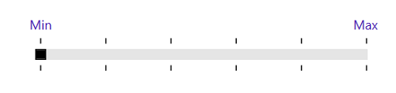
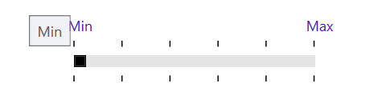
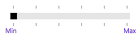
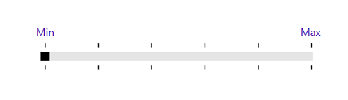
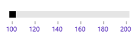
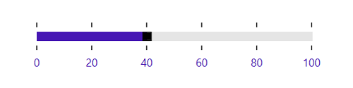
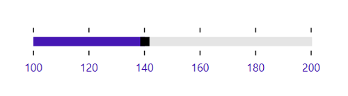
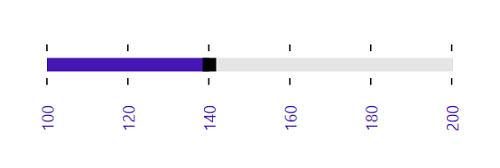

# Label Support in WPF Range Slider (SfRangeSlider)

This feature allows the display of labels for custom values given in the collection of CustomLabels when the ShowCustomLabels property is set to true. When ShowValueLabels is set to true, it also displays labels for all the tick values.

Property Table

<table>
<tr>
<th>
{{ '**Property**' | markdownify }}</th><th>
{{ '**Description**' | markdownify }}</th></tr>
<tr>
<td>
CustomLabels</td><td>
It describes an observable collection of items that contains the custom labels and the values for that the labels should be displayed.</td></tr>
<tr>
<td>
ShowCustomLabels</td><td>
This property allows the display of custom labels based on the CustomLabels collection for particular values.</td></tr>
<tr>
<td>
ShowValueLabels</td><td>
This property allows the tick labels to be displayed.</td></tr>
<tr>
<td>
LabelPlacement</td><td>
This property specifies the position of the custom label placement.</td></tr>
<tr>
<td>
ValuePlacement</td><td>
This property specifies the position of the label for all of the ticks.</td></tr>
<tr>
<td>
LabelOrientation</td><td>
LabelOrientation specifies the orientation of the labels as either horizontal or vertical.</td></tr>
</table>

## CustomLabels

CustomLabels is an observable collection of items that contains the Label and Value properties. Create an observable collection of items by specifying the custom labels for corresponding values as illustrated in the following code example.

Create a ViewModel class with CustomCollection property.





   public class ViewModel
    {
        private ObservableCollection<Items> customCollection = new ObservableCollection<Items>();
        public ObservableCollection<Items> CustomCollection
        {
            get { return customCollection; }

            set { customCollection = value; }
        }

        public ViewModel()
        {
            this.customCollection.Add(new Items() { label = "Min", value = 100 });
            this.customCollection.Add(new Items() { label = "Max", value = 200 });
        }
    }





In the following code example, the CustomCollection property is bound to [CustomLabels](https://help.syncfusion.com/cr/wpf/Syncfusion.SfInput.Wpf~Syncfusion.Windows.Controls.Input.SfRangeSlider~CustomLabels.html) property in the SfRangeSlider control that populates the custom labels collection.





<editors:SfRangeSlider
                    Width="300"
                    CustomLabels="{Binding CustomCollection}"
                    Maximum="200"
                    Minimum="100"
                    ShowCustomLabels="True"
                    TickFrequency="20"
                    TickPlacement="Outside"
                    ThumbToolTipPlacement="BottomRight"/>





            Grid parentGrid = new Grid();
            SfRangeSlider rangeSlider = new SfRangeSlider()
            {
                Width = 300,
                Maximum = 200,
                Minimum = 100,
                ShowCustomLabels = true,
                TickFrequency = 20,
                TickPlacement = Syncfusion.Windows.Controls.Input.TickPlacement.Outside,
                ThumbToolTipPlacement = ThumbToolTipPlacement.BottomRight
            };

            Binding binding = new Binding("CustomCollection");
            binding.Source = viewModel;
            rangeSlider.SetBinding(SfRangeSlider.CustomLabelsProperty, binding);

            parentGrid.Children.Add(rangeSlider);
            this.Content = parentGrid;





RangeSlider with CustomLabels

## ShowCustomLabels

The default value for [ShowCustomLabels](https://help.syncfusion.com/cr/wpf/Syncfusion.SfInput.Wpf~Syncfusion.Windows.Controls.Input.SfRangeSlider~ShowCustomLabels.html) is false. When set to true, it displays the custom labels with the corresponding Tool tip for specific values based on the [CustomLabels](https://help.syncfusion.com/cr/wpf/Syncfusion.SfInput.Wpf~Syncfusion.Windows.Controls.Input.SfRangeSlider~CustomLabels.html) collection.





<editors:SfRangeSlider
                    Width="300"
                    CustomLabels="{Binding CustomCollection}"
                    Maximum="200"
                    Minimum="100"
                    ShowCustomLabels="True"
                    TickFrequency="20"
                    TickPlacement="Outside"
                    ThumbToolTipPlacement="BottomRight"/>





            Grid parentGrid = new Grid();
            SfRangeSlider rangeSlider = new SfRangeSlider()
            {
                Width = 300,
                Maximum = 200,
                Minimum = 100,
                ShowCustomLabels = true,
                TickFrequency = 20,
                TickPlacement = Syncfusion.Windows.Controls.Input.TickPlacement.Outside,
                ThumbToolTipPlacement = ThumbToolTipPlacement.BottomRight
            };

            Binding binding = new Binding("CustomCollection");
            binding.Source = viewModel;
            rangeSlider.SetBinding(SfRangeSlider.CustomLabelsProperty, binding);

            parentGrid.Children.Add(rangeSlider);
            this.Content = parentGrid;





RangeSlider with ShowCustomLabels

## LabelPlacement

[LabelPlacement](https://help.syncfusion.com/cr/wpf/Syncfusion.SfInput.Wpf~Syncfusion.Windows.Controls.Input.SfRangeSlider~LabelPlacement.html) property describes the position of the custom labels for particular values mentioned in the CustomLabels collection. Available options for this property are:

1. BottomRight
2. TopLeft

The following code example illustrates the usage of the LabelPlacement property. The output is displayed in the corresponding images.





<editors:SfRangeSlider
                    Width="300"
                    CustomLabels="{Binding CustomCollection}"
                    Maximum="200"
                    Minimum="100"
                    ShowCustomLabels="True"
                    TickFrequency="20"
                    TickPlacement="Outside"
                    LabelPlacement="BottomRight"/>





            Grid parentGrid = new Grid();
            SfRangeSlider rangeSlider = new SfRangeSlider()
            {
                Width = 300,
                Maximum = 200,
                Minimum = 100,
                ShowCustomLabels = true,
                TickFrequency = 20,
                TickPlacement = Syncfusion.Windows.Controls.Input.TickPlacement.Outside,
                LabelPlacement = LabelPlacement.BottomRight
            };

            Binding binding = new Binding("CustomCollection");
            binding.Source = viewModel;
            rangeSlider.SetBinding(SfRangeSlider.CustomLabelsProperty, binding);

            parentGrid.Children.Add(rangeSlider);
            this.Content = parentGrid;





LabelPlacement in BottomRight





<editors:SfRangeSlider
                    Width="300"
                    CustomLabels="{Binding CustomCollection}"
                    Maximum="200"
                    Minimum="100"
                    ShowCustomLabels="True"
                    TickFrequency="20"
                    TickPlacement="Outside"
                    LabelPlacement="TopLeft"/>





            Grid parentGrid = new Grid();
            SfRangeSlider rangeSlider = new SfRangeSlider()
            {
                Width = 300,
                Maximum = 200,
                Minimum = 100,
                ShowCustomLabels = true,
                TickFrequency = 20,
                TickPlacement = Syncfusion.Windows.Controls.Input.TickPlacement.Outside,
                LabelPlacement = LabelPlacement.TopLeft
            };

            Binding binding = new Binding("CustomCollection");
            binding.Source = viewModel;
            rangeSlider.SetBinding(SfRangeSlider.CustomLabelsProperty, binding);

            parentGrid.Children.Add(rangeSlider);
            this.Content = parentGrid;





LabelPlacement in TopLeft

## ShowValueLabels

The default value of the [ShowValueLabels](https://help.syncfusion.com/cr/wpf/Syncfusion.SfInput.Wpf~Syncfusion.Windows.Controls.Input.SfRangeSlider~ShowValueLabels.html) property is false. When set to true, it displays the label for all the ticks based on the ValuePlacement property.





<editors:SfRangeSlider
                    Width="300"
                    Maximum="100"
                    Minimum="0"
                    ShowValueLabels="True"
                    TickFrequency="20"
                    TickPlacement="BottomRight"
                    Value="40" />





            Grid parentGrid = new Grid();
            SfRangeSlider rangeSlider = new SfRangeSlider()
            {
                Width = 300,
                Maximum = 100,
                Minimum = 0,
                Value = 40,
                ShowValueLabels = true,
                TickFrequency = 20,
                TickPlacement = Syncfusion.Windows.Controls.Input.TickPlacement.BottomRight
            };

            parentGrid.Children.Add(rangeSlider);
            this.Content = parentGrid;





ShowValueLabels property

## ValuePlacement

The [ValuePlacement](https://help.syncfusion.com/cr/wpf/Syncfusion.SfInput.Wpf~Syncfusion.Windows.Controls.Input.SfRangeSlider~ValuePlacement.html) property describes the position of the labels for all the ticks. Available options for this property are:

1. BottomRight
2. TopLeft

The following code example illustrates the usage of [ValuePlacement](https://help.syncfusion.com/cr/wpf/Syncfusion.SfInput.Wpf~Syncfusion.Windows.Controls.Input.SfRangeSlider~ValuePlacement.html) property. The output is displayed in the corresponding images.





<editors:SfRangeSlider
                    Width="300"
                    Maximum="100"
                    Minimum="0"
                    ShowValueLabels="True"
                    TickFrequency="20"
                    TickPlacement="Outside"
                    ValuePlacement="TopLeft"
                    Value="40" />





            Grid parentGrid = new Grid();
            SfRangeSlider rangeSlider = new SfRangeSlider()
            {
                Width = 300,
                Maximum = 100,
                Minimum = 0,
                Value = 40,
                ShowValueLabels = true,
                TickFrequency = 20,
                TickPlacement = Syncfusion.Windows.Controls.Input.TickPlacement.BottomRight, 
                ValuePlacement = ValuePlacement.TopLeft
            };

            parentGrid.Children.Add(rangeSlider);
            this.Content = parentGrid;





ValuePlacement in TopLeft.





<editors:SfRangeSlider
                    Width="300"
                    Maximum="100"
                    Minimum="0"
                    ShowValueLabels="True"
                    TickFrequency="20"
                    TickPlacement="Outside"
                    ValuePlacement="BottomRight"
                    Value="40" />





            Grid parentGrid = new Grid();
            SfRangeSlider rangeSlider = new SfRangeSlider()
            {
                Width = 300,
                Maximum = 100,
                Minimum = 0,
                Value = 40,
                ShowValueLabels = true,
                TickFrequency = 20,
                TickPlacement = Syncfusion.Windows.Controls.Input.TickPlacement.BottomRight, 
                ValuePlacement = ValuePlacement.BottomRight
            };

            parentGrid.Children.Add(rangeSlider);
            this.Content = parentGrid;





ValuePlacement in BottomRight

## LabelOrientation

The [LabelOrientation](https://help.syncfusion.com/cr/wpf/Syncfusion.SfInput.Wpf~Syncfusion.Windows.Controls.Input.SfRangeSlider~LabelOrientation.html) property describes the orientation of the labels for both ticks and custom labels. Available options for this property are:

1. Horizontal
2. Vertical

The following code example illustrates the usage of [LabelOrientation](https://help.syncfusion.com/cr/wpf/Syncfusion.SfInput.Wpf~Syncfusion.Windows.Controls.Input.SfRangeSlider~LabelOrientation.html) property. The output is displayed in the corresponding images.





<editors:SfRangeSlider
                    Width="300"
                    Maximum="200"
                    Minimum="100"
                    ShowValueLabels="True"
                    TickFrequency="20"
                    TickPlacement="Outside"
                    ValuePlacement="BottomRight"
                    LabelOrientation="Horizontal"
                    Value="140" />





            Grid parentGrid = new Grid();
            SfRangeSlider rangeSlider = new SfRangeSlider()
            {
                Width = 300,
                Maximum = 200,
                Minimum = 100,
                Value = 140,
                ShowValueLabels = true,
                TickFrequency = 20,
                TickPlacement = Syncfusion.Windows.Controls.Input.TickPlacement.Outside, 
                ValuePlacement = ValuePlacement.BottomRight,
                LabelOrientation = Orientation.Horizontal
            };

            parentGrid.Children.Add(rangeSlider);
            this.Content = parentGrid;





LabelOrientation as Horizontal





<editors:SfRangeSlider
                    Width="300"
                    Maximum="200"
                    Minimum="100"
                    ShowValueLabels="True"
                    TickFrequency="20"
                    TickPlacement="Outside"
                    ValuePlacement="BottomRight"
                    LabelOrientation="Vertical"
                    Value="140" />





            Grid parentGrid = new Grid();
            SfRangeSlider rangeSlider = new SfRangeSlider()
            {
                Width = 300,
                Maximum = 200,
                Minimum = 100,
                Value = 140,
                ShowValueLabels = true,
                TickFrequency = 20,
                TickPlacement = Syncfusion.Windows.Controls.Input.TickPlacement.Outside, 
                ValuePlacement = ValuePlacement.BottomRight,
                LabelOrientation = Orientation.Vertical
            };

            parentGrid.Children.Add(rangeSlider);
            this.Content = parentGrid;





LabelOrientation as Vertical

