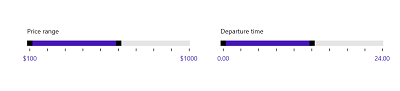

# WPF Range Slider (SfRangeSlider) Overview

The [SfRangeSlider](https://help.syncfusion.com/cr/wpf/Syncfusion.Windows.Controls.Input.SfRangeSlider.html) control enables the selection of a value range within specified minimum and maximum limits. Users can select the range by moving the thumb controls along a track. This control is highly customizable, offering options such as orientation, selection range, custom label support, touch interaction, snap-to-tick functionality, tick placement, and tooltip support.

## Key Features

- **Orientation**: Configure the RangeSlider orientation to be either horizontal or vertical.
- **Selection Range**: Define a range of values using two thumbs for precise selection.

- **Thumb Positioning**: Allow the RangeSlider thumb to move to the tapped track position.

- **Styling and Appearance**: Customize the UI and appearance of the control to fit application requirements.

- **ToolTip Support**: Display the RangeSlider value with customizable tooltips.
- **Gestures**: Support for both KeyGesture and MouseGesture inputs.
