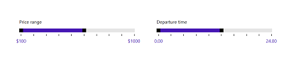

# About Syncfusion® WPF RangeSlider (SfRangeSlider) Control

[SfRangeSlider](https://help.syncfusion.com/cr/wpf/Syncfusion.Windows.Controls.Input.SfRangeSlider.html) control allows the value range to be selected within the defined minimum and maximum limit. The range can be selected by moving the Thumb control along a track. In terms of appearance, this control is highly customizable and offers many options such as orientation, selection range, custom label support, touch support, snap to tick, tick placement, tooltip support etc.

Key Features:

* **Orientation** —  Set the orientation of the RangeSlider either horizontally or vertically.
* **SelectionRange** — Select the range of values using two thumbs.  
* **Move the Thumb to the Tapped Position** — Allow the thumb of RangeSlider to tapped position of the track.
* **Styling and Appearance** — The control is completely customizable in terms of the UI. Change the appearance of the control as required.
* **ToolTip Support** — Shows the value of the RangeSlider. It is fully customizable.
* **Gestures** — Provides both KeyGesture and MouseGesture.

