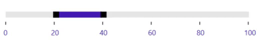

# Range in WPF Range Slider (SfRangeSlider)

The [SfRangeSlider](https://help.syncfusion.com/cr/wpf/Syncfusion.SfInput.Wpf~Syncfusion.Windows.Controls.Input.SfRangeSlider.html) control provides support to select the range of value using two thumbs.  

## ShowRange  

When ShowRange property is set to true, two thumbs are placed in the track. One thumb is used to update the start of the range selection and another thumb is used to update the end of the range selection.  





 <editors:SfRangeSlider
                    Width="300"
                    Maximum="100"
                    Minimum="0"
                    RangeEnd="70"
                    RangeStart="40"
                    ShowRange="True" />





            Grid parentGrid = new Grid();
            SfRangeSlider rangeSlider = new SfRangeSlider()
            {
                Width = 300,
                Maximum = 100,
                Minimum = 0,
                ShowRange = true,
                RangeStart = 40,
                RangeEnd = 70
            };

            parentGrid.Children.Add(rangeSlider);
            this.Content = parentGrid;





N> When the `ShowRange` property is set to true, both ToolTip will display RangeStart and RangeEnd. 

## RangeStart  

Gets or sets the start value of the range start.  





 <editors:SfRangeSlider
                    Width="300"
                    Maximum="100"
                    Minimum="0"
                    RangeEnd="70"
                    RangeStart="40"
                    ShowRange="True" />





            Grid parentGrid = new Grid();
            SfRangeSlider rangeSlider = new SfRangeSlider()
            {
                Width = 300,
                Maximum = 100,
                Minimum = 0,
                ShowRange = true,
                RangeStart = 40,
                RangeEnd = 70
            };

            parentGrid.Children.Add(rangeSlider);
            this.Content = parentGrid;





## RangeEnd 

Gets or sets the end value of the range end.  





 <editors:SfRangeSlider
                    Width="300"
                    Maximum="100"
                    Minimum="0"
                    RangeEnd="70"
                    RangeStart="40"
                    ShowRange="True" />





            Grid parentGrid = new Grid();
            SfRangeSlider rangeSlider = new SfRangeSlider()
            {
                Width = 300,
                Maximum = 100,
                Minimum = 0,
                ShowRange = true,
                RangeStart = 40,
                RangeEnd = 70
            };

            parentGrid.Children.Add(rangeSlider);
            this.Content = parentGrid;





## Drag Selected Range

The `AllowRangeDrag` API allows the range in the Range Slider to be adjusted and the range to be dragged without changing the start and end ranges individually. The default value of `AllowRangeDrag` is false.





<editors:SfRangeSlider
                    Width="300"
                    AllowRangeDrag="True"
                    Maximum="100"
                    Minimum="0"
                    RangeEnd="20"
                    RangeStart="0"
                    ShowRange="True"
                    ShowValueLabels="True"
                    TickFrequency="20" />





            Grid parentGrid = new Grid();
            SfRangeSlider rangeSlider = new SfRangeSlider()
            {
                Width = 300,
                Maximum = 100,
                Minimum = 0,
                ShowRange = true,
                RangeStart = 0,
                RangeEnd = 20,
                ShowValueLabels = true,
                TickFrequency = 20,
                AllowRangeDrag = true
            };

            parentGrid.Children.Add(rangeSlider);
            this.Content = parentGrid;





