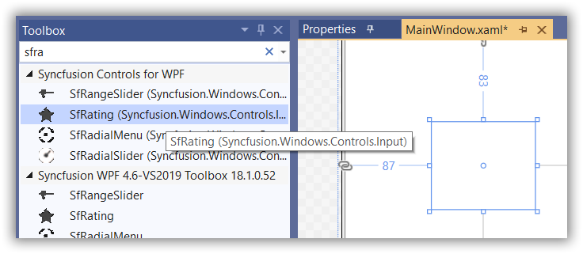

# Getting Started with WPF Rating (SfRating)

This section provides a step-by-step guide to configuring the [SfRating](https://help.syncfusion.com/cr/wpf/Syncfusion.Windows.Controls.Input.SfRating.html) control in real-time scenarios, along with walkthroughs of its customization features.

## Assembly Deployment

Refer to the [control dependencies](https://help.syncfusion.com/wpf/control-dependencies#sfrating) to identify the necessary assemblies or NuGet packages for using the [SfRating](https://help.syncfusion.com/cr/wpf/Syncfusion.Windows.Controls.Input.SfRating.html) control in your application.

For more information about installing NuGet packages in a WPF application, visit: [How to Install NuGet Packages](https://help.syncfusion.com/wpf/visual-studio-integration/nuget-packages)
## Creating an Application with SfRating Control
In this walkthrough, you will create a WPF application featuring the [SfRating](https://help.syncfusion.com/cr/wpf/Syncfusion.Windows.Controls.Input.SfRating.html) control. Here's what's covered:
1. [Creating a Project](#creating-a-project)
2. [Adding Control via Designer](#adding-control-via-designer)
3. [Adding Control Manually in XAML](#adding-control-manually-in-xaml)
4. [Adding Control Manually in C#](#adding-control-manually-in-c)

## Creating a Project

This section provides detailed instructions for creating a new project in Visual Studio to display the [SfRating](https://help.syncfusion.com/cr/wpf/Syncfusion.Windows.Controls.Input.SfRating.html) control.

## Adding Control via Designer
To add the [SfRating](https://help.syncfusion.com/cr/wpf/Syncfusion.Windows.Controls.Input.SfRating.html) control to your application, drag and drop it from the Toolbox into the designer. The required assembly will be added automatically.

## Adding Control Manually in XAML

To manually add the [SfRating](https://help.syncfusion.com/cr/wpf/Syncfusion.Windows.Controls.Input.SfRating.html) control in XAML, follow these steps:

1. Add the following required assembly references to your project:

   - Syncfusion.SfShared.WPF
   - Syncfusion.SfInput.WPF

2. Import the Syncfusion® WPF schema **http://schemas.syncfusion.com/wpf** into your XAML page.

3. Declare [SfRating](https://help.syncfusion.com/cr/wpf/Syncfusion.Windows.Controls.Input.SfRating.html) within your XAML page.





<Window x:Class="SfRating_GettingStarted.MainWindow"
        xmlns="http://schemas.microsoft.com/winfx/2006/xaml/presentation"
        xmlns:x="http://schemas.microsoft.com/winfx/2006/xaml"
        xmlns:d="http://schemas.microsoft.com/expression/blend/2008"
        xmlns:mc="http://schemas.openxmlformats.org/markup-compatibility/2006"
        xmlns:local="clr-namespace:SfRating_GettingStarted"
        mc:Ignorable="d"
        Title="SfRating Application" Height="450" Width="800"
        xmlns:syncfusion="http://schemas.syncfusion.com/wpf">

    <Grid>
        <syncfusion:SfRating ItemsCount="5" Width="150"/>
    </Grid>
</Window>




{{ codesnippet1 | OrderList_Indent_Level_1 }}

## Adding Control Manually in C#

To manually add the [SfRating](https://help.syncfusion.com/cr/wpf/Syncfusion.Windows.Controls.Input.SfRating.html) control in C#, follow these steps:

1. Add the following required assembly references to your project:

    - Syncfusion.SfShared.WPF
    - Syncfusion.SfInput.WPF

2. Import the SfRating namespace: **Syncfusion.Windows.Controls.Input**.

3. Create an instance of the SfRating control and add it to the window.





using Syncfusion.Windows.Controls.Input;

namespace SfRating_GettingStarted
{
    /// 

    /// Interaction logic for MainWindow.xaml
    /// 

    public partial class MainWindow : Window
    {
        
        public MainWindow()
        {
            InitializeComponent();
            //Creating an instance of SfRating control. 
            SfRating newrating = new SfRating()
            {
                ItemsCount = 5,
                Width = 150
            };
            //Adding SfRating as window content.
            this.Content = rating;
        }
    }
}




{{ codesnippet2 | OrderList_Indent_Level_1 }}

## Customizing the Number of Rating Items

You can customize the number of rating items displayed using the [ItemsCount](https://help.syncfusion.com/cr/wpf/Syncfusion.Windows.Controls.Input.SfRating.html#Syncfusion_Windows_Controls_Input_SfRating_ItemsCount) property in the [SfRating](https://help.syncfusion.com/cr/wpf/Syncfusion.Windows.Controls.Input.SfRating.html) control.

> **Note**: The default value of `ItemsCount` is 0.





<syncfusion:SfRating ItemsCount="5" Width="150"/>
	




SfRating rating = new SfRating()
{
    ItemsCount = 5,
    Width = 150
};





## Setting the Value

The displayed value selected among the rating items can be set using the [Value](https://help.syncfusion.com/cr/wpf/Syncfusion.Windows.Controls.Input.SfRating.html#Syncfusion_Windows_Controls_Input_SfRating_Value) property.

> **Note**: By default, the `Value` property is set to 0.




<syncfusion:SfRating ItemsCount="5" Value="3" Width="150"/>
	




SfRating rating = new SfRating()
{
    ItemsCount = 5,
    Width = 150,
    Value = 3
};





## Precision of Selection

The [SfRating](https://help.syncfusion.com/cr/wpf/Syncfusion.Windows.Controls.Input.SfRating.html) control allows you to rate items with full, half, or exact precision using the [Precision](https://help.syncfusion.com/cr/wpf/Syncfusion.Windows.Controls.Input.SfRating.html#Syncfusion_Windows_Controls_Input_SfRating_Precision) property.

> **Note**: The default value of `Precision` is `Standard`.





<syncfusion:SfRating ItemsCount="5" Precision="Exact" Width="150"/>
	




SfRating rating = new SfRating()
{
    ItemsCount = 5,
    Width = 150,
    Precision = Syncfusion.Windows.Primitives.Precision.Standard
};





[View Sample on GitHub](https://github.com/SyncfusionExamples/SfRating-getting-started)

## Themes

SfRating supports various built-in themes. Refer to the following links to apply themes to the SfRating:

- [Apply theme using SfSkinManager](https://help.syncfusion.com/wpf/themes/skin-manager)
- [Create a custom theme using ThemeStudio](https://help.syncfusion.com/wpf/themes/theme-studio#creating-custom-theme)

  