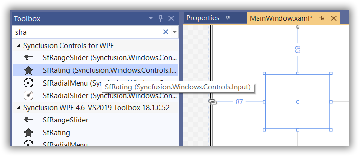

# Getting Started with WPF Rating (SfRating)

This section explains how to configure the [SfRating](https://help.syncfusion.com/cr/wpf/Syncfusion.Windows.Controls.Input.SfRating.html) control in a real-time scenario and also provides a walk-through on some of the customization features available in the SfRating control.

## Assembly deployment

Refer to the [control dependencies](https://help.syncfusion.com/wpf/control-dependencies#sfrating) section to get the list of assemblies or NuGet package that needs to be added as a reference to use the [SfRating](https://help.syncfusion.com/cr/wpf/Syncfusion.Windows.Controls.Input.SfRating.html) control in any application.

You can find more details about installing the NuGet package in a WPF application in the following link:
[How to install nuget packages](https://help.syncfusion.com/wpf/installation/install-nuget-packages)

## Creating Application with SfRating control
In this walkthrough, you will create a WPF application that contains the [SfRating](https://help.syncfusion.com/cr/wpf/Syncfusion.Windows.Controls.Input.SfRating.html) control.
1. [Creating the project](#creating-the-project)
2. [Adding the control via the designer](#adding-the-control-via-the-designer)
3. [Adding the control manually in XAML](#adding-the-control-manually-in-xaml)
4. [Adding the control manually in C#](#adding-the-control-manually-in-c)

## Creating the project

The following section provides detailed information to create a new project in Visual Studio to display the [SfRating](https://help.syncfusion.com/cr/wpf/Syncfusion.Windows.Controls.Input.SfRating.html) control.

1. Open Visual Studio and click **File → New → Project**.
2. Select **WPF App (.NET Framework)** or **WPF Application (.NET)** depending on your target framework.
3. Name the project **SfRating_GettingStarted** and click **Create**.

## Adding the control via the designer
The [SfRating](https://help.syncfusion.com/cr/wpf/Syncfusion.Windows.Controls.Input.SfRating.html) control can be added to the application by dragging it from the Toolbox and dropping it in the designer. The required assembly will be added automatically.

1. If the Toolbox is not visible, open it from **View → Toolbox**.
2. In the Toolbox search box, type **SfRating** and locate the control under the **Syncfusion WPF** tab.
3. Drag **SfRating** onto the designer surface of `MainWindow.xaml`.

## Adding the control manually in XAML

To add the [SfRating](https://help.syncfusion.com/cr/wpf/Syncfusion.Windows.Controls.Input.SfRating.html) control manually in XAML, do the following:

1. Add the required assembly references to the project:

   * Syncfusion.SfInput.WPF
   * Syncfusion.SfShared.WPF
   
2. Import the Syncfusion WPF schema `http://schemas.syncfusion.com/wpf` in the XAML page.

3. Declare [SfRating](https://help.syncfusion.com/cr/wpf/Syncfusion.Windows.Controls.Input.SfRating.html) in the XAML page.





<Window x:Class="SfRatingSample.MainWindow"
        xmlns="http://schemas.microsoft.com/winfx/2006/xaml/presentation"
        xmlns:x="http://schemas.microsoft.com/winfx/2006/xaml"
        xmlns:d="http://schemas.microsoft.com/expression/blend/2008"
        xmlns:mc="http://schemas.openxmlformats.org/markup-compatibility/2006"
        xmlns:local="clr-namespace:SfRatingSample"
        mc:Ignorable="d"
        Title="SfRating Application" Height="450" Width="800"
        xmlns:syncfusion="http://schemas.syncfusion.com/wpf">
    <Grid>
        <syncfusion:SfRating ItemsCount="5" Width="150"/>
    </Grid>
</Window>




{{ codesnippet1 | OrderList_Indent_Level_1 }}

## Adding the control manually in C#

To add the [SfRating](https://help.syncfusion.com/cr/wpf/Syncfusion.Windows.Controls.Input.SfRating.html) control manually in C#, do the following:

1. Add the required assembly references to the project:

    * Syncfusion.SfShared.WPF
    * Syncfusion.SfInput.WPF

2. Import the SfRating namespace `Syncfusion.Windows.Controls.Input`.

3. Create an SfRating control instance and add it to the window.





using System.Windows;
using Syncfusion.Windows.Controls.Input;

namespace SfRatingSample
{
    /// 

    /// Interaction logic for MainWindow.xaml
    /// 

    public partial class MainWindow : Window
    {
        public MainWindow()
        {
            InitializeComponent();
            //Creating an instance of the SfRating control.
            SfRating rating = new SfRating()
            {
                ItemsCount = 5,
                Width = 150
            };
            //Adding SfRating as the window content.
            this.Content = rating;
        }
    }
}




{{ codesnippet2 | OrderList_Indent_Level_1 }}

## Customizing the number of rating items

The number of rating items to be displayed can be customized using the [ItemsCount](https://help.syncfusion.com/cr/wpf/Syncfusion.Windows.Controls.Input.SfRating.html#Syncfusion_Windows_Controls_Input_SfRating_ItemsCount) property in the [SfRating](https://help.syncfusion.com/cr/wpf/Syncfusion.Windows.Controls.Input.SfRating.html) control.

N> The default value of `ItemsCount` is `0`, so no items render until you set this property to a positive integer.





<syncfusion:SfRating ItemsCount="5" Width="150"/>
	




SfRating rating = new SfRating()
{
    ItemsCount = 5,
    Width = 150
};
this.Content = rating;





## Setting the value

You can set the selected value among the rating items in the [SfRating](https://help.syncfusion.com/cr/wpf/Syncfusion.Windows.Controls.Input.SfRating.html) control using the [Value](https://help.syncfusion.com/cr/wpf/Syncfusion.Windows.Controls.Input.SfRating.html#Syncfusion_Windows_Controls_Input_SfRating_Value) property. The valid range is `0` to `ItemsCount`.

N> By default, the value of this property is `0`.





<syncfusion:SfRating ItemsCount="5" Value="3" Width="150"/>
	




SfRating rating = new SfRating()
{
    ItemsCount = 5,
    Width = 150,
    Value = 3
};
this.Content = rating





## Setting the selection precision

The [SfRating](https://help.syncfusion.com/cr/wpf/Syncfusion.Windows.Controls.Input.SfRating.html) control provides options to rate items as full, half, or exact values using the [Precision](https://help.syncfusion.com/cr/wpf/Syncfusion.Windows.Controls.Input.SfRating.html#Syncfusion_Windows_Controls_Input_SfRating_Precision) property.

N> By default, the value of the `Precision` property is `Standard`.





<syncfusion:SfRating ItemsCount="5" Precision="Exact" Width="150"/>
	




SfRating rating = new SfRating()
{
    ItemsCount = 5,
    Width = 150,
    Precision = Syncfusion.Windows.Primitives.Precision.Exact
};
this.Content=rating;





[View Sample in GitHub](https://github.com/SyncfusionExamples/SfRating-getting-started)

## Theme

SfRating supports various built-in themes. Refer to the links below to apply themes for the SfRating:

  * [Apply theme using SfSkinManager](https://help.syncfusion.com/wpf/themes/skin-manager)
	
  * [Create a custom theme using ThemeStudio](https://help.syncfusion.com/wpf/themes/theme-studio#creating-custom-theme)

  