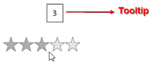

# ToolTip in WPF Rating (SfRating)

Tooltip provides additional information about objects that are unfamiliar to users and are not directly displayed in UI. In the WPF SfRating control, tooltip shows the data of `Value` property. It will be displayed when the mouse is hovered over the rating items, and it will be disappeared when the mouse is moved from the rating items. The tooltip is enabled or disabled using the `ShowToolTip` property. The default value of this property is true.





    <rating:SfRating ItemsCount="5" ShowToolTip="True" >
    </rating:SfRating>
	




SfRating rating;
public MainWindow()
{
    InitializeComponent();
    rating = new SfRating();
    rating.ItemsCount = 5;
    rating.ShowToolTip = true;
    Content = rating;
}





### Set tooltip precision

The `AutoToolTipPrecision` property sets the number precisions to be displayed after decimal point in tooltip. To set AutoToolTipPrecision, set the precision mode to `Exact`.

N> The default value of this property is 1.





	<rating:SfRating ItemsCount="5" Precision="Exact" AutoToolTipPrecision="6" >
    </rating:SfRating>
	




SfRating rating;
public MainWindow()
{
    InitializeComponent();
    rating = new SfRating();
    rating.ItemsCount = 5;
    rating.Precision = Precision.Exact;
    rating.AutoToolTipPrecision = 6;
    Content = rating;
}





