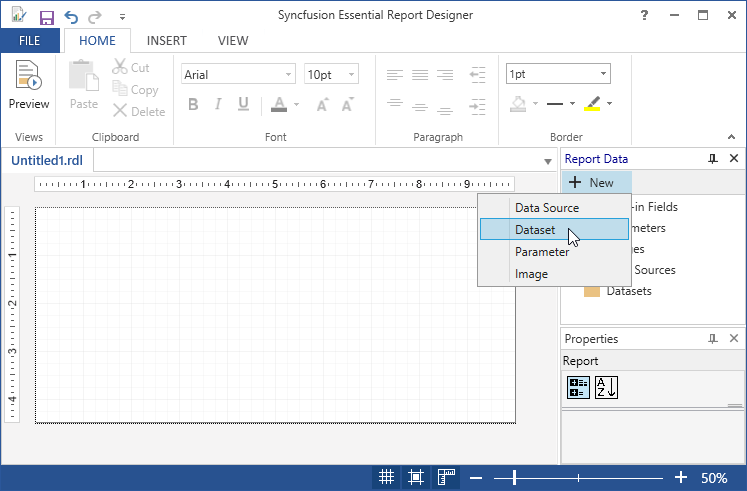
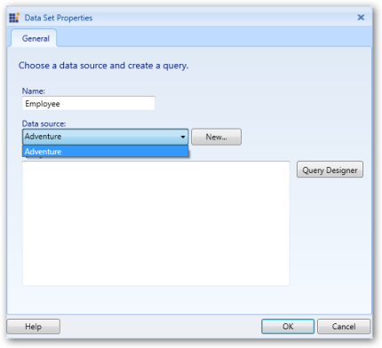
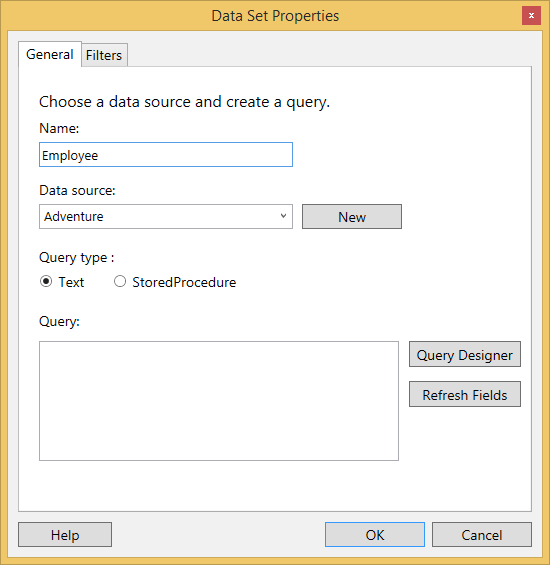
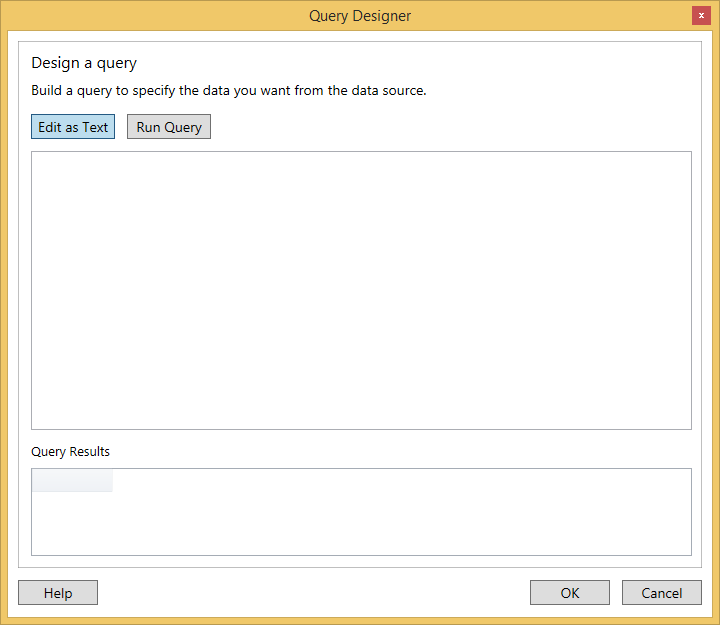
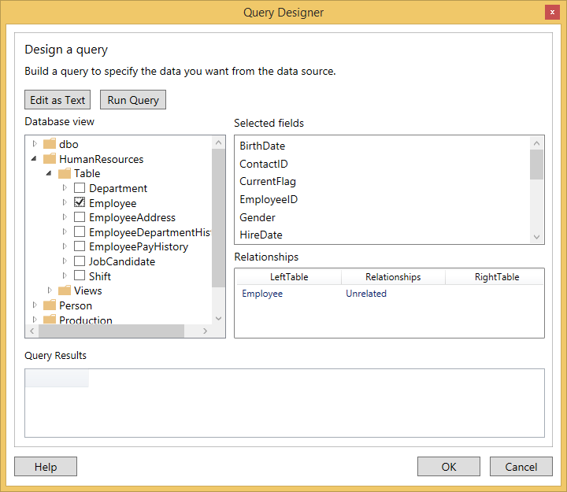
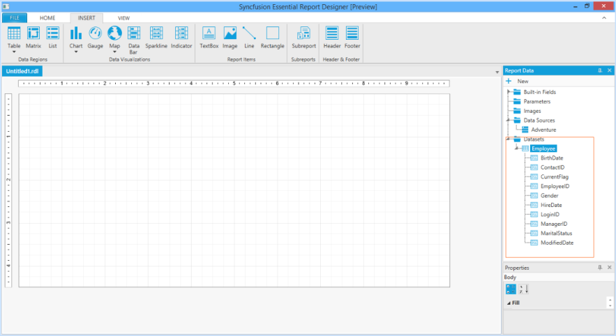
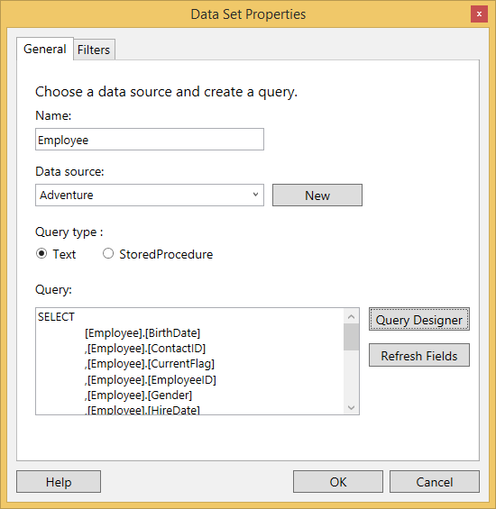
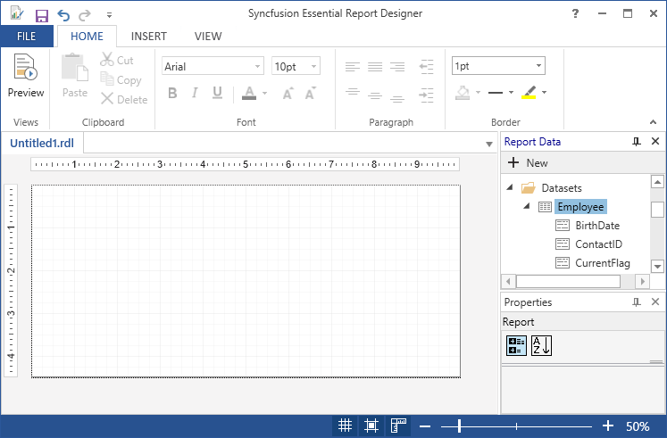

# Add DataSet in WPF ReportDesigner Control

Data set is a collection of data fields. You can add the data set to the corresponding data source in the Report Designer by using the following steps. 

1. In the Report Data, Click New, and then click the DataSet.

   

2. Right click the added data source (Adventure) and click Add DataSet.

   

3. Right click on the DataSets and click Add DataSet.

   

4. In Data Set Properties wizard, enter a name for the data set in the Name field and to select the fields manually from the database, click the Query Designer.

   

5. In Query Designer wizard,Click Edit as Text to manually write the query to retrieve fields from the database.

   

6. Choose the Query in the database view and select the corresponding fields in that query.

   

7. Test the query by clicking the Run Query.

   

8. Click OK.Then the added fields will display on the Query field in the Data Set Properties wizard.

   

9. Click OK.The added DataSet (Employee) and its fields are appear in the Report Data panel. 

   

