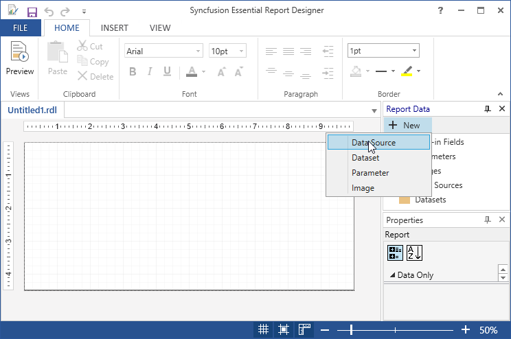
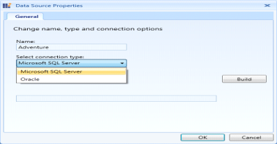
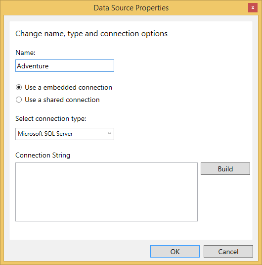
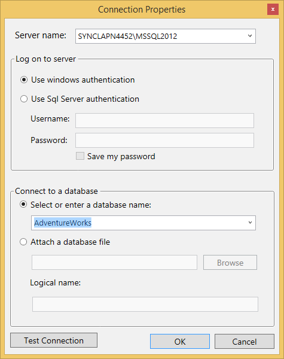
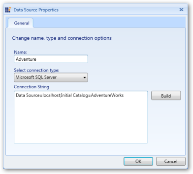
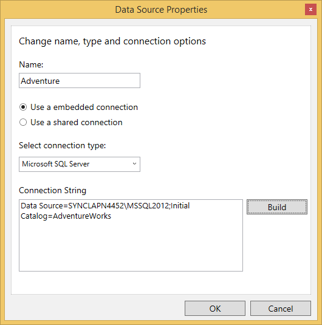
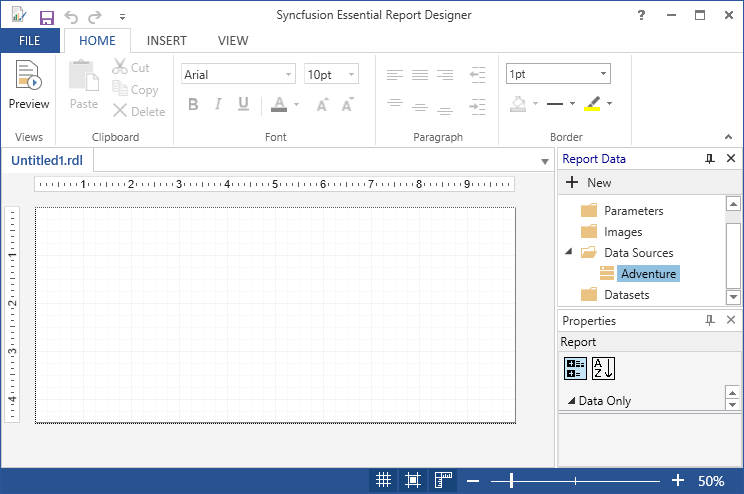

# Add DataSource in WPF ReportDesigner Control

This feature allows you to add a DataSource to the Report Designer. It binds the database from the server. The following steps are used to add the DataSource to the Report Designer.

1. In the Report Data, Click New, and then click the DataSource.

   

2. Right click on the Data Sources field and then click on Add Data Source.
   
   

3. Enter the DataSource name in the Name field and choose use a embedded connection radio button and select the connection type from the Select connection type drop-down.

   

4. Click Build, then connection properties Wizard opens

5. Enter the server name in the Server name field. 

6. In log on to server column select use windows authentication, then select or enter a database name in the Select or enter a database name drop-down ComboBox in connect to a database column.

   
   
7. Click the Test Connection to check the server connection.

8. The Test Results dialog box is displayed after completing the connection check.

   

9. Click OK. It provides a connection string for the DataSource. 

    

10. Click OK. The added DataSource (Adventure) appears in the Report Data panel.

    