## Add Parameter

You can add parameter to the ReportDesigner using the following steps:

1. In the Report Data, click New, and then click the DataSet.

   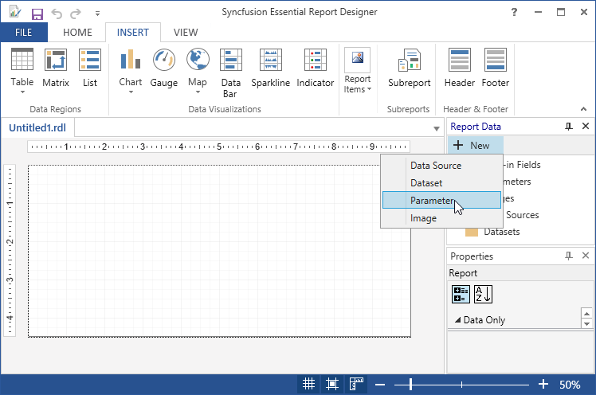

2. Right-click the Parameters and click Add Parameter.

   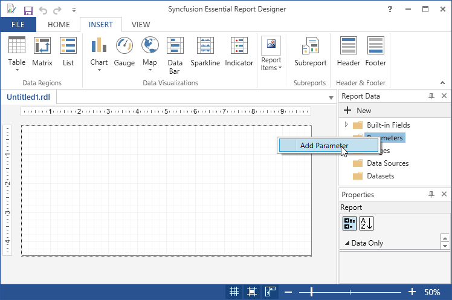

3. Then, the Report Parameter properties dialog opens.

4. In the Report Parameter properties, select any of the following in the General tab.

   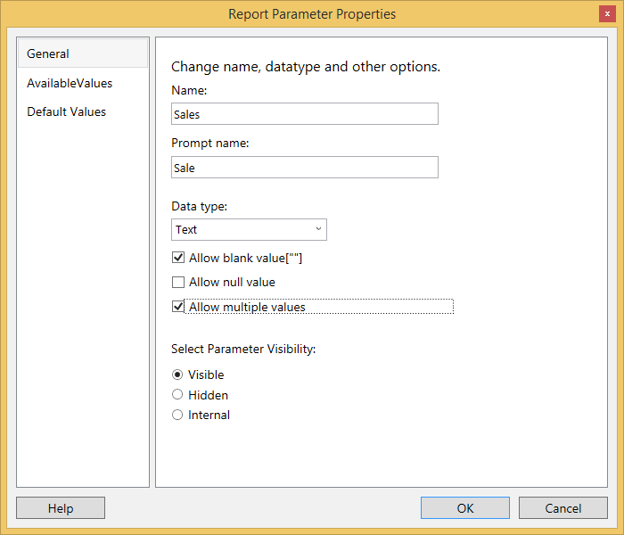

   * Name: Type the name of the parameter or accept the default name. 
   
   * Prompt:  Type the text that appears next to the parameter textbox when the user runs the report.
   
   * Data type: Selects the data type for the parameter value.
   
   * Allow blank value: Allows users to select blank value for the parameter.
   
   * Allow null value: Allows users to select null value for the parameter.
   
   * Allow multiple values: Allows users to select more than one value for the parameter. 
   
   * Visible: Shows the parameter on the toolbar at the top of the report.
   
   * Hidden: Hides the parameter, so that, it does not display on the toolbar. 
   
   * Internal: Hides the parameter and protect it from being modified on the Report Server after the report is published. 

5. In the Report Parameter properties, select any of the following in the Available Values tab. 

   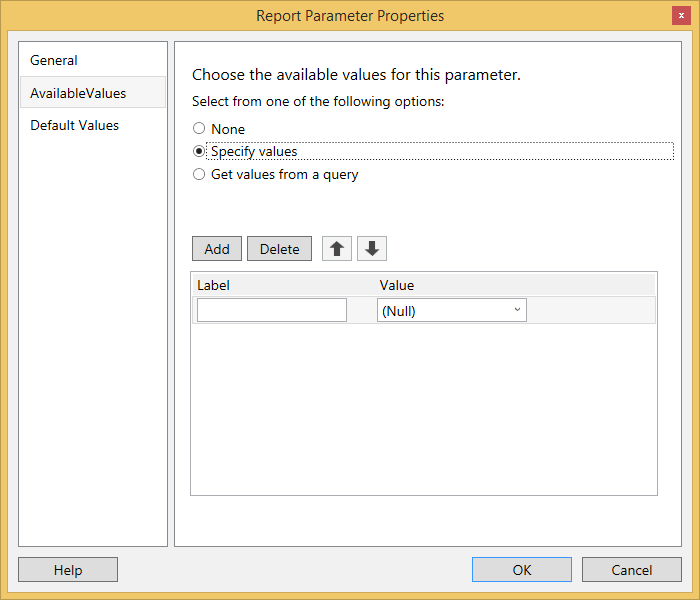

   * Default values: Select an option to display default values from a query or a static value.

   * Specify values: Select this option to enter a static list of parameter values from which users can choose. If you select this option, a list in which you can type values and labels appears.

   * Label: Appears only when Specify Values is selected. Type a label that is displayed to the users. When the user clicks the label in the list, the value specified in value is retained for the parameter.

   * Value: Appears only when Specify Values is selected. Type a value that will be retained for the parameter.
   
   * Get values from a query: Select Get Values from a query to provide a dynamic list of parameter values from which users can choose. This list is obtained from a data source. If you select from a query, three fields will appear in which you can define query information.

   * Dataset: Appears only when Get Values from a query is selected. Select a dataset from which to retrieve the list of parameters. You can define datasets using the Data view. For more information, see Defining Report Datasets.

   * Value field: Appears only when Get Values from a query is selected. Select a field from which to obtain a list of available values, for example, EmployeeID. The available fields are retrieved from a list of column or field names in the dataset.

   * Label field: Appears only when Get Values from a query is selected. Select a field to obtain a list of labels to display to users for the values, for example, EmployeeName. The available fields are retrieved from a list of column or field names in the dataset.

   
   
6. In the Report Parameter properties, select any of the following in the Default Values tab:

   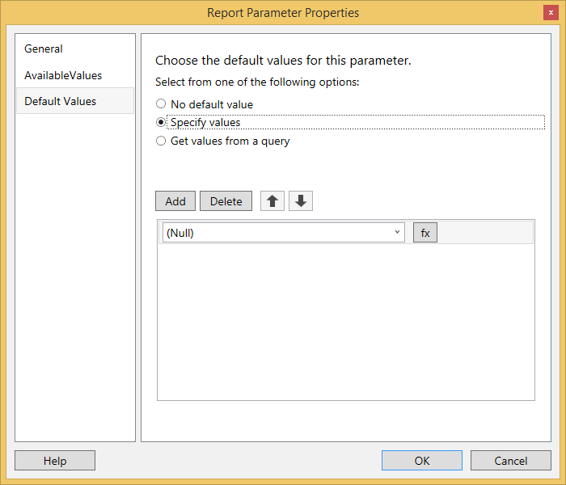

   * No Default values: Select No default values, if you do not want to provide a default value for the parameter.

   * Specify Values: Select Specify Values to enter a static default value or a set of default values for the parameter. If you select Specify Values, a textbox appears in which you can type a value or set of values. Click the expression button to edit the expression.

   * Get Values from a query: Select Get Values from a query to retrieve the default value or set of default values from a data source. If you select Get Values from a query, two fields appear in which you can define the query information.

   * Dataset: Appears only when Get Values from a query is selected. Select a dataset from which to retrieve a default value or a set of default values for the parameter. You define datasets using the Data view. For more information, see Defining Report Datasets.

   * Value field: Appears only when Get Values from a query is selected. Select a field from which to obtain the default value or a set of default values. The available fields are retrieved from a list of column or field names in the dataset. The value of the first row in the dataset is used for the default value.

   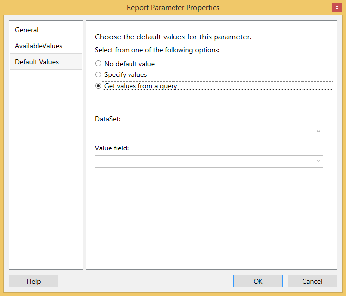
   
7. Click OK.

8. To delete a report parameter, right-click the report parameter and click Delete. 

   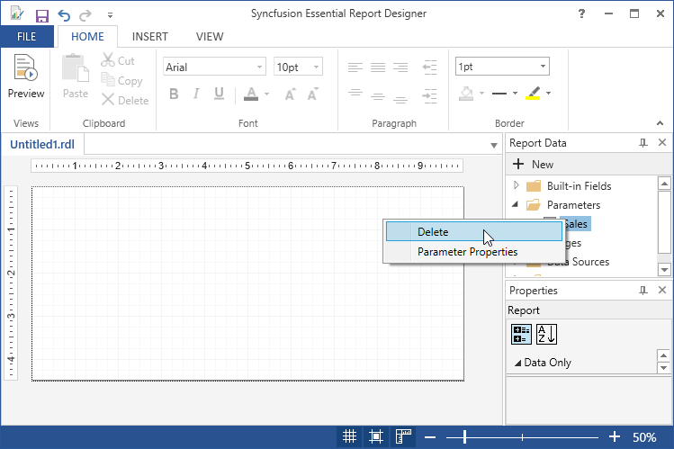

## Add a query parameter

ReportDesigner automatically creates a report parameter with the default properties for Name, Prompt, and DataType when you add a query parameter in the dataset query. 

[How to add dataset](/wpf/ReportDesigner/Add-DataSet)
Describes how to add dataset in the WPF report designer.

1. In the Report Data pane, right-click the Datasets folder and click Add DataSet.

	

2. In the Dataset properties wizard, enter a name for the dataset in the Name field and to select the fields manually from the database, click the Query Designer.

	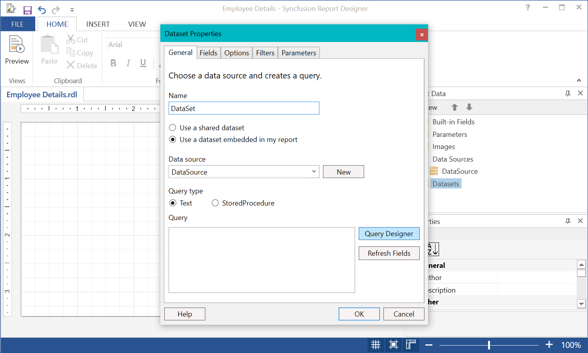
	
3. Choose the query in the database view and select the corresponding fields (Employee database) in that query and test the query by clicking the Run Query.

	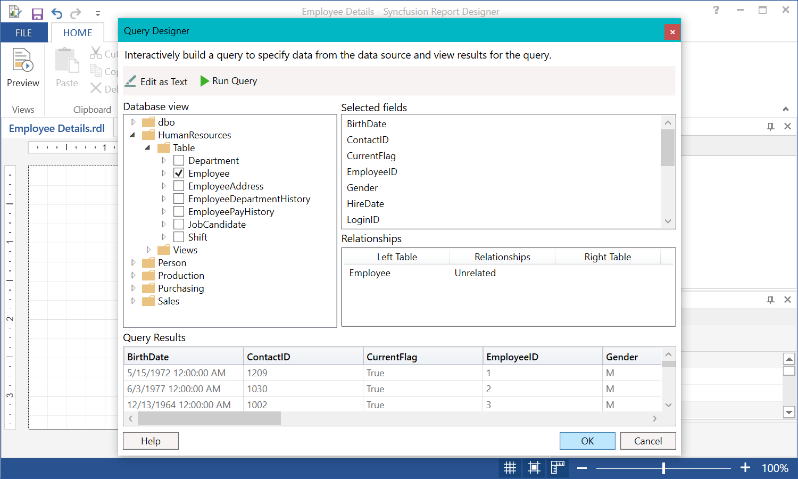
	
4. Click OK. Then, the added fields will be displayed on the query field in the Dataset Properties wizard.

	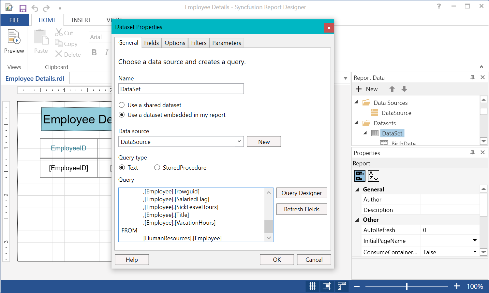

5. Click OK to add the dataset in the report data pane. Now, drag and drop the table and add the dataset field values to the table.

      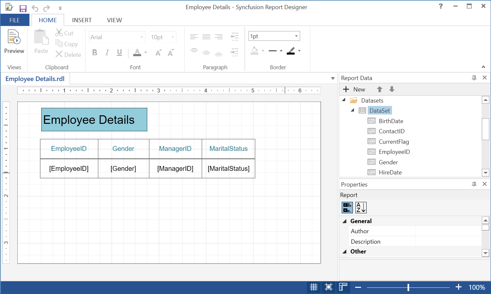

6. Right-click the dataset and open the dataset (Employee) properties. Add the Transact-SQL, WHERE clause as the last line in the query text area and Click OK.

	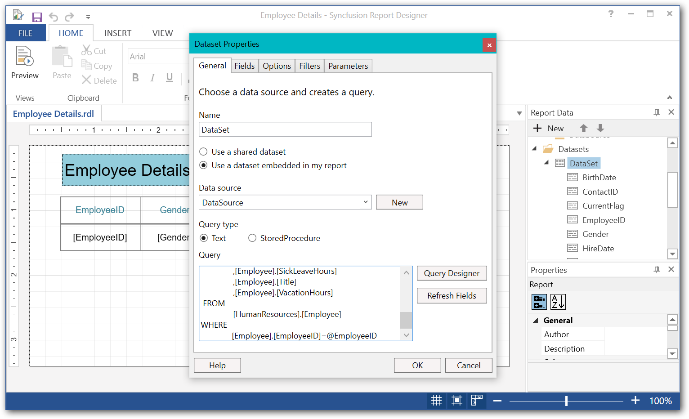
	
	The WHERE clause limits the retrieved data to the Employee that is specified by the query parameter @EmployeeID.

		SELECT 
		[Employee].[BirthDate]
		,[Employee].[ContactID]
		,[Employee].[CurrentFlag]
		,[Employee].[EmployeeID]
		,[Employee].[Gender]
		,[Employee].[HireDate]
		,[Employee].[LoginID]
		,[Employee].[ManagerID]
		,[Employee].[MaritalStatus]
		,[Employee].[ModifiedDate]
		,[Employee].[NationalIDNumber]
		,[Employee].[rowguid]
		,[Employee].[SalariedFlag]
		,[Employee].[SickLeaveHours]
		,[Employee].[Title]
		,[Employee].[VacationHours]
		FROM 
		[HumanResources].[Employee]
		WHERE
            [Employee].[EmployeeID] = @EmployeeID
	
7. The Define Query Parameters dialog box opens and prompts for a value for the query parameter @EmployeeID, when clicking Run(!) in the query designer toolbar. Resultant table data will be displayed based on the value provided for parameter in ParameterValue.

	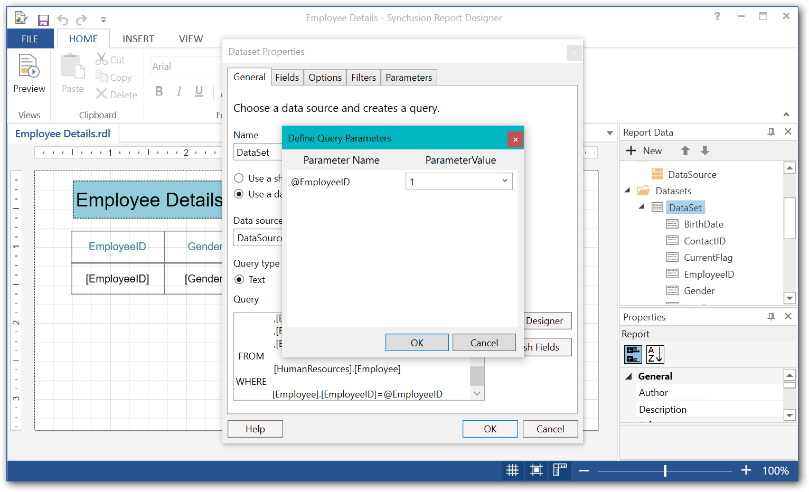
	
8. Click OK. Now, the parameters in the dataset query is added to the parameters folder.

	