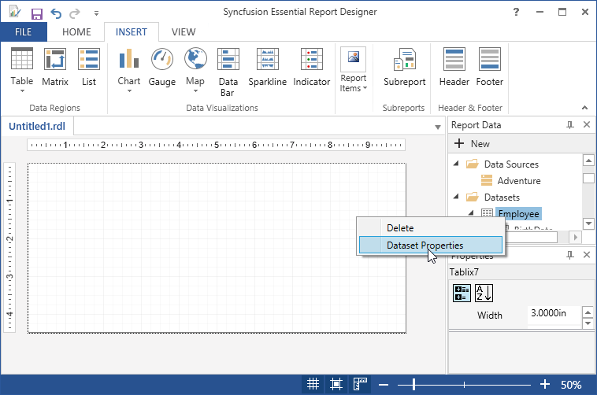
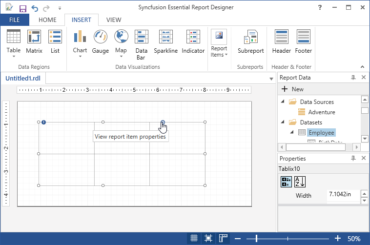
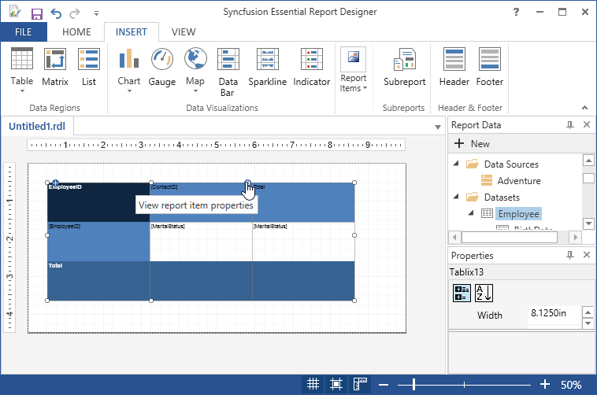
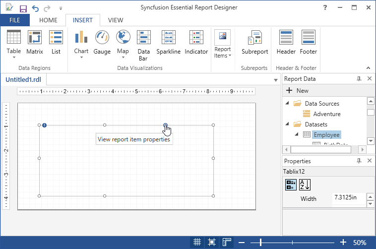
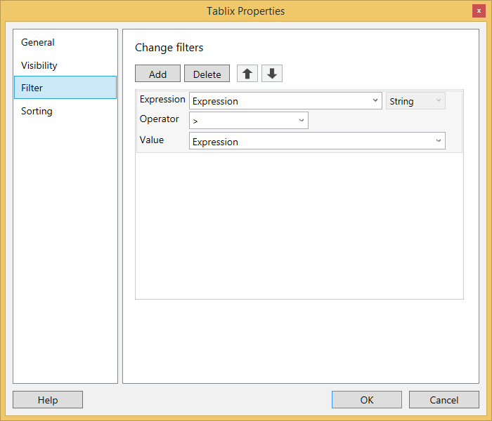

# Add Report Filter

You can add report filter to the Report Designer using the following steps.

## Add Report Filter in DataSet

1. Right-click a Dataset (Employee) in the Report Data pane and then click Dataset Properties.

   

2. The Dataset Properties dialog box opens. 

3. Click Filters. This displays the current list of filter equations.

4. By default, the list is empty.Click Add.

5. A new blank filter equation appears.

6. In Expression, type or select the expression for the field to filter.

7. To edit the expression, click the expression button. 

8. From the drop-down box, select the data type that matches the type of data in the expression.

9. In the Operator box, select the operator that you want the filter to use to compare the values in the Expression box and the Value box.

10. In the Value box, type the expression or value against which you want the filter to evaluate the value in Expression.

    

11. Click OK.

## Add Report Filter in Tablix, List or Matrix

1. Select Tablix, Matrix or List and click on the View report item properties.

   
   
   
   
   

2. The Tablix properties dialog opens.

3. Click Filters. This displays the current list of filter equations. 

4. By default, the list is empty.

5. Click Add. A new blank filter equation appears.

6. In Expression, type or select the expression for the field to filter.

7. To edit the expression, click the expression button. 

8. From the drop-down box, select the data type that matches the type of data in the expression.

9. In the Operator box, select the operator that you want the filter to use to compare the values in the Expression box and the Value box.

10. In the Value box, type the expression or value against which you want the filter to evaluate the value in Expression.

    

11. Click OK.

   

