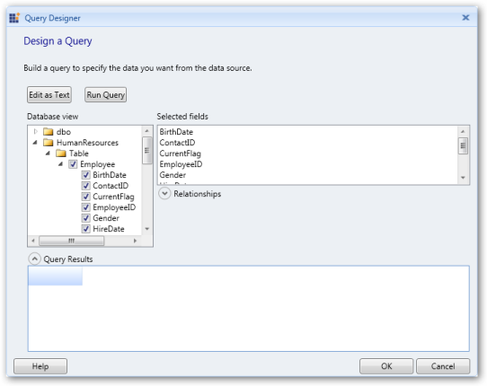

# Add a Data Set to Report Designer

Data set is a collection of data fields. You can add the data set to the corresponding data source in the Report Designer by using the following steps. 

1. Right click the added data source (Adventure) and click Add DataSet.

{  | markdownify }
{:.image }

> _Note: You can also open the Data Set Properties dialog by clicking New > Data Set._

> 

{  | markdownify }
{:.image }

2. Once the Data Set Properties dialog opens, enter a name for the data set in the Name field.

{  | markdownify }
{:.image }

3. To select the fields manually from the database, click the Query Designer. The Query Designer dialog opens.

{  | markdownify }
{:.image }

4. Click Edit as Text to manually write the query to retrieve fields from the database. You can test the query by clicking the Run Query.

{  | markdownify }
{:.image }

5. Click OK to add the query in the Query field.

{  | markdownify }
{:.image }

> _Note: Now, the added data fields appears under the data set._

> 

{  | markdownify }
{:.image }

