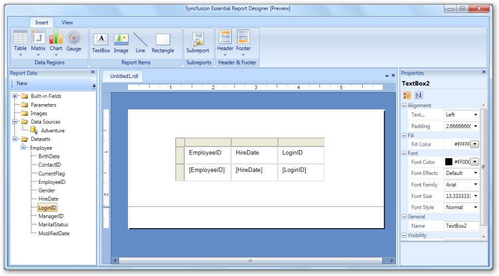

# Add a Table to the Report Designer

You can add tables to the Report Designer and drag the data fields to the table columns. The following steps illustrate how to add a table to the Report Designer. 

1. On the Insert tab, click Table.

{{ '' | markdownify }}
{:.image }

2. To insert a table into the Report Designer, click Insert Table. The table with three columns appears in the Report Designer, by default. 

{{ '' | markdownify }}
{:.image }

3. Drag the data fields to the table columns.

{{ '' | markdownify }}
{:.image }

Steps to add a column to the table:

1. Right click a cell where you want to insert a column. 

{{ '' | markdownify }}
{:.image }

2. Click Insert Column, and then click Left to insert the column to the left of the cell or click Right to insert the column to right of the cell.
> 
_Note: When a new column is inserted in the table, you can drag a data field to the inserted column._

> 

{{ '' | markdownify }}
{:.image }

Steps to Add a Parent Group to theTable:

1. Right click a cell where you want to insert a parent group. 
2. Click Add Group and then select Parent Group.

{{ '' | markdownify }}
{:.image }

> _Note: In the given example, all EmployeeIDs are grouped with ManagerIDs. The ManagerID column is shown to the left of the EmployeeID._

{{ '' | markdownify }}
{:.image }

## Apply Styles to the Table 

You can apply styles to cells of the table by using the Properties grid or Properties dialog. To change the background color of a cell, select a color that you want to apply from the Fill Color drop-down ComboBox.

{{ '' | markdownify }}
{:.image }

