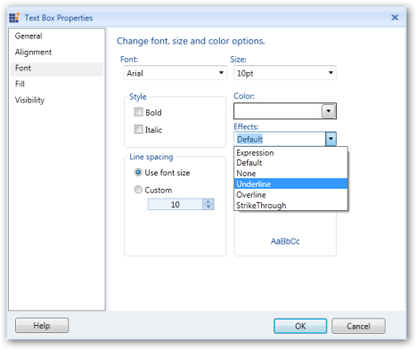

# Add a TextBox to the Report Designer

You can insert a TextBox in the Report Designer and drag report items to the TextBox by using the following steps.

1.Click Insert tab.

2.Drag the TextBox to the Report Designer panel. A TextBox appears on the Report Designer window.

1.To add the first value of the data field, drag the data field from the Report Data to the added TextBox.

## Apply Styles to the TextBox

To apply styles to the TextBox:

1.Right click the TextBox and select the TextBox properties.

2.In the TextBox properties dialog, select any of the following:

  1.General to change the name and value of the TextBox. 
  
  2.Alignment to set the horizontal alignment, vertical alignment, and padding of the TextBox.
  
  3.Font to set the font family, font size, font color, font style, font effects, and line spacing of the TextBox.
  
  4.Fill to set the background color of the TextBox.
  
  5.Visibility to set the visibility of the TextBox when the report is initially run.

3.Set the desired values, and then click OK to update the selected values in the TextBox.

4.To set the font color for the text box, click the Font tab and select Expression from the Effects drop-down. 
It opens the Expression window. 

5.Set the desired values and click OK. 

Note: When you set a value that starts with the character “=“, then it assigns the default value of that property to the TextBox.

6.To change the properties by using the Properties Grid, click the TextBox. The Properties Grid appears at the right of the 
Report Designer. By using this, you can set styles to the TextBox as shown in the following screenshot.

### Deleting TextBox

To delete the TextBox, right click the TextBox to be deleted, and then select Delete.

