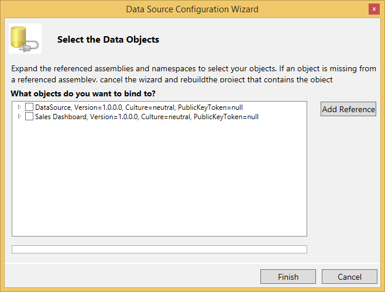
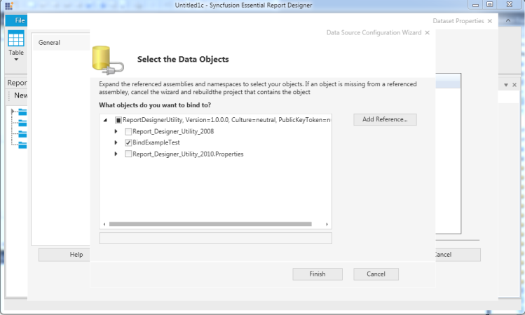
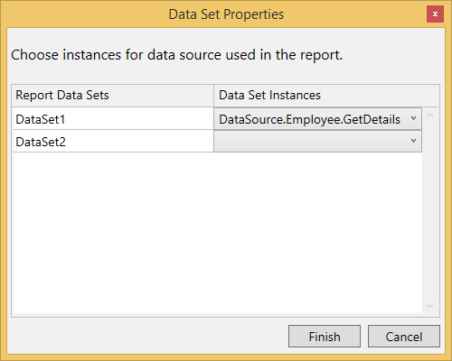
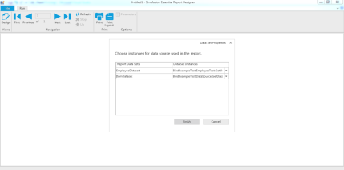

# Create RDLC Reports through Wizard

The RDLC reports can be created by using ReportDesigner control and an available list of business objects. The following steps demonstrate how to view RDLC report in the Report Designer.

1. Create a new WPF application in the Visual Studio and add the necessary ReportDesigner references to the application.

2. Set the following properties to design the RDLC report.

   ~~~ csharp

   this.ReportDesignerControl.EnableMDIDesigner = false;
   ReportDesignerControl.DesignMode = Syncfusion.Windows.Reports.Designer.DesignMode.RDLC;
   ReportDesignerControl.Assemblies = new List<Assembly>();
   ReportDesignerControl.EnableMDIDesigner = true;
   System.IO.FileInfo info = new System.IO.FileInfo("../../DataSource.dll");
   //Load datasource from precompiled dlls.. 
   //If the aseembly not loaded then please unblock the DataSource.dll by selecting its property
   ReportDesignerControl.Assemblies.Add(Assembly.LoadFile(info.FullName));

   //To load the classes from the executing assembly.
   ReportDesignerControl.Assemblies.Add(Assembly.GetExecutingAssembly());
   ReportDesignerControl.OpenReport(new System.IO.FileInfo("../../BusinessData.rdlc").FullName);
   
   ~~~

3. Add the corresponding RDLC file in the folder.    
   
4. Add the DataSource and DataSet to the Report Designer.

5. Select a namespace that contains the business object.

   

6. Select a business object type to design the report by using fields.

   

7. Drag and drop the fields from the data set in the necessary report items. 

8. Click Run to preview the report in the designer. You have to provide a DataSet value to preview the report.

9. Select the collection of business objects by selecting the necessary method in the provided assembly.

   

10. The output is displayed as shown in the following figure.

    