# Draw Chart Report Item

You can add a chart to the Report Designer using the following steps.

Add a data source and dataset to the Report Designer.

## Inserting chart through Insert Chart

1. Click Chart in the Insert Tab,Select Insert Chart in the list and drag it to the Report designer.

   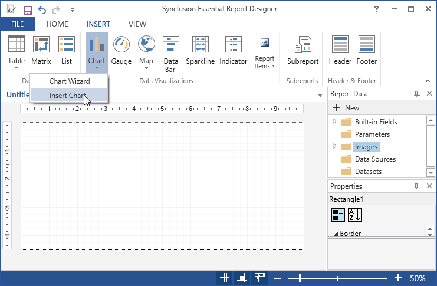

2. A Chart properties wizard opens,Click OK.Then chart will be added with its default properties.

   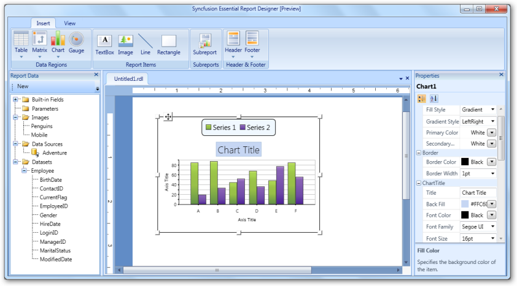
   
   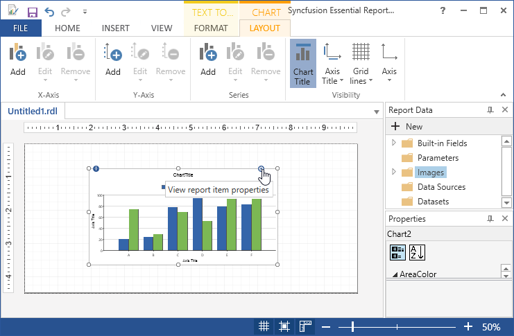

3. To change the Values of Value Axis, Area color and Category Axis,Double Click on the chart.

4. To Add the Report Items such as text boxes, lines, and images and rectangle to the chart,click and drag the selected report items to the chart.

5. Drag a data field to the category axis panel and the value axis panel.

6. To Apply Styles to the Charts,Right Click on the Chart and select the Chart Properties from the context menu.

   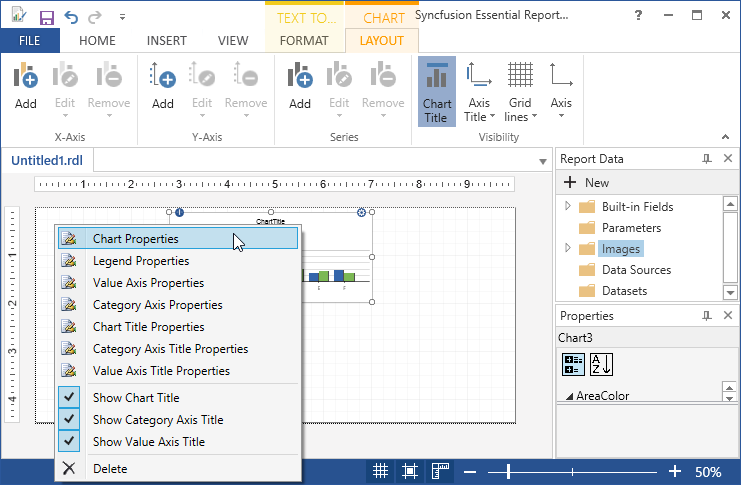

7. In the Chart Properties dialog, select any of the following.

   * General - To change the chart type and ToolTip of the chart.

   * Data - To set the Dataset name and data fields of the corresponding datasets.

   * Appearance - To set the Chart name and border options and background options.
   
   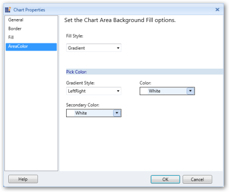
   
8. Click OK.Then the values are updated in the Chart.

9. Right click on the chart and select Legend Properties from the context menu.

   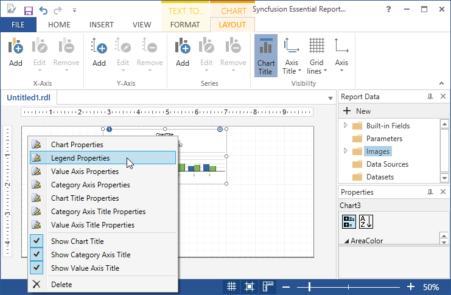

10. The Legend Properties dialog opens. Select any of the following.

    * General - To change the position, color, name and layout of the legend.

    * Font - To set the font color, font family, font size, and font style of the legend.

    * Border - To set the border color and border width of the legend.
	
	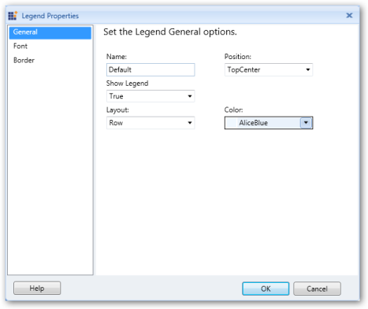
	
11. Click OK.Then the values are updated in the Legend.

12. Right click on the chart and select Value Axis Properties from the context menu.

    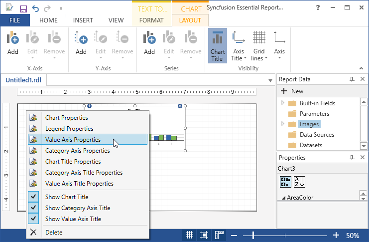

    * General - To change the direction, line style, line width and line color of the value axis.

    * Label - To set the font family, font size, font angle, font style, font color, and visibility of the value axis label.

    * Tick - To set the style, width, color, and length of the value axis tick, and set the visibility of the major and minor tick marks.
	
	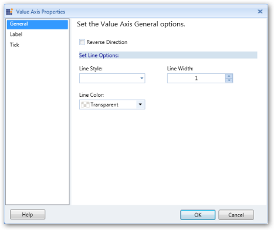
	
13. Click OK.Then the values are updated in the Value Axis.

14. Right click on the chart and select Category Axis Properties from the context menu.

    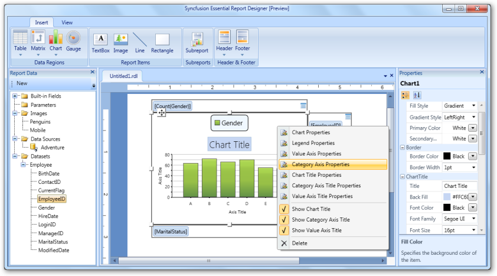

    * General - To change the direction, line style,line width and line color of the category axis.
	
	* Label - To set the font family, font size,font angle, font style, font color, font weight and visibility of the category axis label.
	
	* Tick - To set the style, width, color, and length of the value axis tick, and set the visibility of the major and minor tick marks.
	
	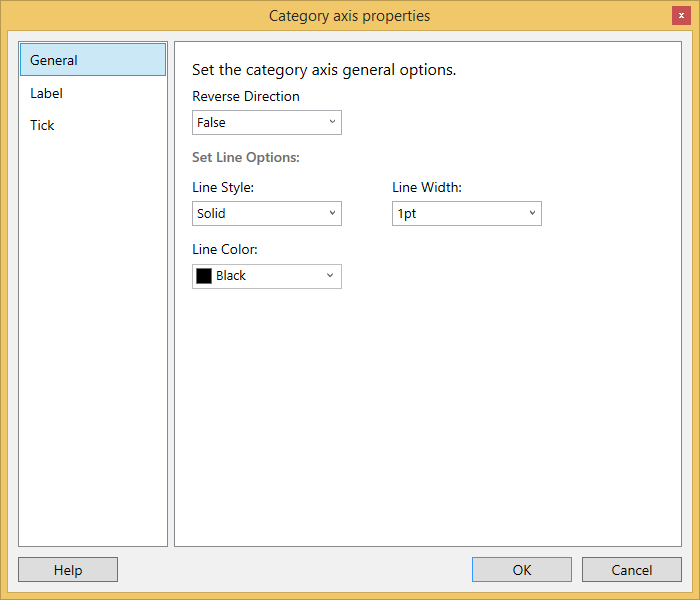
	
15. Click OK.Then the values are updated in the Category Axis.

16. Right click on the chart and select Chart title Properties from the context menu.

    

    * General - To set the chart title options like title, font, color, size, background and style. 
	
	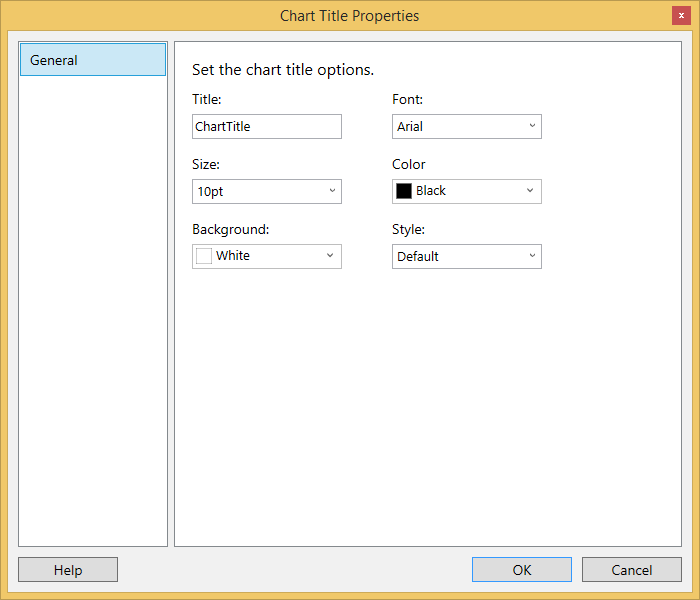
	
17. Click OK to update the values for Chart title.

18. Right click on the chart and select Category Axis title Properties from the context menu.

    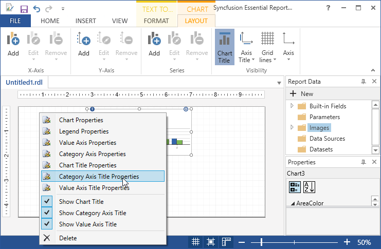

    * General - To set the chart title options like title, font family, font color, font size, title alignment and font style.
	
	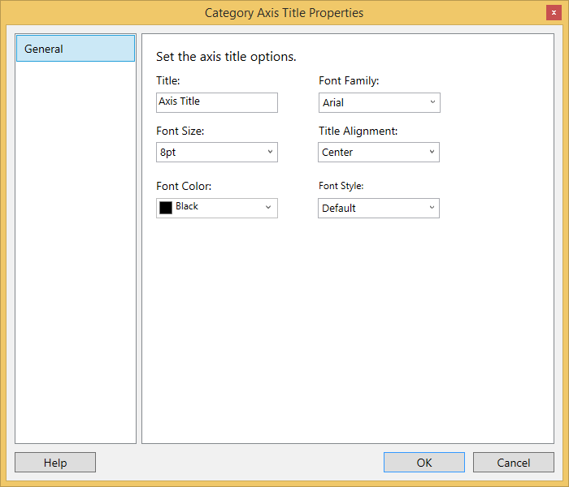

19. Click OK to update the values for Category Axis title.
	
20. Right click on the chart and select Value Axis title Properties from the context menu.	

    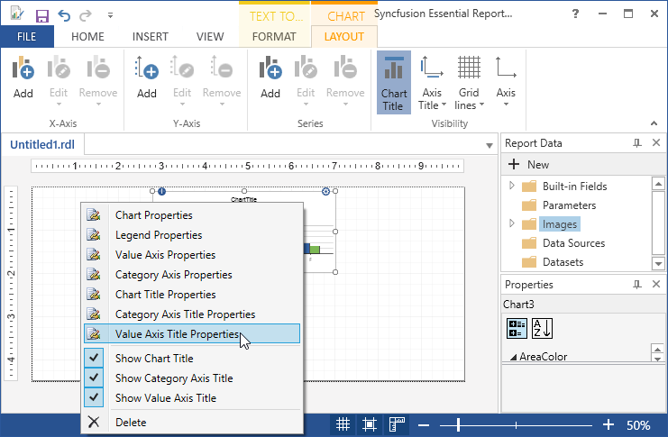

    * General - To set the chart title options like title, font family, font color, font size, title alignment and font style.
	
	
	
21. Click OK to update the values for Category Axis title.

22. To delete the chart,Right click and select delete.

    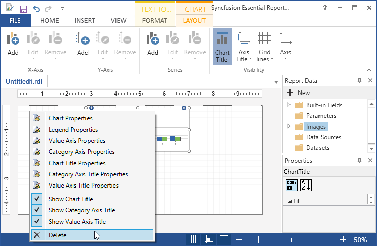
	
	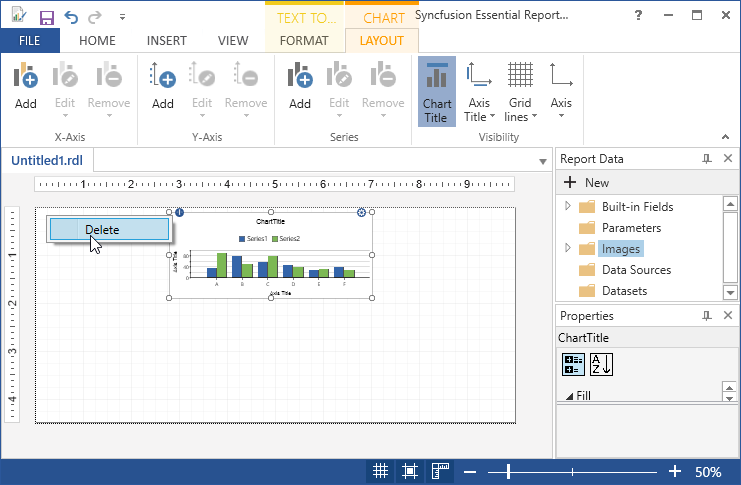
	
## Inserting chart through Chart Wizard

1. Click on Insert tab, and select Chart.

2. Choose Chart Wizard, in Insert > Chart.

   I. Choose an existing dataset in this report,if dataset is already added.
   
   II. Choose create a dataset, if dataset is not added.Then Create datasource and dataset,and follow the following steps.
   
3. If dataset is already added select available datasets and click Next.

   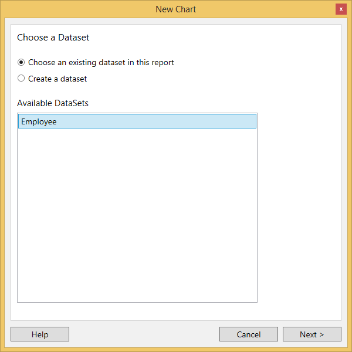

4. Drag to available fields to the corresponding Series,Categories and values and click Next.

   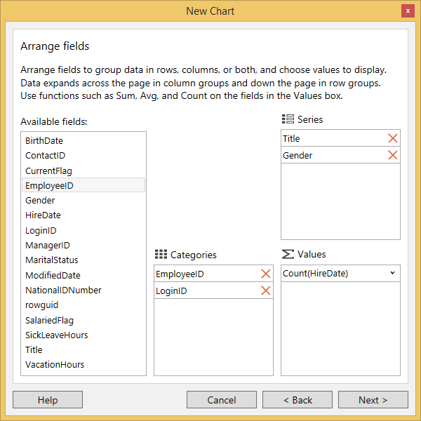

5. Select the Style and Layout of the table and click Finish.

   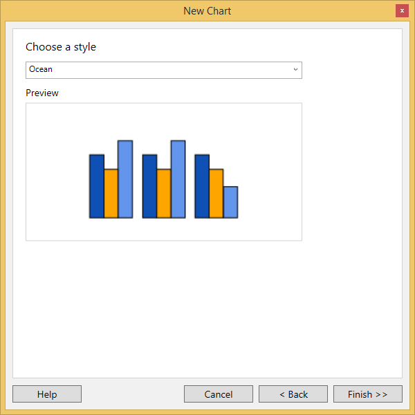
   
6. Then the chart will display with the selected fields.

   
   
7. To Apply Styles to the Charts,Right Click on the Chart and select the Chart Properties from the context menu.

   

8. In the Chart Properties dialog, select any of the following.

   * General - To change the chart type and ToolTip of the chart.

   * Data - To set the Dataset name and data fields of the corresponding datasets.

   * Appearance - To set the Chart name and border options and background options.
   
   
   
9. Click OK.Then the values are updated in the Chart.

10. Right click on the chart and select Legend Properties from the context menu.

    

11. The Legend Properties dialog opens. Select any of the following.

    * General - To change the position, color, name and layout of the legend.

    * Font - To set the font color, font family, font size, and font style of the legend.

    * Border - To set the border color and border width of the legend.
	
	
	
12. Click OK.Then the values are updated in the Legend.

13. Right click on the chart and select Value Axis Properties from the context menu.

    

    * General - To change the direction, line style, line width and line color of the value axis.

    * Label - To set the font family, font size, font angle, font style, font color, and visibility of the value axis label.

    * Tick - To set the style, width, color, and length of the value axis tick, and set the visibility of the major and minor tick marks.
	
	
	
14. Click OK.Then the values are updated in the Value Axis.

15. Right click on the chart and select Category Axis Properties from the context menu.

    

    * General - To change the direction, line style,line width and line color of the category axis.
	
	* Label - To set the font family, font size,font angle, font style, font color, font weight and visibility of the category axis label.
	
	* Tick - To set the style, width, color, and length of the value axis tick, and set the visibility of the major and minor tick marks.
	
	
	
16. Click OK.Then the values are updated in the Category Axis.

17. Right click on the chart and select Chart title Properties from the context menu.

    

    * General - To set the chart title options like title, font, color, size, background and style. 
	
	
	
18. Click OK to update the values for Chart title.

19. Right click on the chart and select Category Axis title Properties from the context menu.

    

    * General - To set the chart title options like title, font family, font color, font size, title alignment and font style.
	
	

20. Click OK to update the values for Category Axis title.
	
21. Right click on the chart and select Value Axis title Properties from the context menu.	

    

    * General - To set the chart title options like title, font family, font color, font size, title alignment and font style.
	
	
	
22. Click OK to update the values for Category Axis title.

23. To delete the chart,Right click and select delete.

    
	
	

    