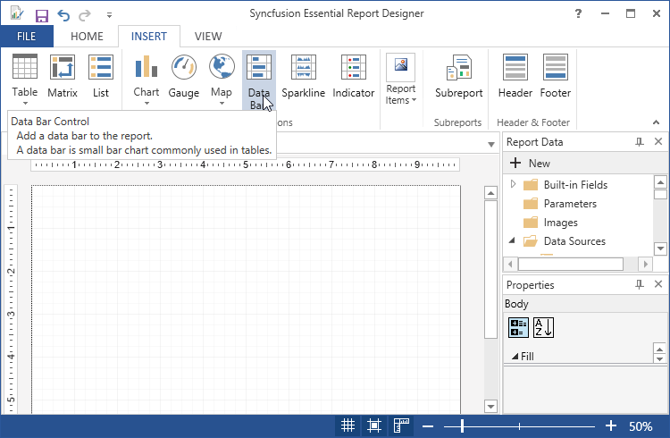
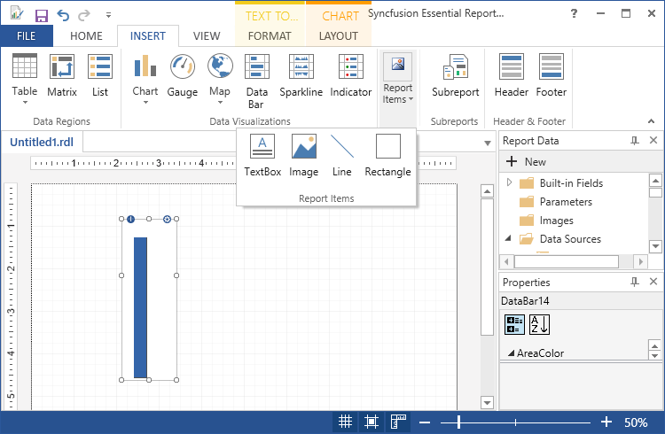
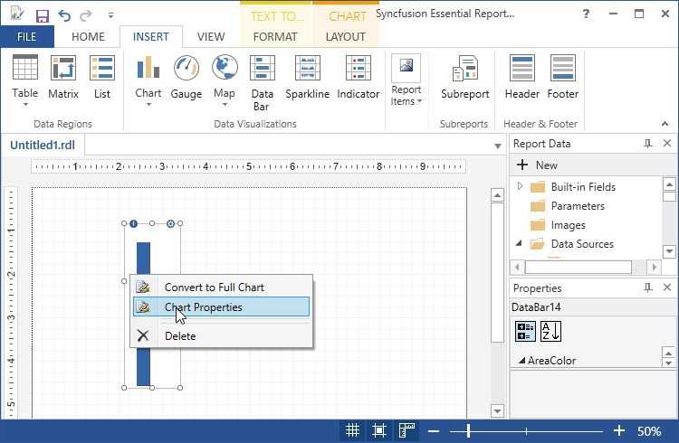
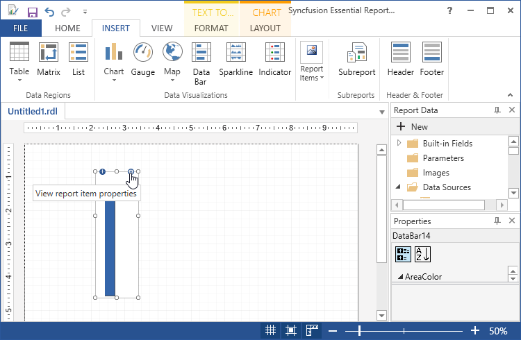
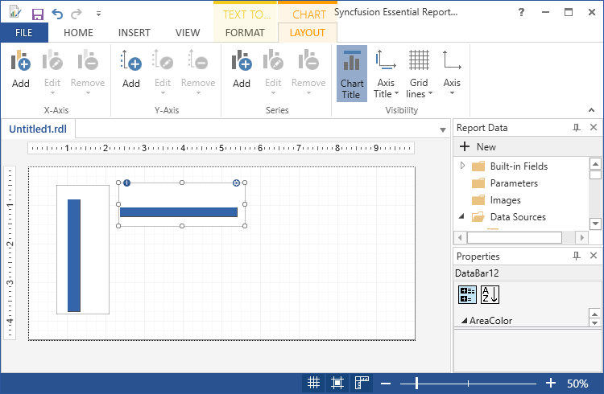
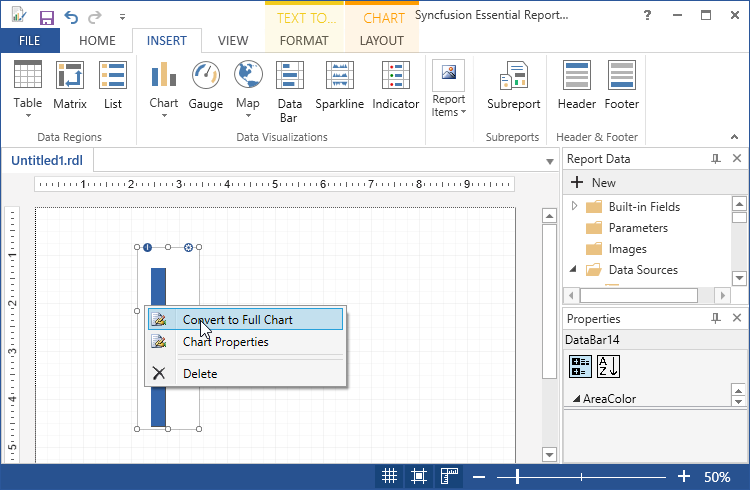
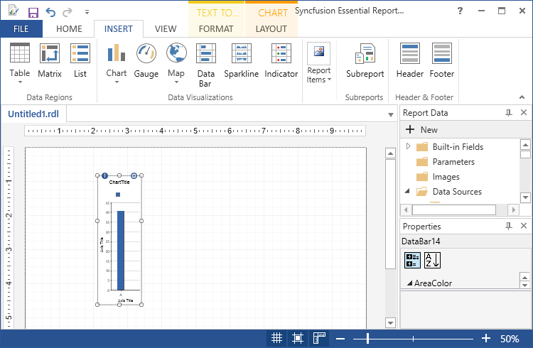
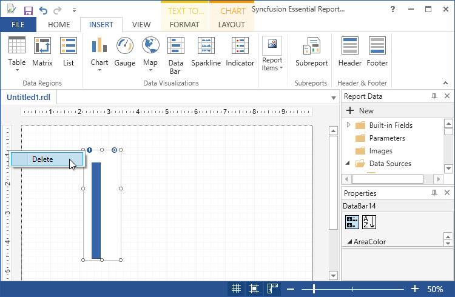
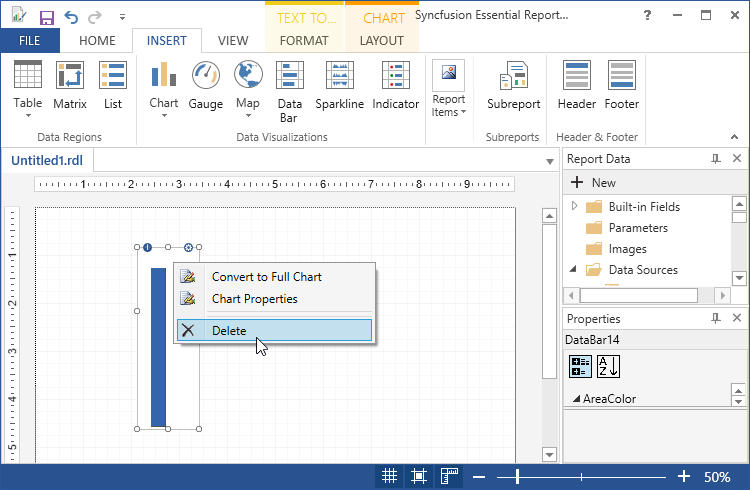

# Draw DataBar Report Item

You can add a DataBar to the Report Designer using the following steps.

1. Click DataBar in the Insert Tab and drag it to the Report designer.

   

2. A Chart properties wizard opens, Click OK.Then DataBar will be added with its default properties.

   

3. To Add the Report Items such as text boxes, lines, and images and rectangle to the DataBar,click and drag the selected report items to the DataBar.

   

4. To Apply Styles to the DataBar, Right Click on the DataBar and select the Chart Properties from the context menu or click on the view report item properties.

   
   
   

5. In the Chart Properties dialog, select any of the following.

   

   * General - To change the DataBar type and ToolTip of the chart.

   * Data - To set the Dataset name and data fields of the corresponding datasets.

   * Appearance - To set the Chart name and border options and background options.
   
6. Click OK. Then the values are updated in the DataBar.

7. Select properties like chart title, axis title, grid lines, axis and add chart in x axis, y axis and series in Layout tab.

   

8. To convert the DataBar to chart, Right click on the DataBar and select convert to full chart.

   

9. Then the DataBar will converted into the chart.

   

10. To delete the DataBar, right click and select delete.

    
	
	

