# Draw Gauge Report Item

You can follow these steps to add a Gauge to the Report Designer.

1. Click Gauge in the Insert Tab and drag it to the Report designer.

2. To add data fields to the Gauge, drag a data field from the Report Data to the radial gauge panel.

3. Right click the Gauge and select the Gauge Properties.

   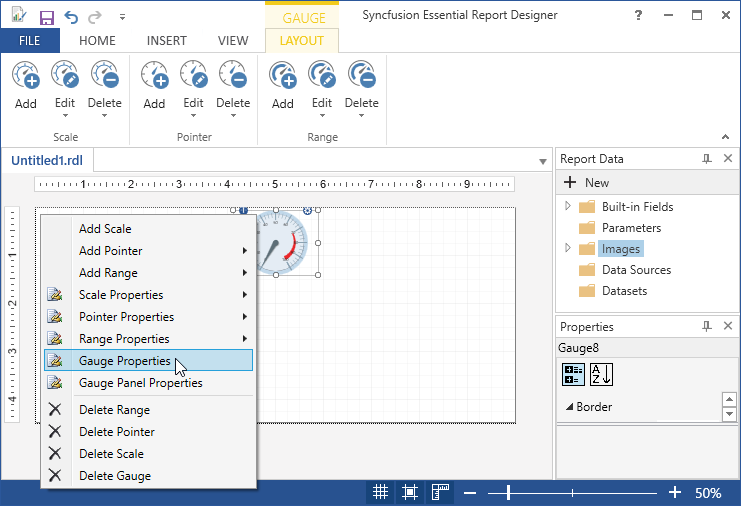

4. In the Gauge Properties dialog, select the following.

   * General - To set the gauge frame thickness, name, tooltip, type and fill options.
   
   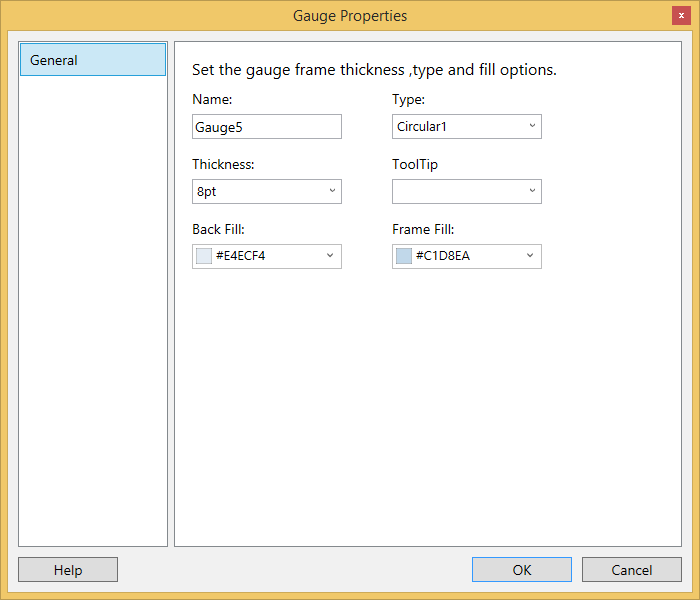
   
5. Click Ok.Then the values are updated in the gauge.

6. To change the scale properties of Gauge,Right click on gauge and navigate to the Scale Properties > RadialScale1 or Click on View Report Item Properties.

   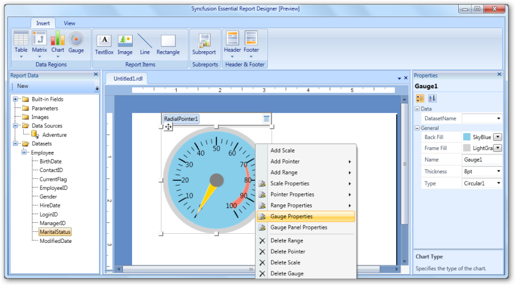
   
   

7. In the Scale Properties wizard, select any of the following.

   * General - To change minimum value, maximum value, radius, start angle, and sweep angle of the scale.
   
   * Data - To Set the DataSet Name, Data fields and Scale Pointers.

   * Label - To set the placement of the label, label distance from the scale, font size, font color, and font angle of the labels.

   * MajorTick - To set length, width, shape, color, and placement of the major ticks.

   * MinorTick - To set length, width, shape, color, and placement of the minor ticks.
   
   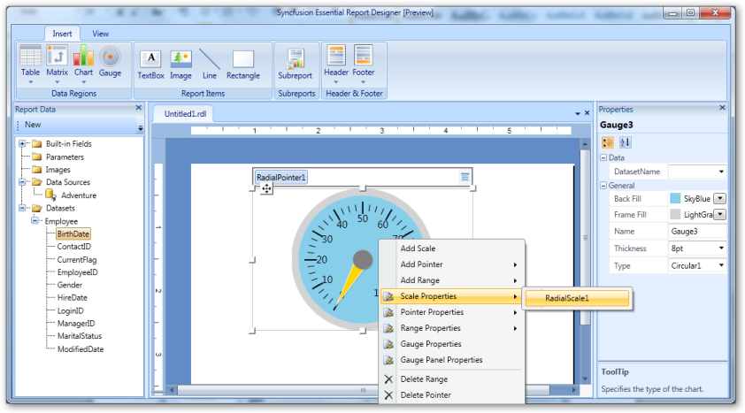
   
8. Click OK.Then the values are updated in the scale.

9. To change the range properties of the Gauge,Right click the gauge and navigate to the Range Properties > RadialRange1.

   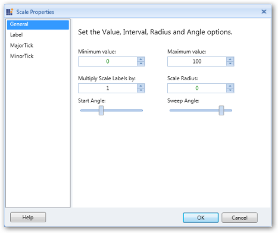

10. In the Range Properties wizard, select any of the following

    * General - To change the start range, end range, start width, end width, placement, background color and distance from scale.

    * Border - To set the border width and border color of the gauge range.
	
	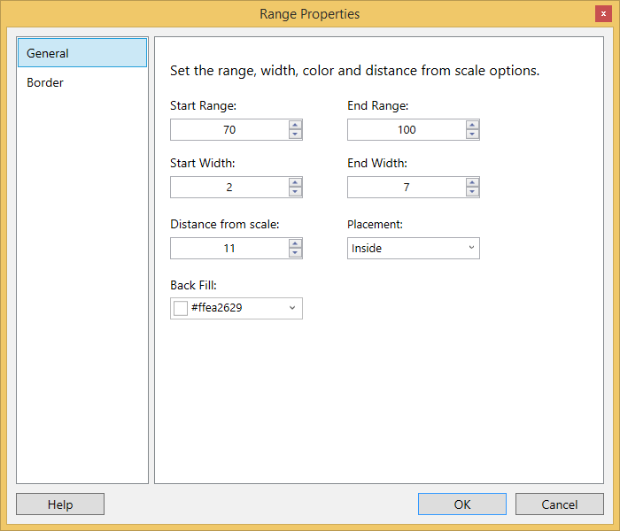
	
11. Click OK.Then the values are updated in the Range.

12. To change the pointer properties of the Gauge,Right click the gauge and navigate to the Pointer Properties > RadialPointer0.

    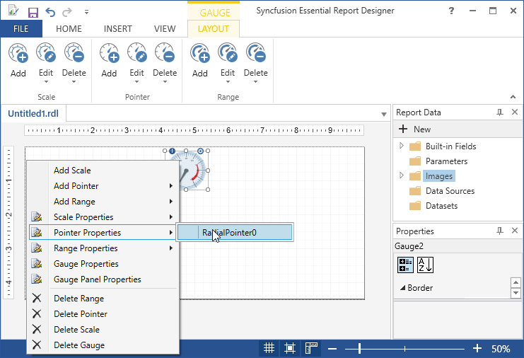

    * General - To change the Pointer length, Pointer Width, Pointer type, Needle type, Marker placement, Marker style, Cap radius and Cap color.
	
	* Fill - To change the Pointer color, Border width and color.
	
	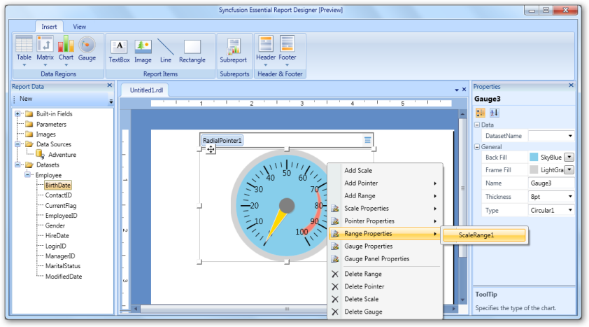
	
13. Click Ok.Then the values are updated in the Pointer.

14. To delete Range,Right click on the gauge and select Delete Range.

    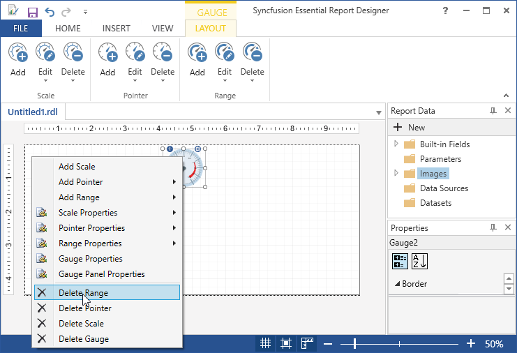

15. To delete Pointer,Right click on the gauge and select Delete Pointer.

    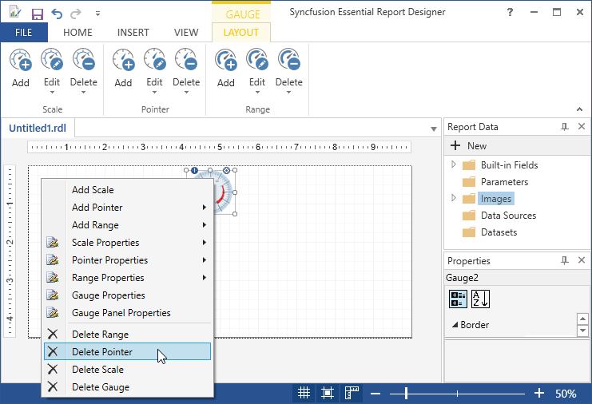

16. To delete Gauge,Right click on the gauge and select Delete Gauge or Select Delete.

    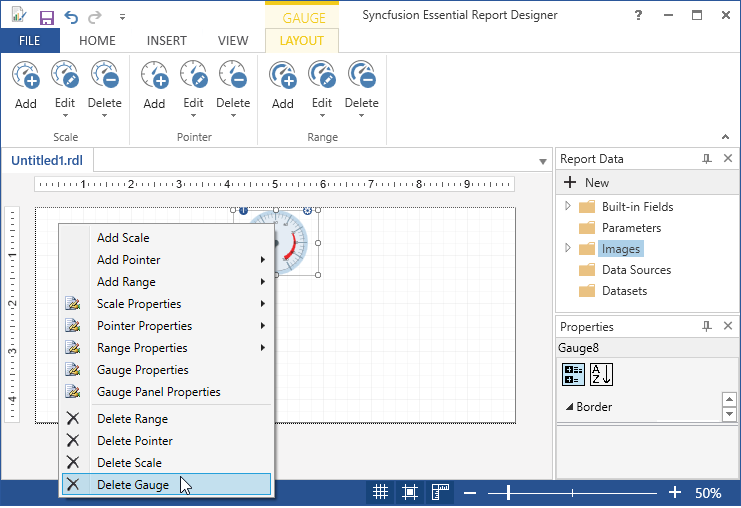
	
	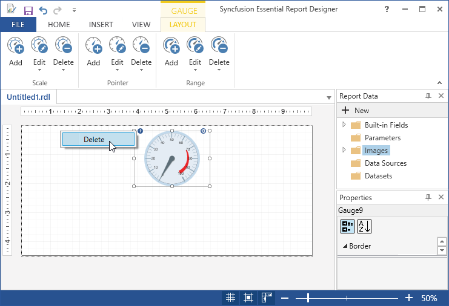

17. To delete Scale,Right click on the gauge and select Delete Scale.

    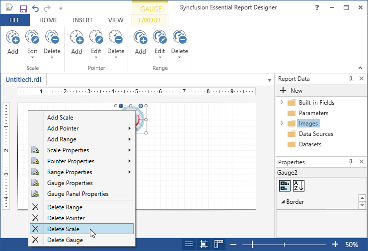

18. To Add Scale,Right click on the gauge and select Add Scale.

    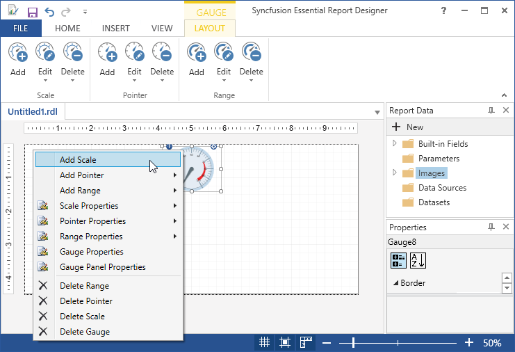

19. To Add Pointer,Right click on the gauge and select Add Pointer > RadialScale1.

    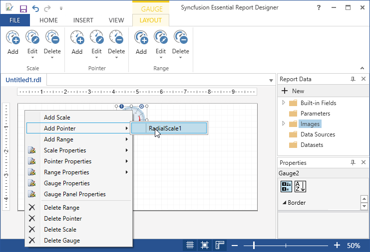

20. To Add Range,Right click on the gauge and select Add Range > RadialScale1.

    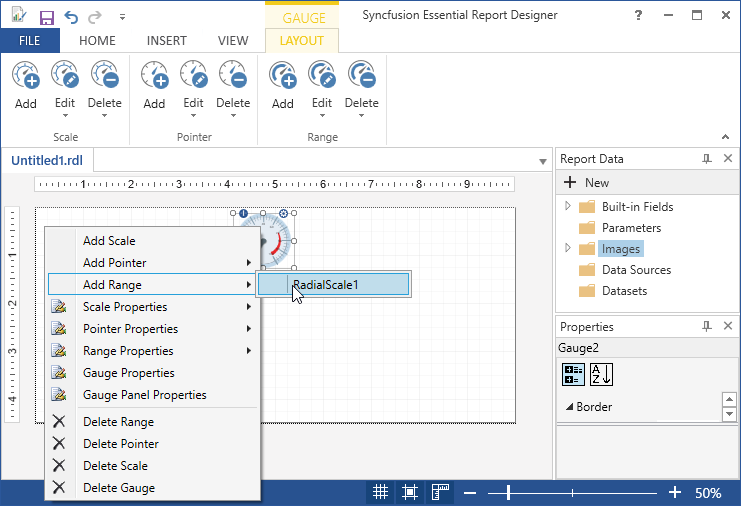
