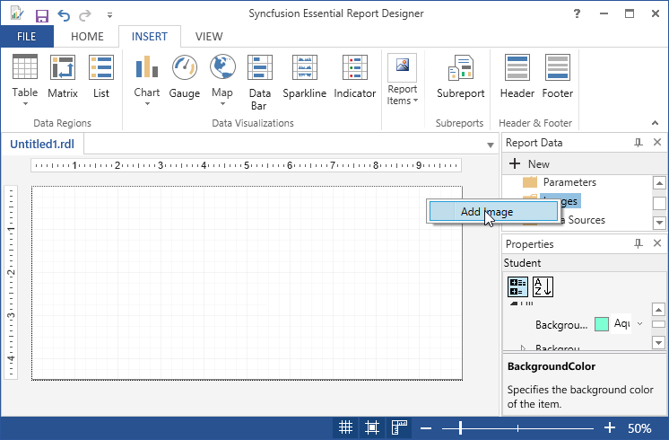
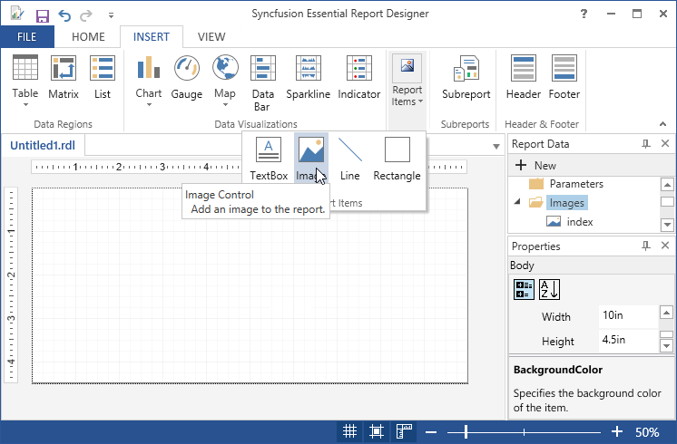
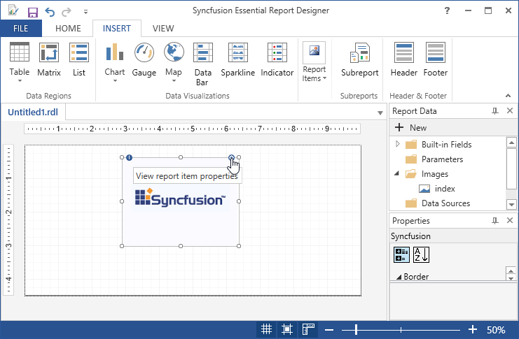
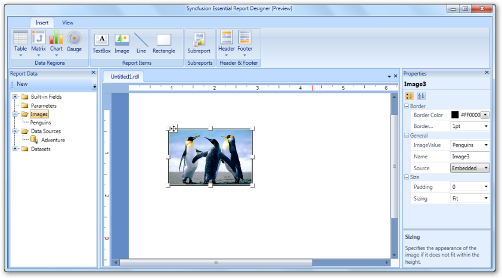
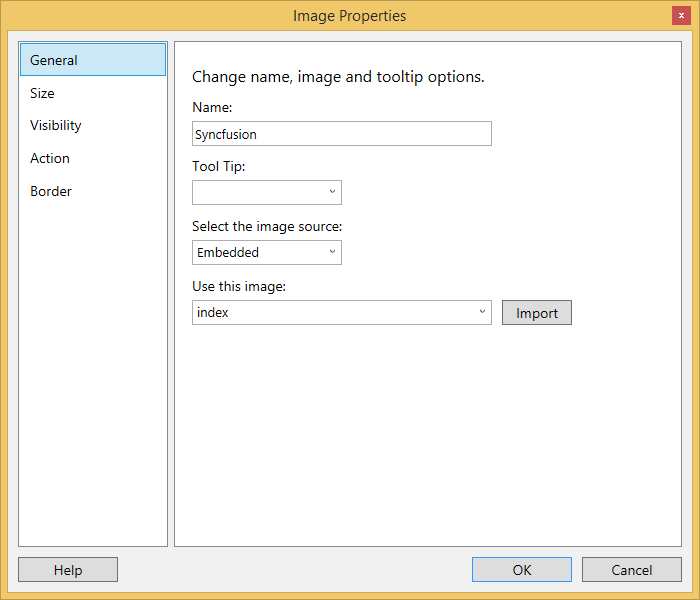
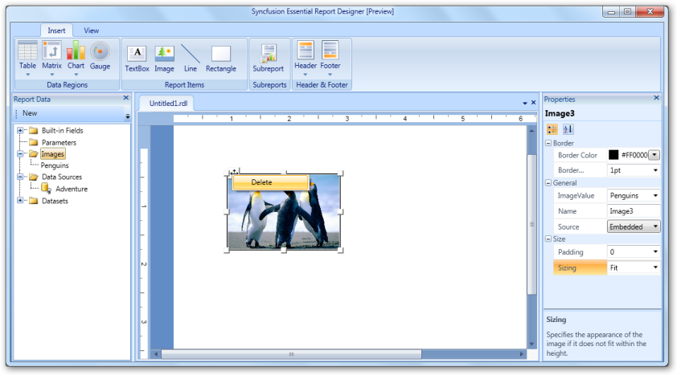

# Draw Image Report Item

You can insert image in Report Designer using the following steps.

1. Right click on Images in Report Data,then select Add image.

   

2. Click Insert Tab, select Image from Report Items.

   

3. Right click on image and select Image Properties or click on the view report item properties. Then Image Properties wizard opens.

   
   
   

4. In Image Properties dialog,select any on the following.

   * General - To set the Name,ToolTip of the image or image source, select an embedded image and import an image from the local disk.
 
   * Size - To set the display size and padding of the image.
   
   * Visibility - To set the visibility of the image when the report is initially run.
   
   * Actions - To change the hyperlink options.
   
   * Border - To set the border color and border width and style of the image.
   
   
   
5. Set the desired values, and then click OK to update the values in the Image.
   
6. To change the image properties,change the values in the Properties Grid.

7. To Delete the image,Right click on the image and select Delete.

   

