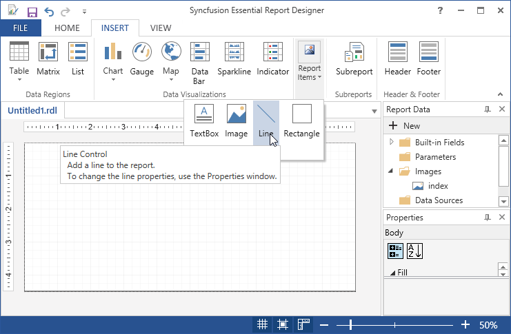
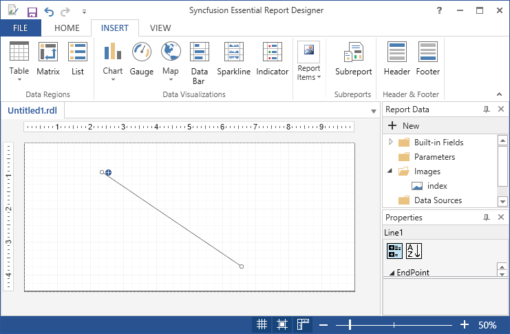

# Draw Line Report Item

You can insert line in Report Designer using the following steps.

1. Click Insert Tab, select Line from Report Items.

   
   
2. To change the line properties like End Points,General,Style,Location and Visibility,change the corresponding values in the Properties Grid.

    

3. To Delete the line,Right click on the line and select Delete.

   