# Draw Map Report Item

You can add a Map to the Report Designer using the following steps.

Add a data source and dataset to the Report Designer.

## Inserting Map through Insert Map

1. Click Map in the Insert Tab,Select Insert Map in the list and drag it to the Report designer.

   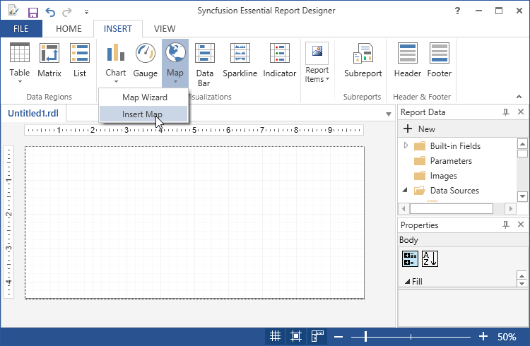

2. A Map properties wizard opens,Click Ok.Then Map will be added with its default properties.

   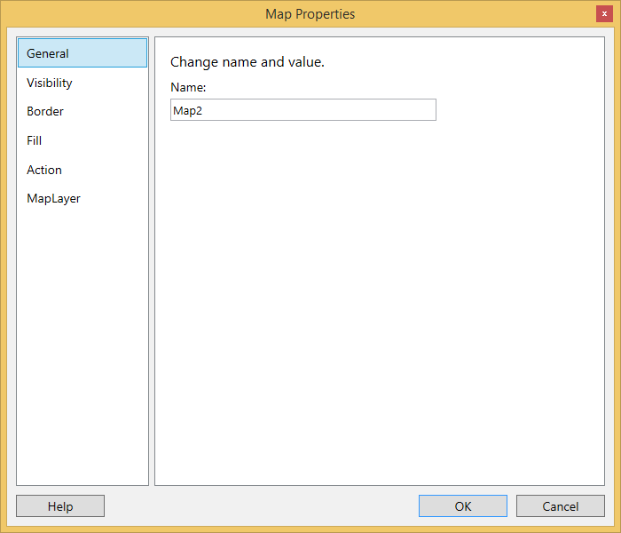

3. In the Map Properties dialog, select any of the following.

   * General - To set Name and value of the chart.
   
   * Visibility - To Change display options when report is initially run.
   
   * Border -  To set the border style, border width and border background.
   
   * Fill - To change the background color.
   
   * Action - To change the hyperlinks.
   
   * MapLayer - To add map layers to the map.
   
4. To add layer to the map right click on the map and select AddLayer, then layer properties wizard will open.

   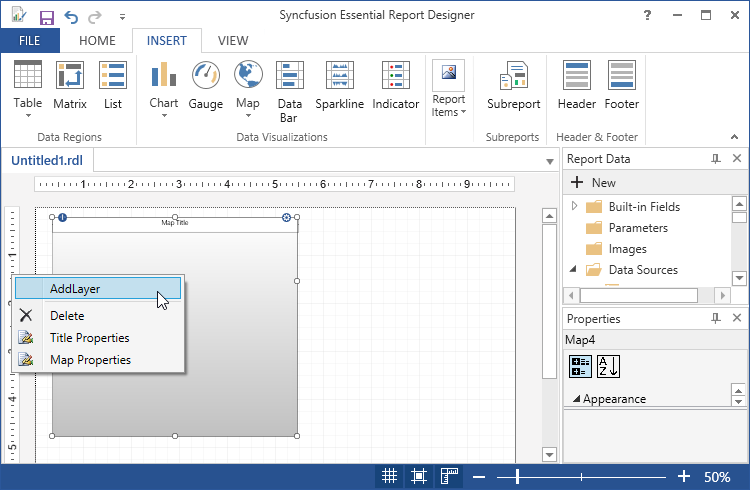

5. In layer properties wizard,do any of the following.

   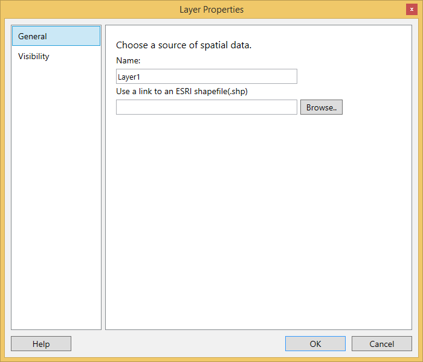

   * General - To set name and link to an ESRI shapefile.
   
   * Visibility - To Change display options when report is initially run.
   
6. To Add the Report Items such as text boxes, lines, and images and rectangle to the map,click and drag the selected report items to the map.

   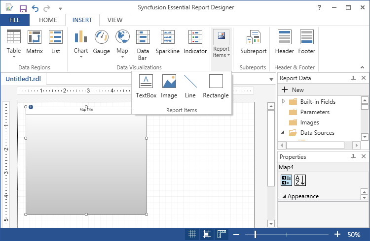

7. In order to change the properties of the map, click on the view report item properties or right click on the map and select map properties, then map properties wizard will open.

   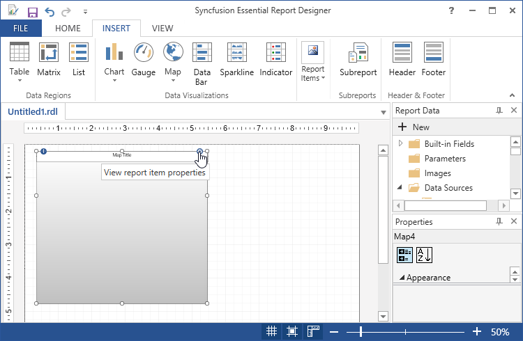
   
   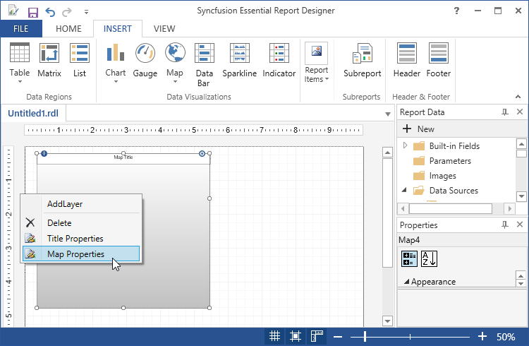

8. To change the title properties of the map, right click on the map and select title properties.

   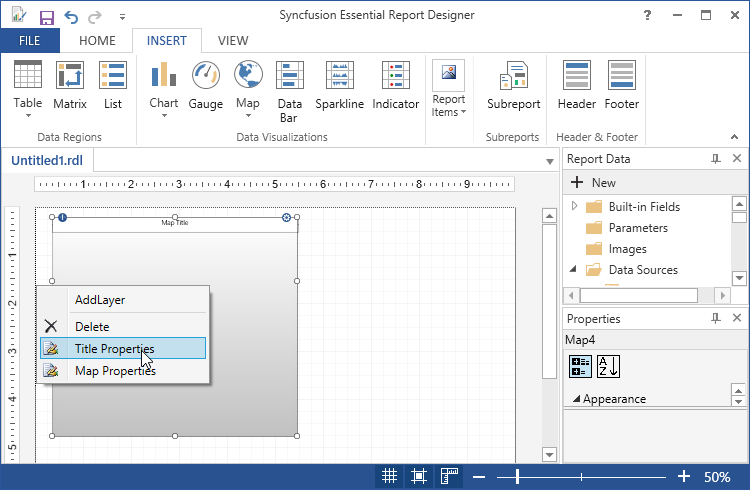

9. Title properties wizard will open.

   

   * General - To set the title, font, size, color, background and style.
   
10. To delete the map, right click and select delete.

    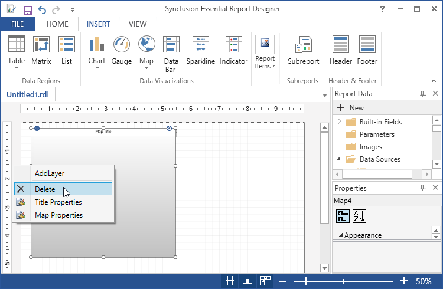

## Inserting map through Map Wizard

1. Click Map in the Insert Tab, Select Map Wizard in the list.

   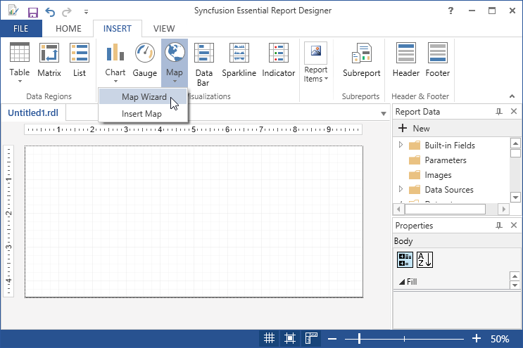

2. Then New Map Wizard opens, set the ESRI Shapefile path and click Next.

   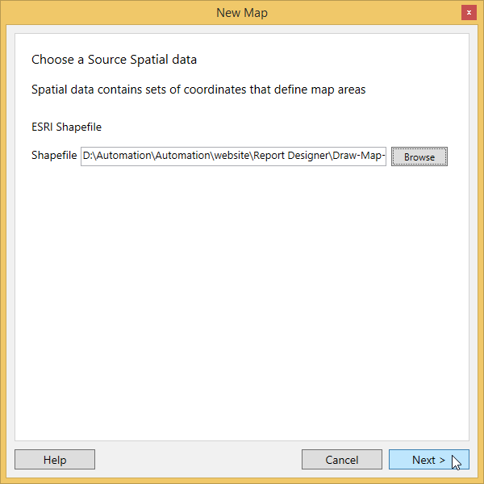

3. Select map visualization in the next window and select Next.

   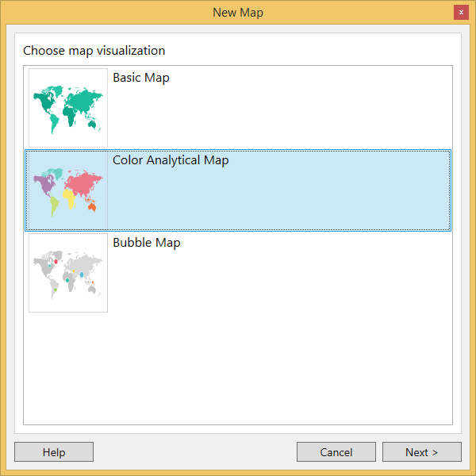

4. Choose the dataset in the next window and click Next.

   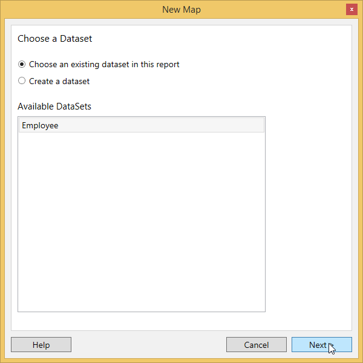

   I. Choose an existing dataset in this report,if dataset is already added.
   
   II. Choose create a dataset, if dataset is not added.Then Create datasource and dataset,and follow the following steps.

5. Then specify the match fields for spatial and analytical data in the next window and click Next.

   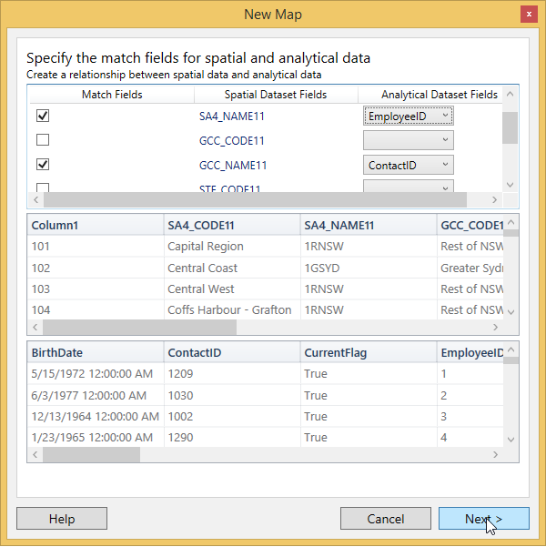

6. Choose data theme and color visualization in the next window.

   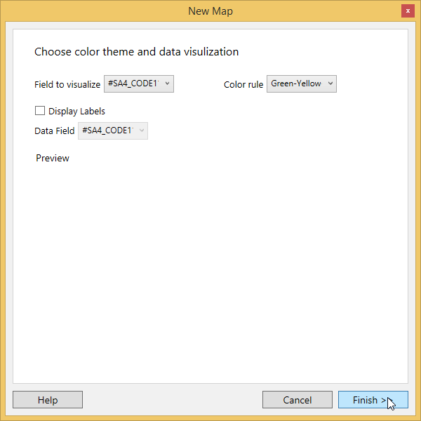

7. Then the map will display with the selected fields.

   

8. To Apply Styles to the map, Right Click on the map and select the map Properties from the context menu.

   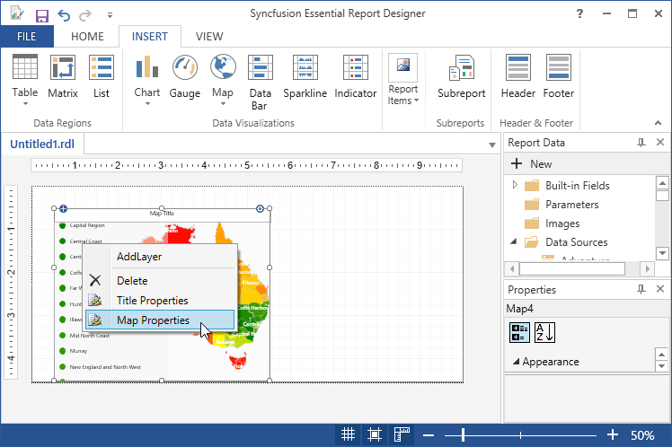    

9. In the Map Properties wizard, select any of the following.

   

   * General - To set Name and value of the chart.
   
   * Visibility - To Change display options when report is initially run.
   
   * Border -  To set the border style, border width and border background.
   
   * Fill - To change the background color.
   
   * Action - To change the hyperlinks.
   
   * MapLayer - To add map layers to the map.
   
10. To add layer to the map right click on the map and select AddLayer,then layer properties wizard will open.

    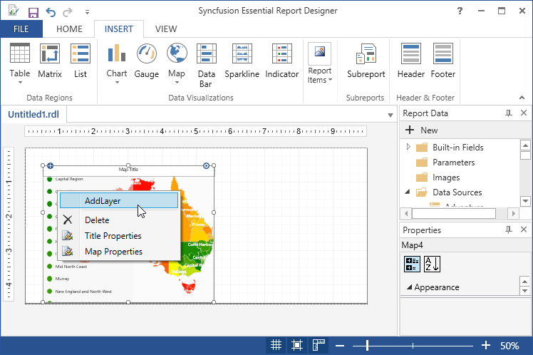

11. In layer properties wizard, do any of the following.

    

    * General - To set name and link to an ESRI shapefile.
   
    * Visibility - To Change display options when report is initially run.
	
12. To Add the Report Items such as text boxes, lines, and images and rectangle to the map,click and drag the selected report items to the map.

    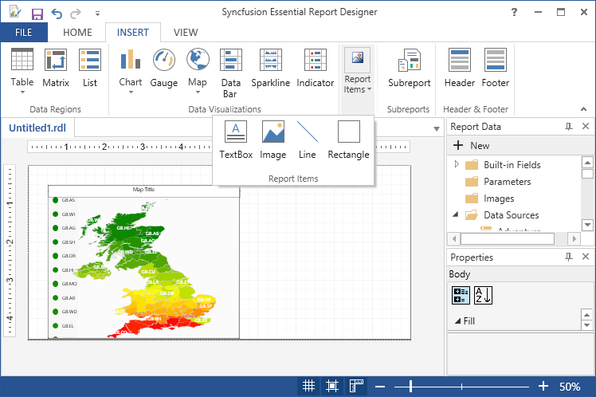

13. In order to change the properties of the map, click on the view report item properties, then map properties wizard will open.

    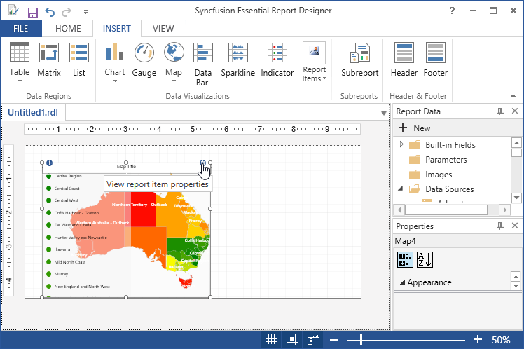

14. To change the title properties of the map, right click on the map and select title properties.

    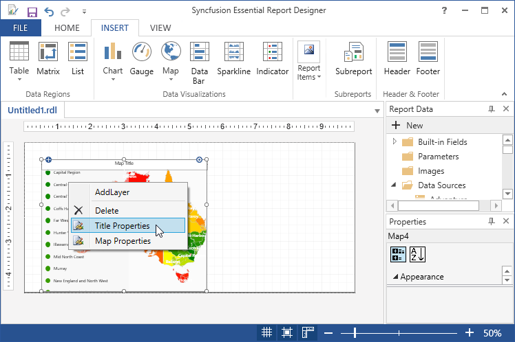

15. Title properties wizard will open.

    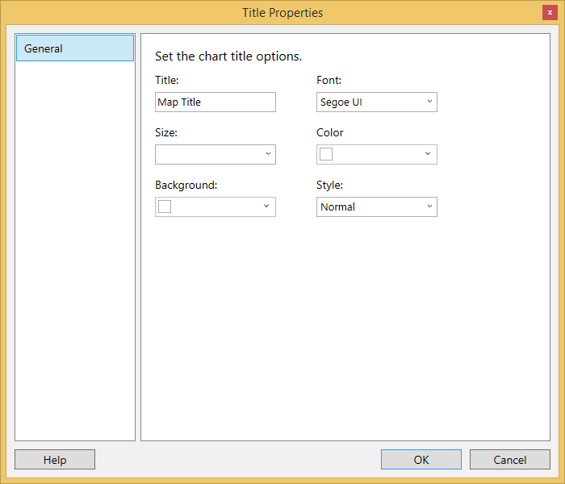

    * General - To set the title, font, size, color, background and style.
   
16. To delete the map, right click and select delete.

    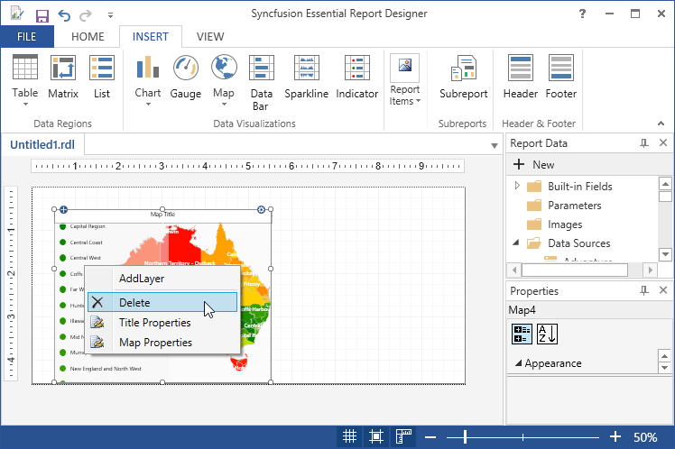
   

   
   