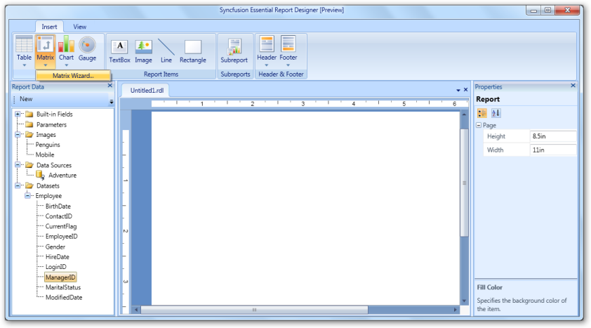
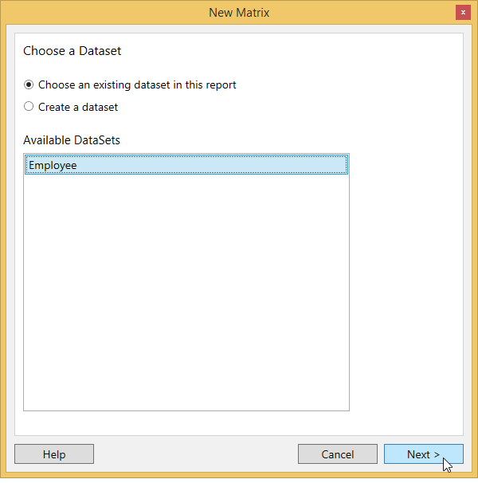
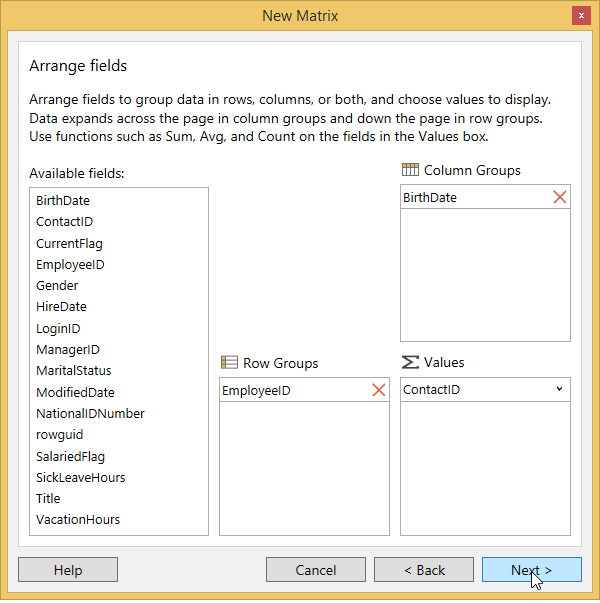
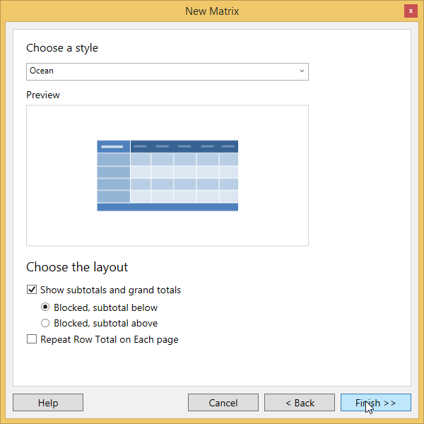
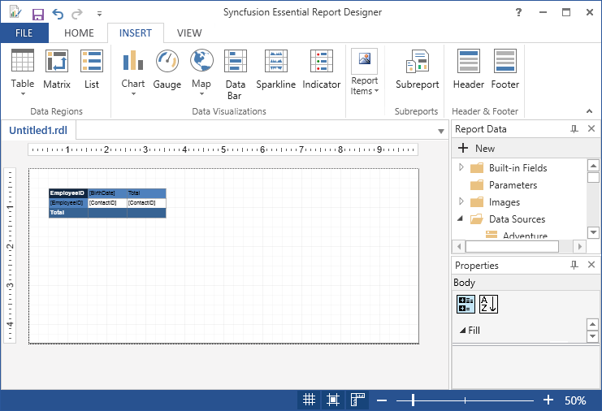

# Draw Matrix Report Item

You can follow these steps to add a Matrix to the Report Designer.

1. Add a data set to the Report Designer.

2. Click Matrix in the Insert Tabs.

3. New Matrix wizard opens. 

   * Choose an existing dataset in this report,if any dataset is added in the report designer.
   
   
   
   * Choose create a dataset,if dataset is not added in the report designer.
   
   
   
4. Click Next after selecting create a dataset and choose the datasource in the available datasources.

   

5. Select any fields from the database view and click Run Query.

6. Then the Query Result will be displayed according to the query selection.

7. Click Next.Then Arrange fields windows will display.

8. Drag the required fields from the Available fields to Row Groups, Column Groups, and Values fields.

   

9. Click Next.Then choose a style and layout and click Finish.

   

10. A matrix is added to the Report Designer with the selected data fields.

    

   