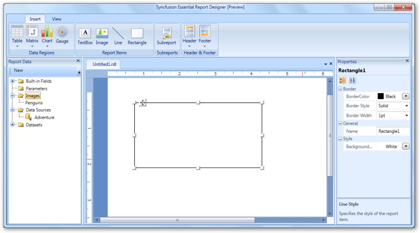
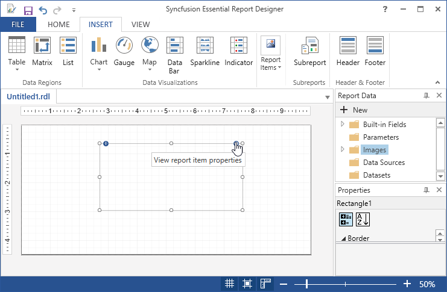
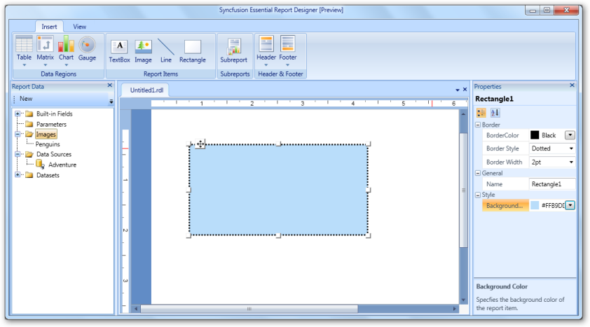
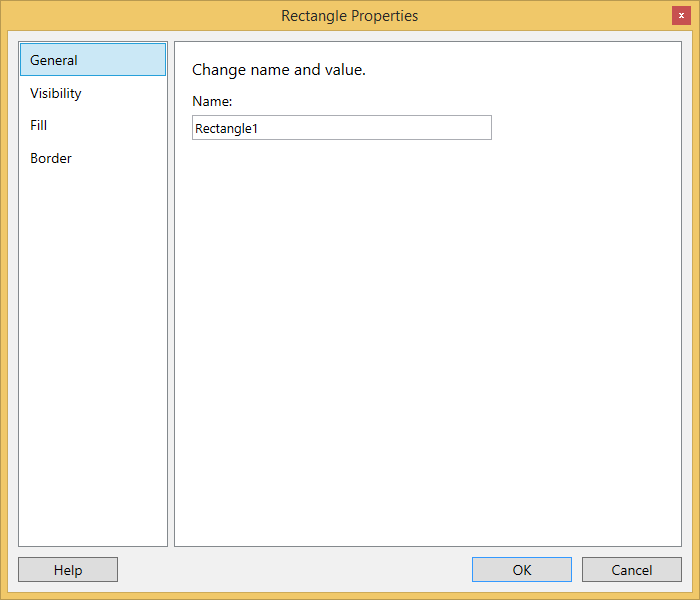
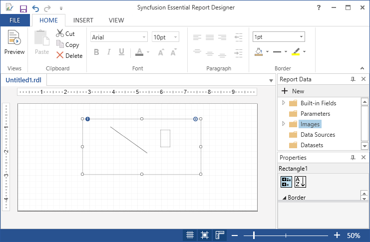
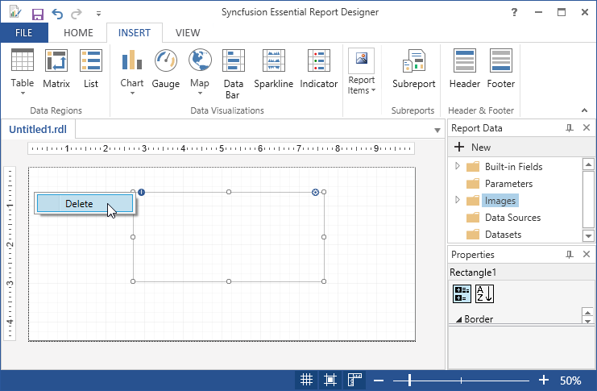

# Draw Rectangle Report Item

You can insert rectangle in Report Designer using the following steps.

1. Click Insert Tab, select Rectangle from Report Items.

   
   
2. Select View Report Item properties or Right Click on the Rectangle and select Rectangle Properties.

   
   
   

3. Then Rectangle Properties wizard will open do any of the following.

   * General - To set the Name for the Rectangle.

   * Visibility - To set the visibility of the Rectangle when the report is initially run. 

   * Fill - To set the background color of the Rectangle.   
   
   * Border - To set the Rectangle border, border width and border color.
   
   
   
3. Set the desired values, and then click OK to update the values in the Rectangle.

4. To Add the Report Items such as text boxes, lines, and images, to the rectangle,drag the selected report items to the rectangle.

   

5. To Delete the Rectangle from the Report Designer,Right Click on the icon and select Delete.

   