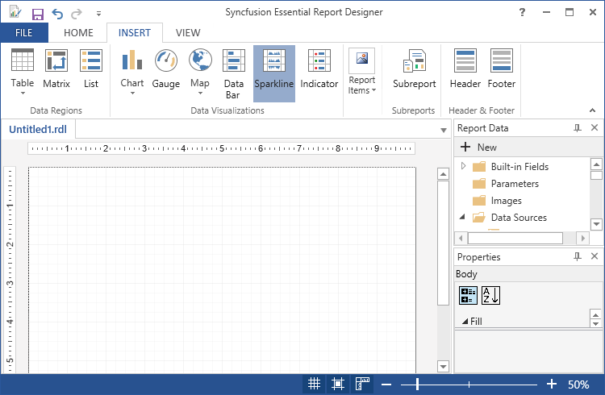
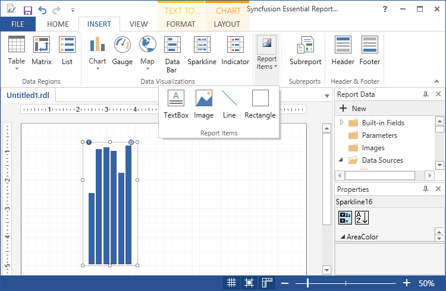
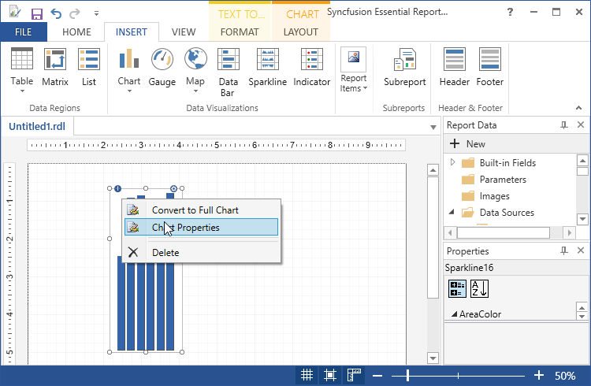
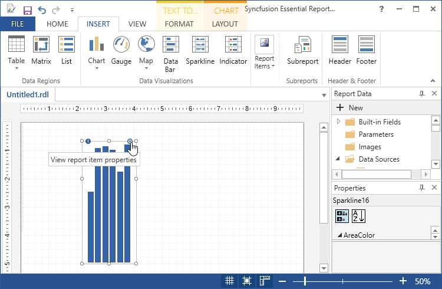
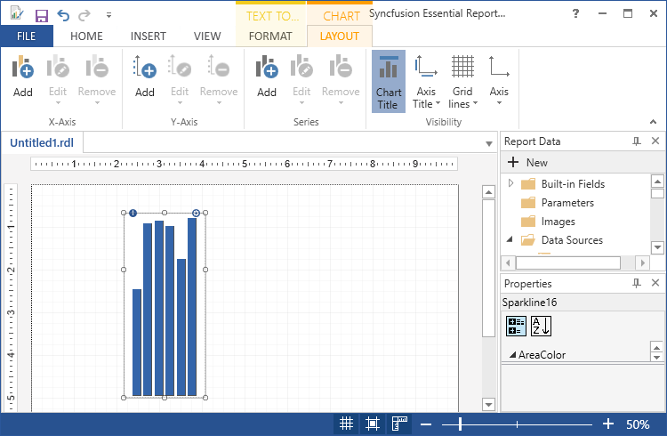
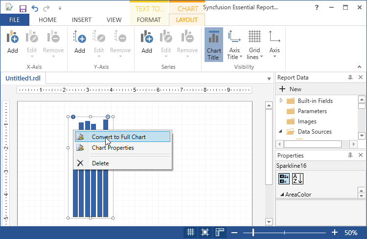
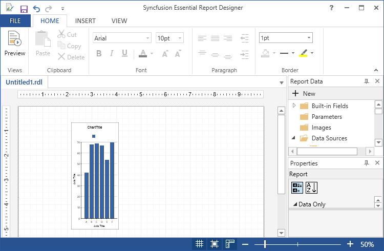
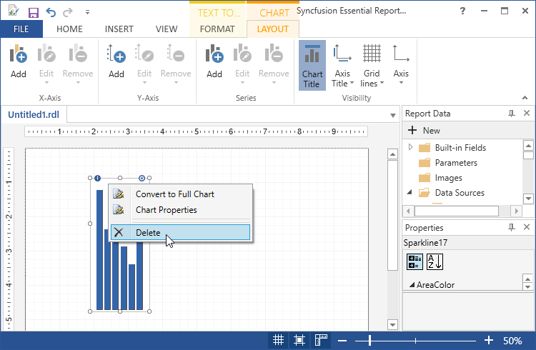
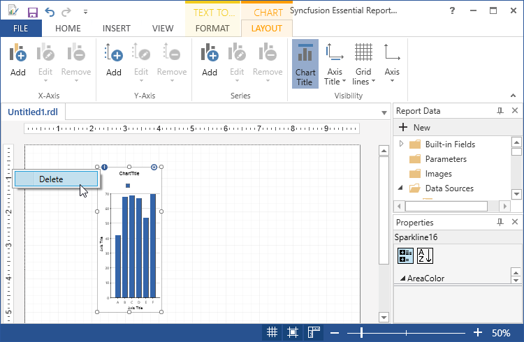

# Draw Sparkline Report Item

You can add a sparkline to the Report Designer using the following steps.

1. Click sparkline in the Insert Tab and drag it to the Report designer.

   

2. A Chart properties wizard opens, Click Ok.Then sparkline will be added with its default properties.

   
   
3. To Add the Report Items such as text boxes, lines, and images and rectangle to the sparkline,click and drag the selected report items to the sparkline.

   
   
4. To Apply Styles to the sparkline, Right Click on the sparkline and select the Chart Properties from the context menu or click on the view report item properties.

   
   
   
   
5. In the Chart Properties dialog, select any of the following.

   

   * General - To change the sparkline type and ToolTip of the chart.

   * Data - To set the Dataset name and data fields of the corresponding datasets.

   * Appearance - To set the Chart name and border options and background options.
   
6. Click Ok.Then the values are updated in the sparkline.

7. Select properties like chart title, axis title, grid lines, axis and add chart in x axis, y axis and series in Layout tab.

   
   
8. To convert the sparkline to chart, Right click on the sparkline and select convert to full chart.

   

9. Then the sparkline will converted into the chart.

   
   
10. To delete the sparkline, right click and select delete.

    
	
	