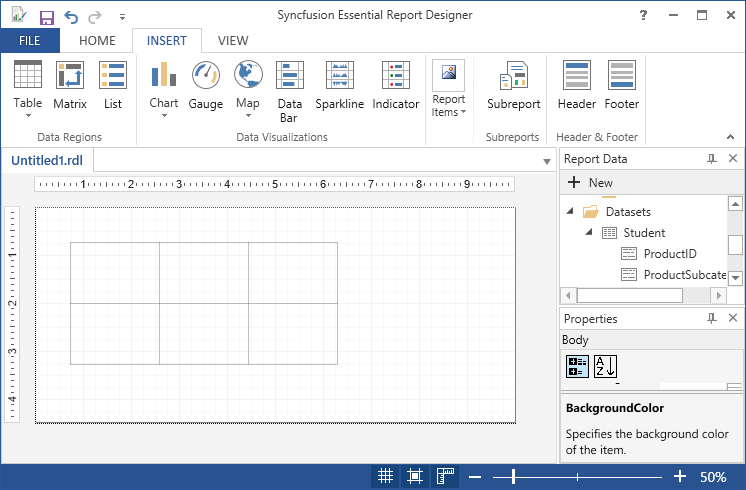
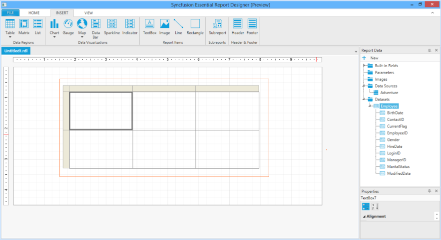
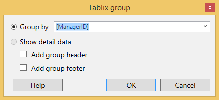
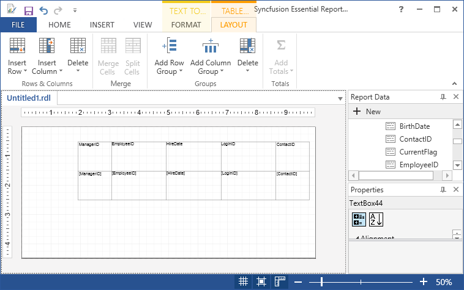
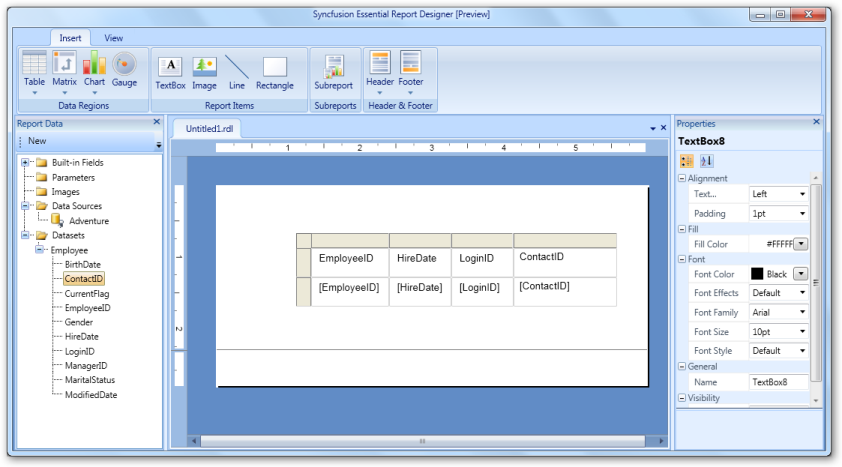
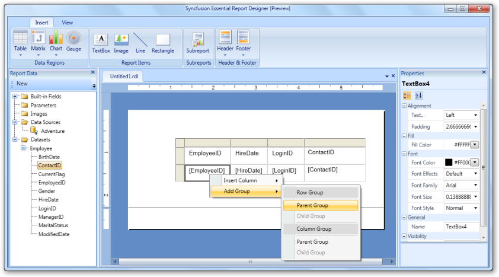
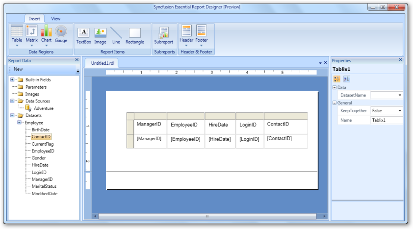
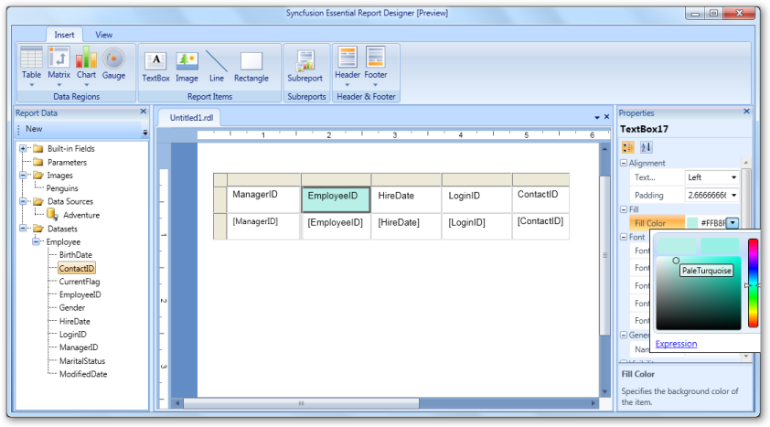

# Draw Table Report Item

You can add tables to the Report Designer and drag the data fields to the table columns. The following steps illustrate how to add table. 

## Inserting Table through Insert Table

1. Click on Insert tab, and select Table.

2. Choose Insert Table, then the table will be inserted into the Report Designer with three columns,by default.

   

3. Drag the data fields to the table columns.

4. Select Tablix a click on view report item properties,then Tablix properties wizard will open.

   * General - To set name,row header,column header,page break options and dataset properties.
   
   * Visibility - To change the display options when the report is initially run.
   
   * Filter - To filter the fields based on the expression.
   
   * Sorting - To sort the fields in ascending order or descending order.
   
5. We can insert column,insert row,delete rows,insert maps,add groups,insert textbox,insert image,insert line,insert gauge,insert subreport and insert indicator on Right click and select any options. 

6. To add a column in the table, Right click on the  cell where you want to insert a column and select Insert Column and click Right, to insert a column to the existing cell.

   

7. To add a parent group to the table, Right click on the cell where you want to insert a parent group and Click Add Group, then select Parent Group.Then the Tablix wizard will open.

   

8. Then select the dataset field to group with that cell.

   

9. The Style for the table can be applied through Properties Window.

## Inserting table through Table Wizard

1. Click on Insert tab, and select Table.

2. Choose Table Wizard, in Insert > Table.

   I. Choose an existing dataset in this report,if dataset is already added.
   
   II. Choose create a dataset, if dataset is not added.Then Create datasource and dataset,and follow the following steps.

3. If dataset is already added select available datasets and click Next.

   

4. Drag to available fields to the corresponding column groups,row groups and values and click Next.

   

5. Select the Style and Layout of the table and click Finish.

   

6. Then the table is displayed on the designer window and its properties can be changed using Property Grid.

   
	
7. The Background color of the cell is changed using the properties grid.

   

