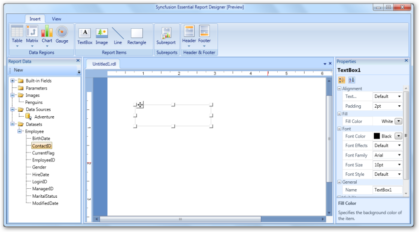
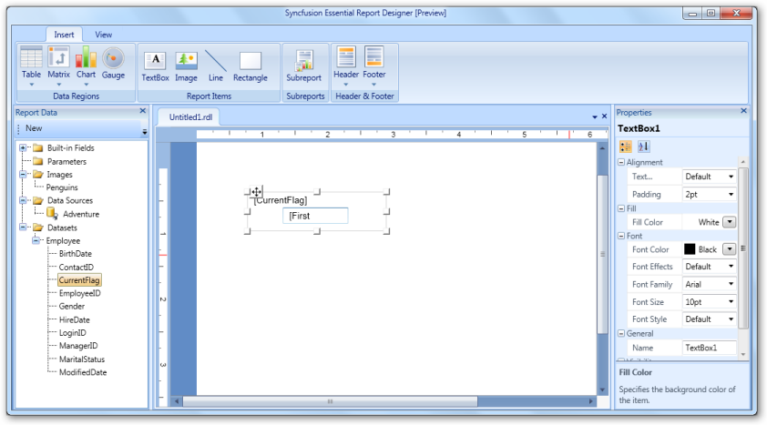
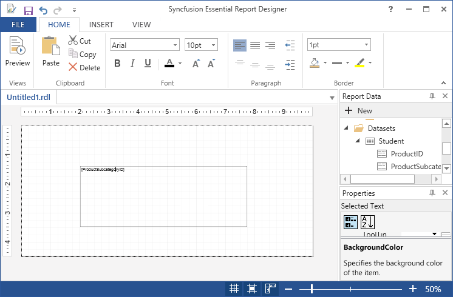
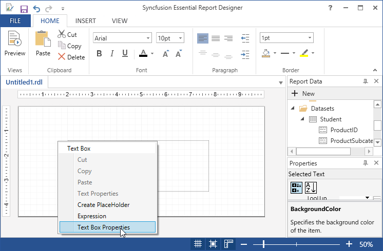
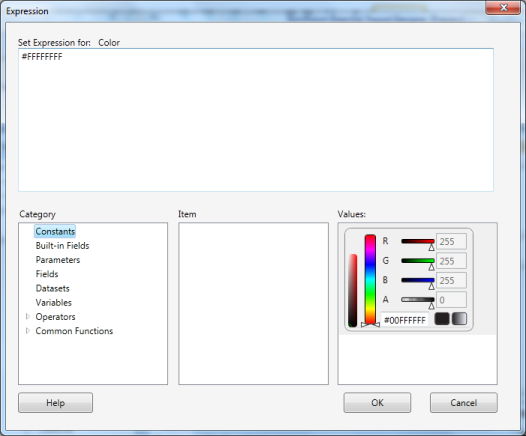
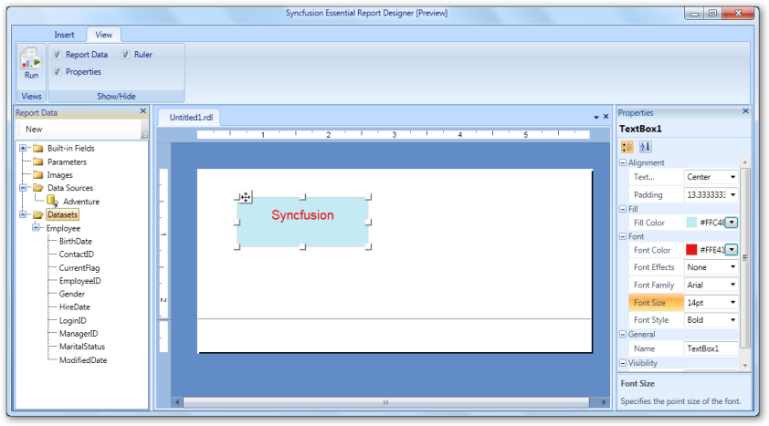
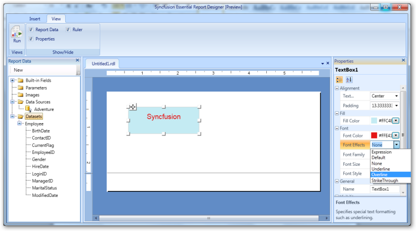

# Draw TextBox Report Item

You can insert TextBox in the Report Designer and drag report items to the TextBox using the following steps.

1. Click Insert Tab, select TextBox from Report Items.

   
   
   

2. To add value to the TextBox, drag the data field from the DataSets in the Report Data.

   

3. Click on the View report item properties or Right click on the TextBox. Then TextBox Properties wizard opens.

   
   
   

4. In the TextBox properties dialog, select any of the following:

   * General - To change the name,value and sizing of the TextBox. 
   
   * Number - To set the numbers,date formats and expressions.
   
   * Alignment - To set the horizontal alignment, vertical alignment, and padding of the TextBox.
   
   * Font - To set the font family, font size, font color, font style, font effects, and line spacing of the TextBox.
   
   * Border - To set the TextBox border, border width and background color.
   
   * Fill - To set the background color of the TextBox.
   
   * Visibility - To set the visibility of the TextBox when the report is initially run.
   
   * Interactive Sorting - To change the options of the TextBox using sorting.

   * Actions - To change the hyperlink options.
   
   
   
5. Set the desired values, and then click OK to update the values in the TextBox.

6. To change the properties by using the Properties Grid, click the TextBox.And change the values in Properties Panel.

7. Select TextBox, Right click and select Delete to delete the textbox.

   

